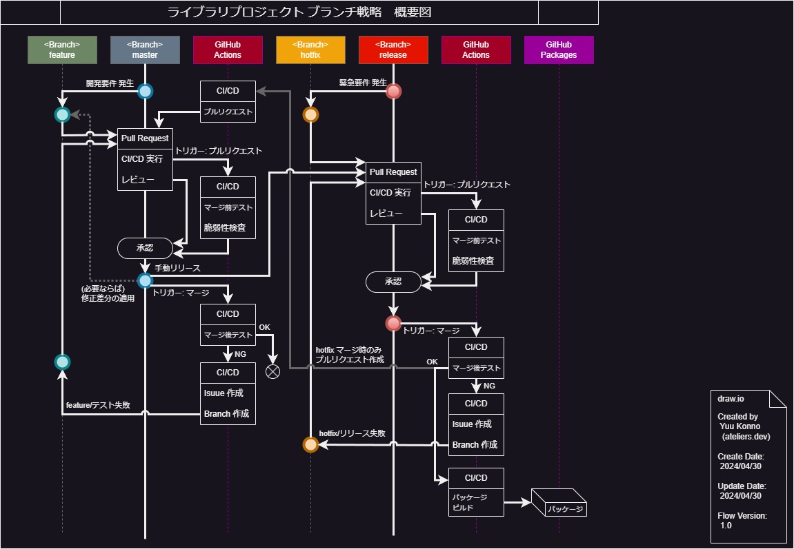
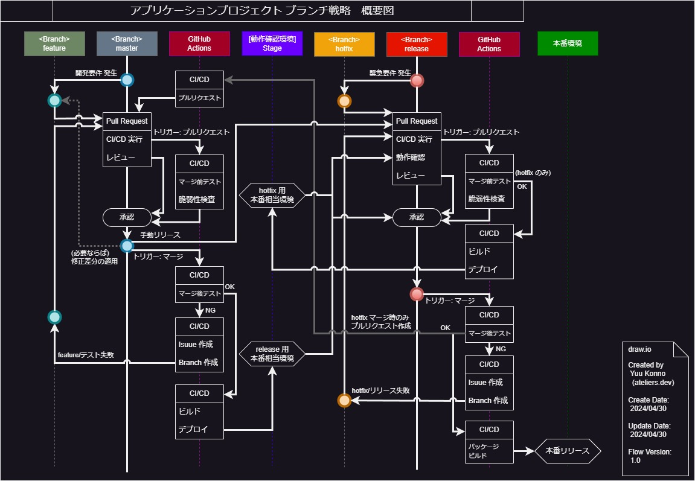

---
# Docusaurus メタデータ 
id: github-guidelines-branch-strategy
slug: /github-guidelines/branch-strategy
category: GitHub ガイドライン
title: ateliers.dev - GitHub ガイドライン - ブランチ戦略
sidebar_label: ブランチ戦略
tags: [GitHub, Repository, Branch]
description: ateliers.dev のコンテンツ「GitHub ガイドライン」です。リポジトリのブランチ戦略と運用について記載しています。
image: img/jpg/ateliers-dev-github-guidelines.jpg
---

# GitHub - ブランチ戦略

*[Created: 2024/04/30, Update: 2024/05/01]*

---

この記事では GitHub リポジトリで、私がどのようにブランチを運用するかについて記載します。

:::warning

この記事は、私個人のGitHubの利用方針であり、ベストプラクティスの主張や提示ではありません。  
個人的なアプローチの紹介であり、全てのプロジェクトや環境に最適なわけではありませんが、参考にしていただければ幸いです。

:::

---

## 1. GitHub ブランチ戦略の概要

私のプロジェクトでは GitHub Flow をベースとし、Git Flow の一部の概念を取り入れたカスタムブランチ戦略を採用しています。  
また、ライブラリとプロジェクトでは、多少の異なるアプローチを取っています。  

### 1.1. 補足事項: GitHub Flow とは？

* 特徴: シンプルで、マスターブランチが常にデプロイ可能な状態を保つことに焦点を当てています。
* 適用: 小規模から中規模のプロジェクト、頻繁なリリースを行うプロジェクトに適しています。

GitHubの公式ドキュメントにあるGitHub Flowのガイドはこちらです: :outbox_tray:[Understanding the GitHub flow](https://docs.github.com/ja/get-started/using-github/github-flow)  
このリンクはGitHub Flowの基本的な概念とステップを解説しており、非常にアクセスしやすい形式で提供されています。

### 1.2. 補足事項: Git Flow とは？

* 特徴: 開発、リリース、メインテナンス、ホットフィックスのための明確に分かれたブランチを持っています。
* 適用: 複数の環境（開発、ステージング、本番）を持つ大規模なプロジェクトに適しています。

Git Flow の考案者である Vincent Driessen 氏のオリジナルブログポストはこちらです: :outbox_tray:[A successful Git branching model](https://nvie.com/posts/a-successful-git-branching-model/)  
この記事で、Git Flow がどのように開発され、どのような問題を解決するために設計されたかが詳しく説明されています。

:::warning

Git Flow の考案者である Vincent Driessen 氏は、このブログポストで Git Flow の使用について再評価を呼びかけています。具体的には、Git Flow が提案された当時の状況と、現代のソフトウェア開発の状況が異なるため、すべてのプロジェクトに Git Flow を適用するのは適切ではない場合があると指摘しています。

どのブランチ戦略を選択するかは、プロジェクトの特性やチームのニーズに応じて決定するべきであり、一つのモデルが全てのケースに適用可能な万能薬ではないという考えが示されています。

:::

---

## 2. 前置き

* GitHub Actions で、様々なトリガーを元に CI/CD を実行しますが、その詳細な内容については省略します。  
  (記事作成中、完了後にリンク)
* GitHub Actions で、定期的なセキュリティスキャンやパッケージの脆弱性スキャンを実行しますが、ブランチ運用フローとは異なるため、省略します。  
  (記事作成中、完了後にリンク)
* プルリクエストの作成方針や承認方針、レビュー方針についても、ブランチ戦略とは異なるため、省略します。  
  (記事作成中、完了後にリンク)

---

## 3. ライブラリプロジェクトのブランチ戦略

GitHub Flow の単純さと Git Flow のリリース管理の利点を組み合わせたカスタムブランチ戦略を採用しています。  
この戦略は、個人プロジェクトや小規模なチームでの利用をターゲットとして、効率的な開発と厳格なリリースプロセスのバランスをとることを目指しています。

**ライブラリのブランチ戦略 概要図:**  

### 3.1. やること簡単まとめ

ブランチやワークフロー図が複雑に見えますが、人の手でやることは基本的に以下の6つのみで、簡単です。

* 開発は master から feature を作り master に戻します。
  * リリースしたい時は master を release に手動でプルリクエストします。
* 緊急パッチは release から hotfix を作り release に戻します。
  * hotfix のプルリクエストマージ後 master に対して自動でプルリクエストが作られるので、レビューとコンフリクトを対応し、マージします。
  * 必要であれば feature ブランチに master の修正を取り込みます。
* master および release へマージ後、自動でマージ後のテストが実行されます。失敗した場合はイシューやブランチが作成されるので、問題を修正します。

### 3.2. ブランチ戦略をカスタムした理由

コンセプトは『可能な限りシンプルに、しかし最低限の品質チェックポイントは設ける』です。

* 単純明快に「master から派生し、master にマージ」のフローを採用したかった。
* しかし GitHub Actions で master のマージをトリガーとして自動ビルドとデプロイを行うと、マージが発生するたびに中途半端なリリースが行われるため、release ブランチを追加。
* release ブランチを追加することで、リリース前の機能が含まれた master との住みわけが可能となり、hotfix ブランチの追加が可能となる。これにより、緊急対応を可能とした。

可能な限り複雑さを排除し、シンプル化を図るも、品質担保と自動化を取り入れるため、このようなカスタムブランチ戦略を採用しました。

### 3.3. ブランチの詳細説明

* master ブランチ:  
  中核となり、最新の安定版を保持します。  
  基本的には常にリリースが可能な状態を目指しますが、マージの結果によっては自動テストに失敗する可能性もあります。  
  このテストが失敗する状態は、優先的かつ速やかに修正を行います。

  直接的な機能のコミットは許可されず、すべての新機能や修正は派生ブランチで行い、プルリクエストを介してマージします。  
  プルリクエストは、自動テストとセキュリティチェックを通過する必要があります。

  ただし例外として、README や LICENSE などのドキュメントの変更は、プルリクエストを介さずに直接 master ブランチのコミットを許可します。

* release ブランチ:  
  特定のリリース準備が整った時、master ブランチからこのブランチにマージされます。  
  masetr および hotfix ブランチからのみマージを許可します。  
  release ブランチへのマージをトリガーとして、自動ビルドが行われ、GitHub Packagesへのデプロイを実行します。

  いかなるケースであっても、例外は許可されません。

* feature (develop) ブランチ:  
  新機能や大きな変更は短命のフィーチャーブランチで開発され、レビューとテストを経て master にマージされます。
  master ブランチから派生し、プルリクエストを介して master ブランチにマージします。  
  
  例外として、個人の開発であるため develop は長寿命のブランチとして使用します。  
  (１人での開発で複数の feature ブランチは、管理工数だけが無駄に増えるためです)

* hotfix ブランチ:  
  急を要するバグ修正やセキュリティの問題は、release ブランチから派生した短命の hotfix ブランチで修正されます。  
  プルリクエストは release ブランチに対して行います。

  **繰り返しますが master からの派生ではなく、release ブランチから派生**します。  
  master はリリース前の機能が含まれるため、hotfix への派生はできません。

  hotfix ブランチの適用後、release ブランチから master へのマージを行い、修正を適用します。 各 feature ブランチは、該当の修正が必要であれば、master ブランチからマージを行います。

この戦略により、開発の柔軟性が保たれつつ、リリースの品質と整理が向上し、最終的な製品の安定性とセキュリティが確保されます。

### 3.4. 複数任での作業時の注意点

もしこの戦略を参考にし、複数人での開発を行う場合、以下の運用方法を推奨します。

* feature から master のプルリクエスト前に、master との差分が無いか、確認してください。  
  差分がある場合、マージによってビルドエラーが発生したり、自動テストに失敗する可能性があります。

### 3.5 改善の余地

いくつか改善の余地があります。

* マージ後の自動テストに失敗時、ブランチを作成します。このフローでは master マージ後の失敗は featue ブランチを作成しますが、厳密には feature とは呼べません。  
  私はこれ以上ブランチの種別を増やしたくないため feature で対応していますが fix-test-failures- などのプレフィックスに変更することで、より明確にすることができます。
* 同様に release マージ後のテスト失敗時に release ブランチを作成しますが、これも厳密には release ではありません。  
  理由も同様で、ブランチ種別を増やしたくないので release で対応することとしていますが、プレフィックスを変更することで、明確にすることができます。

---

## 4. アプリケーションプロジェクトのブランチ戦略

基本的にはライブラリプロジェクトと同様のブランチ戦略を採用しますが、本番同等環境（いわゆるステージング）が存在する点だけが違います。

**アプリケーションのブランチ戦略 概要図:**

### 4.1. ライブラリプロジェクトとの相違点

ステージング環境が存在するため、実際に動作確認を行ってリリースを評価する点が異なります。

* master ではマージ後のテストが正常終了後、release 用のステージング環境に自動デプロイを行います。
  * 手動リリース時に、プルリクエスト承認の評価対象として、動作確認を行います。
* hotfix 時は、マージ前のテストが正常終了後、hotfix 用のステージング環境に自動デプロイを行います。
  * master と同様に hotfix のプルリクエスト承認の評価対象として、動作確認を行います。

:::warning

フローを運用する上でバックアップやロールバック計画も重要になりますが、この記事でその点まで定めるとコード管理方針の域を超え、運用方針やインフラストラクチャ管理戦略に発展します。
この理由により、ここでは省略します。

:::

### 4.2. 適用の範囲

ステージング環境への自動デプロイは、可能なものに限ります。  
例えば Android アプリケーションではエミュレーターによる確認はできますが『実機で確認したい』場合、ステージング環境へのデプロイは事実上不可能です。

このような場合は、ステージング環境への自動デプロイを適用外とし、手動で動作確認を行います。

### 4.3. 改善の余地

* master においては、自動で release 用のステージングに自動デプロイすることは、一長一短です。  
  便利である一方で、リリース検証中の動作確認とテストが全てやり直しとなる可能性があります。
* 同様の理由で、マージ後のテスト成功をステージングの自動デプロイトリガーとするのではなく、release へのプルリクエストをトリガーとすることも検討できます。  
  ただしこの場合は、master のマージ後テストが必ず成功する状態にあるかが不明確であるため、注意が必要です。

飽くまでも個人プロジェクトや小規模チーム向けのブランチ戦略であり、コストが最優先の簡略化されたフローです。  
厳密なバージョン管理やリリース機能の管理が必要な場合は、より複雑なブランチ戦略を検討することをお勧めします。

---

## 5. ブランチの命名方針

プレフィックスだけは、自動化の都合上、一定のルールを設ける必要があります。  
他はある程度、他者から見て理解ができれば、割と自由で良いかなと考えています。

### 5.1. プレフィックスはスラッシュ(`/`)で区切る

ハイフンで区切ったり、アンダースコアで区切ったりと、様々なプロジェクトでそれぞれの方針を取られていますが、私はスラッシュ(`/`)で区切ることを選択します。  

CI/CD のトリガーや、プルリクエストの可否などに使用するため、プレフィックスだけはしっかりと運用します。

例:

* `feature/issue-001`
* `feature/issue-002`
* `hotfix/issue-003`
* `hotfix/bug-fix`
* `hotfix/security-fix`

### 5.2. その他の方針

各々で管理しやすいように、ブランチ名は各自の裁量で良いかなと考えています。ブランチ名が致命的になる事は無いので。  
大事なのは『master から派生し master に戻る』ということだけです。

参考として、私がブランチの命名方針としていることは、以下の通りです。

* 全て小文字で命名する。 (`feature/db-migration-update` など)
* 可能であればタスクと紐付けする。 (`feature/issue-001` など)
* タスクと紐付かない場合、機能や修正内容を簡潔に表現する。 (`hotfix/culculate-bug-fix` など)
* サブタスクはスラッシュ(`/`)やハイフン(`-`)で区切る。 (`feature/issue-001/subtask-001` など)

---

## 6. タグの使用方針

タグは、リリースのタイミングでタグ設定することを基本方針としています。

### 6.1. タグ付けの命名方針

セマンティックバージョニング（SemVer）を用いて、メジャー.マイナー.パッチの形式でタグ付けします。（例: v1.0.0, v1.0.1 など）  
必要であれば、プレリリースやリリース候補(RC)、ベータ版のタグを設定します。（例: v2.0.0-pre, v2.0.0-rc1, v2.0.0-beta）

バージョン管理方針はブランチ戦略から外れてしまうため、詳細は省略しますが、以下の法則でバージョンを管理します。

* メジャー: 以前と互換性が損なわれる変更や、破壊的変更、大幅な機能の修正などを伴う場合にインクリメントします。
* マイナー: 以前との確かな互換性が保証され、新機能の追加や既存機能の拡張、バグ修正の場合にインクリメントします。
* パッチ: 既存の機能に影響を与えないバグ修正や、軽微な変更の場合にインクリメントします。

基本方針として master から release への手動リリース時にマイナーをインクリメントします。
hotfix での修正時には、パッチをインクリメントします。

詳しくは別のドキュメントを参照してください。  
(作成中)

### 6.2. タグ付けのタイミング

ライブラリもアプリケーションも、本番環境へのリリースが確認されたタイミングでタグを設定します。

* リリース時にタグを設定することで、バグのトラブルシューティングや以前のバージョンの回帰テストに利用します。
* 変更履歴の追跡として使用し、どの変更がどのリリースに含まれているかを確認するために利用します。

---
