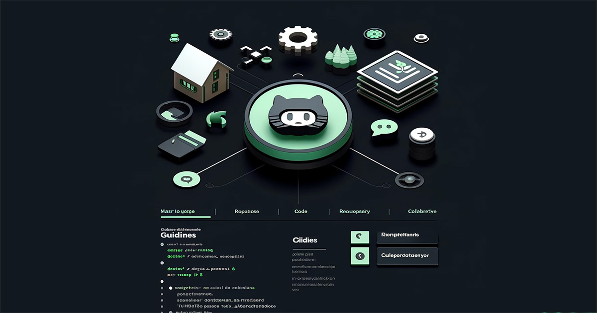

---
# Docusaurus メタデータ 
id: github-guidelines-index
slug: /github-guidelines/
category: GitHub ガイドライン
title: ateliers.dev - GitHub ガイドライン
sidebar_label: GitHub ガイドライン
tags: [github-guidelines]
description: ateliers.dev のコンテンツ「GitHub ガイドライン」のトップページです。
image: img/jpg/ateliers-dev-github-guidelines.jpg
---

# GitHub ガイドライン
*[Created: 2024/04/21, Update: 2024/04/24]*

---

---

GitHubの個人的な使用方針に関するドキュメントです。  
ここでは「私はGitHubをこう使っています」というスタイルが反映されています。

また各リポジトリに関する情報を記載します。

## ガイドライン コンテンツ概要

このセクションの概要は、以下の通りです。

* GitHubを使用したプロジェクト管理やコード共有のベストプラクティスを示します。
* コントリビューションの方法、ブランチ戦略、プルリクエストのガイドラインなど、具体的なガイドラインを設定します。
