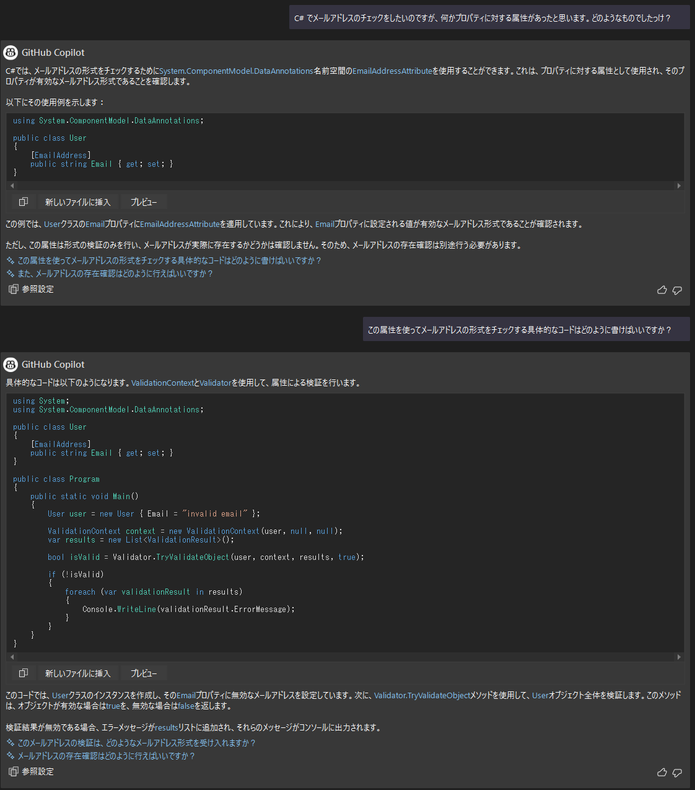
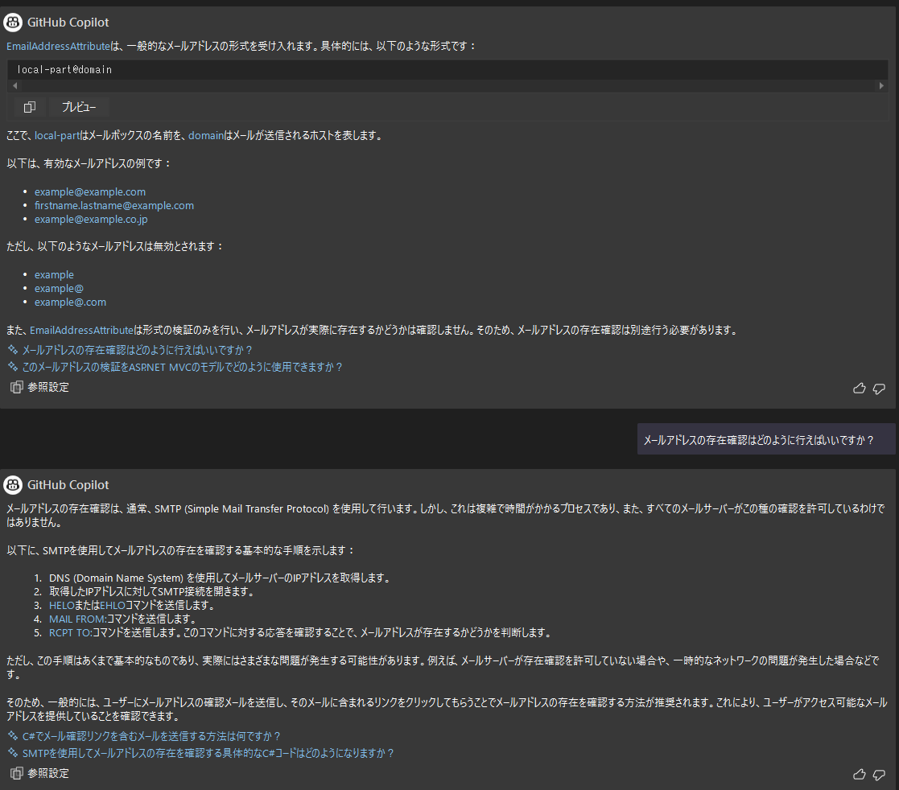
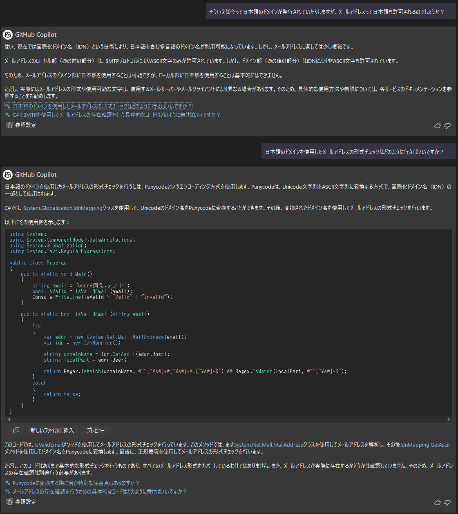
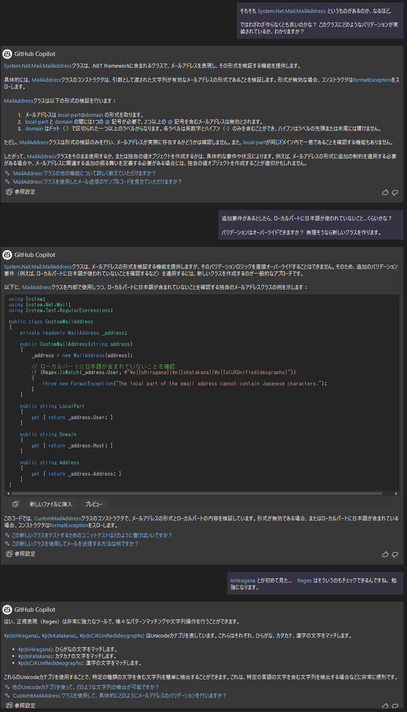
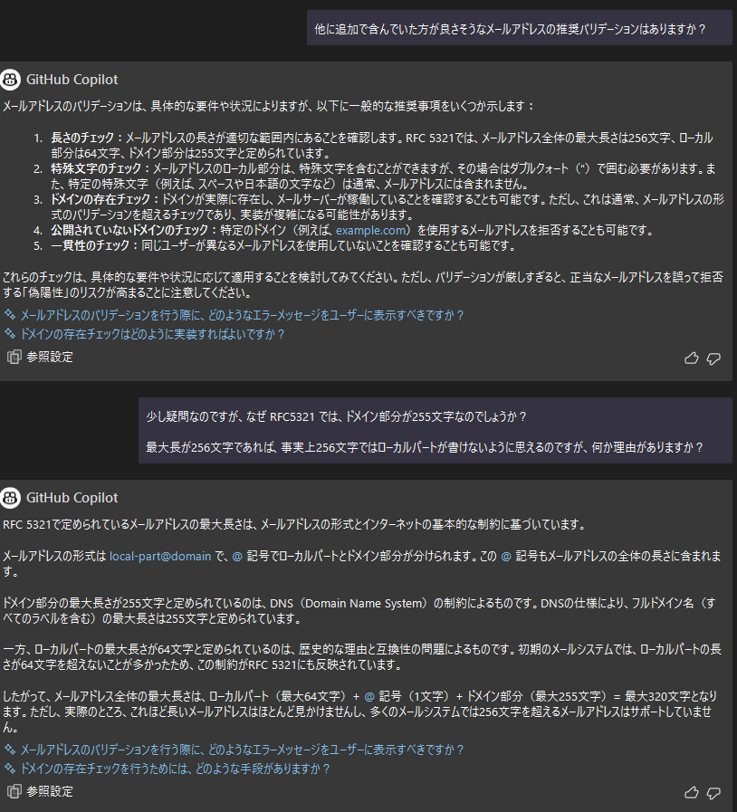

---
id: technical-notebook-ai-chat-memos-csharp-20240410-about-email-address
slug: /technical-notebook/ai-chat-memos/csharp/20240410-about-email-address
category: テクニカルノート
title: 【C#】 メールアドレスについて | ateliers.dev
sidebar_label: 【C#】 メールアドレスについて
tags: [AI, GitHub-Copilot, C#]
description: ateliers.dev のコンテンツ「テクニカルノート」です。C# でメールアドレスの形式チェックに関するメモ書きです。
image: img/jpg/ateliers-dev-technical-notebook.jpg
---

import ArticlesTable from '@site/src/components/ArticlesTable';

# メールアドレスについて

---

調査日: 2024/04/10  
***生成AIは日々進化しているため、調査日時点の情報であることに注意してください。***

---

GitHub Copilot による問答で、メールアドレスの形式チェックに関するメモです。  
社内でメールを扱う変更要件が発生したため、C#でのメールアドレスのチェック方法について調査しました。

---

## 1. メールアドレスの形式チェックについて

---

### 1.1. メールアトリビュート

#### 1.1.1. Question

***私:***  
C# でメールアドレスのチェックをしたいのですが、何かプロパティに対する属性があったと思います。  
どのようなものでしたっけ？

#### 1.1.2. Answer

***GitHub Copilot:***  
C#では、メールアドレスの形式をチェックするために `System.ComponentModel.DataAnnotations` 名前空間の `EmailAddressAttribute` を使用することができます。  
これは、プロパティに対する属性として使用され、そのプロパティが有効なメールアドレス形式であることを確認します。

以下にその使用例を示します：

```csharp
using System.ComponentModel.DataAnnotations;

public class User
{
    [EmailAddress]
    public string Email { get; set; }
}
```

この例では、`User` クラスの `Email` プロパティに `EmailAddressAttribute` を適用しています。  
これにより、`Email` プロパティに設定される値が有効なメールアドレス形式であることが確認されます。  
ただし、この属性は形式の検証のみを行い、メールアドレスが実際に存在するかどうかは確認しません。  
そのため、メールアドレスの存在確認は別途行う必要があります。

---

### 1.2. コーディング例

#### 1.2.1. Question

***私:***  
この属性を使ってメールアドレスの形式をチェックする具体的なコードはどのように書けばいいですか？

#### 1.2.2. Answer

***GitHub Copilot:***  
具体的なコードは以下のようになります。  
`ValidationContext` と `Validator` を使用して、属性による検証を行います。

```csharp
using System;
using System.ComponentModel.DataAnnotations;

public class User
{
    [EmailAddress]
    public string Email { get; set; }
}

public class Program
{
    public static void Main()
    {
        User user = new User { Email = "invalid email" };

        ValidationContext context = new ValidationContext(user, null, null);
        var results = new List<ValidationResult>();

        bool isValid = Validator.TryValidateObject(user, context, results, true);

        if (!isValid)
        {
            foreach (var validationResult in results)
            {
                Console.WriteLine(validationResult.ErrorMessage);
            }
        }
    }
}
```

このコードでは、`User` クラスのインスタンスを作成し、その `Email` プロパティに無効なメールアドレスを設定しています。  
次に、`Validator.TryValidateObject` メソッドを使用して、`User` オブジェクト全体を検証します。  
このメソッドは、オブジェクトが有効な場合はtrueを、無効な場合は `false` を返します。
検証結果が無効である場合、エラーメッセージが `results` リストに追加され、それらのメッセージがコンソールに出力されます。

---

### 1.3. メールアドレスの形式チェック

#### 1.3.1. Question

***私:***  
このメールアドレスの検証は、どのようなメールアドレス形式を受け入れますか？

#### 1.3.2. Answer

***GitHub Copilot:***  
`EmailAddressAttribute` は、一般的なメールアドレスの形式を受け入れます。  
具体的には、以下のような形式です：

```email
local-part@domain
```

以下は、有効なメールアドレスの例です：  

* `example@example.com`  
* `firstname.lastname@example.com`  
* `example@example.co.jp`

ただし、以下のようなメールアドレスは無効とされます：  

* `example`  
* `example@`  
* `example@.com`  

また、`EmailAddressAttribute` は形式の検証のみを行い、メールアドレスが実際に存在するかどうかは確認しません。  
そのため、メールアドレスの存在確認は別途行う必要があります。

---

### 1.4. メールアドレスの存在チェックは省略

---

### 1.5. 日本語ドメインはどうする？

#### 1.5.1 Question

***私:***  
そういえば今って日本語のドメインが発行されていたりしますが、メールアドレスって日本語も許可されるのでしょうか？

#### 1.5.2 Answer

***GitHub Copilot:***  
はい、現在では国際化ドメイン名（IDN）という技術により、日本語を含む多言語のドメイン名が利用可能になっています。  
しかし、メールアドレスに関しては少し複雑です。

メールアドレスのローカル部（@の前の部分）は、SMTPプロトコルによりASCII文字のみが許可されています。  
しかし、ドメイン部（@の後の部分）はIDNにより非ASCII文字も許可されています。

そのため、メールアドレスのドメイン部に日本語を使用することは可能ですが、ローカル部に日本語を使用することは基本的にはできません。

ただし、実際にはメールアドレスの形式や使用可能な文字は、使用するメールサーバーやメールクライアントにより異なる場合があります。  
そのため、具体的な使用方法や制限については、各サービスのドキュメンテーションを参照することをお勧めします。

---

### 1.6. 日本語ドメインメールのチェック

#### 1.6.1. Question

***私:***  
日本語のドメインを使用したメールアドレスの形式チェックはどのように行えばいいですか？

#### 1.6.2. Answer

***GitHub Copilot:***  
日本語のドメインを使用したメールアドレスの形式チェックを行うには、Punycodeというエンコーディング方式を使用します。  
Punycodeは、Unicode文字列をASCII文字列に変換する方式で、国際化ドメイン名（IDN）の一部として使用されます。

C#では、`System.Globalization.IdnMapping`クラスを使用して、Unicodeのドメイン名をPunycodeに変換することができます。  
その後、変換されたドメイン名を使用してメールアドレスの形式チェックを行います。

以下にその使用例を示します：

```csharp
using System;
using System.ComponentModel.DataAnnotations;
using System.Globalization;
using System.Text.RegularExpressions;

public class Program
{
    public static void Main()
    {
        string email = "user@例え.テスト";
        bool isValid = IsValidEmail(email);
        Console.WriteLine(isValid ? "Valid" : "Invalid");
    }

    public static bool IsValidEmail(string email)
    {
        try
        {
            var addr = new System.Net.Mail.MailAddress(email);
            var idn = new IdnMapping();

            string domainName = idn.GetAscii(addr.Host);
            string localPart = addr.User;

            return Regex.IsMatch(domainName, @"^[^\s@]+@[^\s@]+\.[^\s@]+$") && Regex.IsMatch(localPart, @"^[^\s@]+$");
        }
        catch
        {
            return false;
        }
    }
}
```

このコードでは、`IsValidEmail`メソッドを使用してメールアドレスの形式チェックを行っています。  
このメソッドでは、まず `System.Net.Mail.MailAddress` クラスを使用してメールアドレスを解析し、その後 `IdnMapping.GetAscii` メソッドを使用してドメイン名をPunycodeに変換します。  
最後に、正規表現を使用してメールアドレスの形式チェックを行います。

ただし、このコードはあくまで基本的な形式チェックを行うものであり、すべてのメールアドレス形式をカバーしているわけではありません。  
また、メールアドレスが実際に存在するかどうかは確認していません。  
そのため、メールアドレスの存在確認は別途行う必要があります。

---

## 2. 参考画像

---

以下は GitHub Copilot によって生成された応答のスクリーンショットです。

---
---



---



---



---

## 3. 2004/04/11 追記 - 1

---

### 3.1. 追加バリデーションの検討

#### 3.1.1. Question

***私:***  
そもそも `System.Net.Mail.MailAddress` というものがあるのか、なるほど。

ではわざわざ作らなくとも良いのかな？  
このクラスにどのようなバリデーションが実装されているか、わかりますか？

#### 3.1.2. Answer

***GitHub Copilot:***  
`System.Net.Mail.MailAddress` クラスは、.NET Frameworkに含まれるクラスで、メールアドレスを表現し、その形式を検証する機能を提供します。

具体的には、`MailAddress`クラスのコンストラクタは、引数として渡された文字列が有効なメールアドレスの形式であることを検証します。  
形式が無効な場合、コンストラクタは`FormatException`をスローします。

`MailAddress`クラスは以下の形式の検証を行います：  

1. メールアドレスは `local-part@domain` の形式を取ります。  
2. `local-part` と `domain` の間には1つの `@` 記号が必要で、2つ以上の `@` 記号を含むメールアドレスは無効とされます。  
3. `domain` はドット（.）で区切られた一つ以上のラベルからなります。各ラベルは英数字とハイフン（-）のみを含むことができ、ハイフンはラベルの先頭または末尾には置けません。  

ただし、`MailAddress`クラスは形式の検証のみを行い、メールアドレスが実際に存在するかどうかは確認しません。  
また、`local-part` が同じドメイン内で一意であることを確認する機能もありません。

したがって、`MailAddress` クラスをそのまま使用するか、または独自の値オブジェクトを作成するかは、具体的な要件や状況によります。  
例えば、メールアドレスの形式に追加の制約を適用する必要がある場合や、メールアドレスに関連する追加の振る舞いを定義する必要がある場合には、独自の値オブジェクトを作成することが適切かもしれません。

---

### 3.2. バリデーションの追加

#### 3.2.1. Question

***私:***  
追加要件があるとしたら、ローカルパートに日本語が使われていないこと…くらいかな？

バリデーションはオーバーライドできますか？ 無理そうなら新しいクラスを作ります。

#### 3.2.2. Answer

***GitHub Copilot:***  
`System.Net.Mail.MailAddress`クラスは、.NET Frameworkに含まれるクラスで、メールアドレスを表現し、その形式を検証する機能を提供します。

具体的には `MailAddress` クラスのコンストラクタは、引数として渡された文字列が有効なメールアドレスの形式であることを検証します。  
形式が無効な場合、コンストラクタは `FormatException` をスローします。

以下に `MailAddress` クラスを内部で使用しつつ、ローカルパートに日本語が含まれていないことを確認する独自のメールアドレスクラスの例を示します：

```csharp
using System;
using System.Net.Mail;
using System.Text.RegularExpressions;

public class CustomMailAddress
{
    private readonly MailAddress _address;

    public CustomMailAddress(string address)
    {
        _address = new MailAddress(address);

        // ローカルパートに日本語が含まれていないことを確認
        if (Regex.IsMatch(_address.User, @"\p{IsHiragana}|\p{IsKatakana}|\p{IsCJKUnifiedIdeographs}"))
        {
            throw new FormatException("The local part of the email address cannot contain Japanese characters.");
        }
    }

    public string LocalPart
    {
        get { return _address.User; }
    }

    public string Domain
    {
        get { return _address.Host; }
    }

    public string Address
    {
        get { return _address.Address; }
    }
}
```

このコードでは、`CustomMailAddress`クラスのコンストラクタで、メールアドレスの形式とローカルパートの内容を検証しています。  
形式が無効である場合、またはローカルパートに日本語が含まれている場合、コンストラクタは `FormatException` をスローします。

---

### 3.3. 正規表現チェック（参考）

#### 3.3.1. Question

***私:***  
`IsHiragana` とか初めて見た…  
`Regex` はそういうのもチェックできるんですね。 勉強になります。

#### 3.3.2. Answer

***GitHub Copilot:***  
はい、正規表現（Regex）は非常に強力なツールで、様々なパターンマッチングや文字列操作を行うことができます。  
`\p{IsHiragana}` `\p{IsKatakana}` `\p{IsCJKUnifiedIdeographs}` はUnicodeカテゴリを表しています。

これらはそれぞれ、ひらがな、カタカナ、漢字の文字をマッチします。

* `\p{IsHiragana}`: ひらがなの文字をマッチします。  
* `\p{IsKatakana}`: カタカナの文字をマッチします。  
* `\p{IsCJKUnifiedIdeographs}`: 漢字の文字をマッチします。

これらのUnicodeカテゴリを使用することで、特定の種類の文字を含む文字列を簡単に検出することができます。  
これは、特定の言語の文字を含む文字列を検出する場合などに非常に便利です。

---

### 3.4. 個人的な感想

メールももちろんであるが **正規表現（Regex）のひらがな、カタカナ、漢字のマッチング** は、覚えておいた方が良いと思う。  
使う機会は、必ずある。

---

### 3.5. スクリーンショット

---



---

## 4. 2004/04/11 追記 - 2

---

### 4.1. メールアドレスの追加バリデーション

#### 4.1.1. Question

***私:***  
他に追加で含んでいた方が良さそうなメールアドレスの推奨バリデーションはありますか？

#### 4.1.2. Answer

***GitHub Copilot:***  
メールアドレスのバリデーションは、具体的な要件や状況によりますが、以下に一般的な推奨事項をいくつか示します：

1. 長さのチェック：メールアドレスの長さが適切な範囲内にあることを確認します。RFC 5321では、メールアドレス全体の最大長さは256文字、ローカル部分は64文字、ドメイン部分は255文字と定められています。
2. 特殊文字のチェック：メールアドレスのローカル部分は、特殊文字を含むことができますが、その場合はダブルクォート（"）で囲む必要があります。また、特定の特殊文字（例えば、スペースや日本語の文字など）は通常、メールアドレスには含まれません。
3. ドメインの存在チェック：ドメインが実際に存在し、メールサーバーが稼働していることを確認することも可能です。ただし、これは通常、メールアドレスの形式のバリデーションを超えるチェックであり、実装が複雑になる可能性があります。
4. 公開されていないドメインのチェック：特定のドメイン（例えば `example.com`）を使用するメールアドレスを拒否することも可能です。
5. 一貫性のチェック：同じユーザーが異なるメールアドレスを使用していないことを確認することも可能です。

これらのチェックは、具体的な要件や状況に応じて適用することを検討してみてください。ただし、バリデーションが厳しすぎると、正当なメールアドレスを誤って拒否する「偽陽性」のリスクが高まることに注意してください。

---

### 4.2. メールアドレスの長さ

#### 4.2.1. Question

***私:***  
少し疑問なのですが、なぜ RFC5321 では、ドメイン部分が255文字なのでしょうか？

最大長が256文字であれば、事実上256文字ではローカルパートが書けないように思えるのですが、何か理由がありますか？

#### 4.2.2. Answer

***GitHub Copilot:***  
RFC 5321で定められているメールアドレスの最大長さは、メールアドレスの形式とインターネットの基本的な制約に基づいています。

メールアドレスの形式は `local-part@domain` で、`@` 記号でローカルパートとドメイン部分が分けられます。  
この `@` 記号もメールアドレスの全体の長さに含まれます。

ドメイン部分の最大長さが255文字と定められているのは、DNS（Domain Name System）の制約によるものです。  
DNSの仕様により、フルドメイン名（すべてのラベルを含む）の最大長さは255文字と定められています。

一方、ローカルパートの最大長さが64文字と定められているのは、歴史的な理由と互換性の問題によるものです。  
初期のメールシステムでは、ローカルパートの長さが64文字を超えないことが多かったため、この制約がRFC 5321にも反映されています。

したがって、メールアドレス全体の最大長さは、ローカルパート（最大64文字）+ @ 記号（1文字）+ ドメイン部分（最大255文字）= 最大320文字となります。  
ただし、実際のところ、これほど長いメールアドレスはほとんど見かけませんし、  
**多くのメールシステムでは256文字を超えるメールアドレスはサポートしていません。**

---

### 4.3. まとめ

* ローカルパート：最大 64 文字  
* ドメイン：最大 255 文字  
* 全体の最大長：320 文字 （`@` を含む）  

ということなので、バリデーションは  

* ローカルパート：64 文字  
* ドメイン：254 文字　（`@` やローカルパート含むと、256文字超えてしまうので 254）  
* 全体の最大長：256 文字  

で良いと思われる。  
データベースのカラム長は、256文字で設定しておくと良いかもしれない。

---

### 4.4. スクリーンショット

---



---
