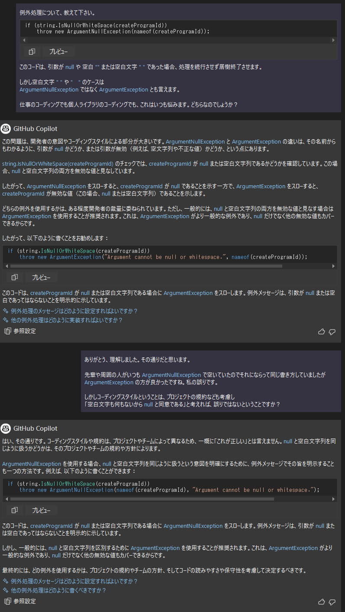

import ArticlesTable from '@site/src/components/ArticlesTable';

# C#のパラメータnullや空文字の例外種別について

---

調査日：2024/04/12  
***生成AIは日々進化しているため、調査日時点の情報であることに注意してください。***

---

## 1. このメモについて

発生させる例外を `ArgumentNullException` とするか `ArgumentException` とするか、という問題です。  
コードレビュー時、パラメータがnullや空文字の例外処理で、指摘するべきかどうか迷いました。

自分自身の知識があいまいであったため、GitHub Copilotに質問してみました。

---

【誤字】

* 「居樹終了」 → 「異常終了」
* 「空いていたので」→「書いていたので」

朝だから寝ぼけてました…　Question はそのまま文字起こしします。

---

### 1.1. `ArgumentNullException`か`ArgumentException`なのか

#### 1.1.1. You - Question

***私：***  
例外処理について、教えて下さい。

```csharp
if (string.IsNullOrWhiteSpace(createProgramId))
    throw new ArgumentNullException(nameof(createProgramId));
```

このコードは、引数が `null` や 空白 `""` または空白文字 `" "` であった場合、処理を続行させず居樹終了させます。  

しかし空白文字 `" "` や `"　"` のケースは
`ArgumentNullException` ではなく `ArgumentException` とも言えます。

仕事のコーディングでも個人ライブラリのコーディングでも、これはいつも悩みます。  
どちらなのでしょうか？

#### 1.1.2. Answer

***GitHub Copilot：***  
この問題は、開発者の意図やコーディングスタイルによる部分が大きいです。  
`ArgumentNullException` と `ArgumentException` の違いは、その名前からもわかるように、引数が `null` かどうか、または引数が無効（例えば、空文字列や不正な値）かどうか、という点にあります。

`string.IsNullOrWhiteSpace(createProgramId)` のチェックでは、`createProgramId` が `null` または空白文字列であるかどうかを確認しています。  
この場合、`null` と空白文字列の両方を無効な値と見なしています。

したがって、`ArgumentNullException` をスローすると、`createProgramId` が `null` であることを示す一方で、`ArgumentException` をスローすると、`createProgramId` が無効な値（この場合、`null` または空白文字列）であることを示します。

どちらの例外を使用するかは、ある程度開発者の裁量に委ねられています。  
ただし、一般的には、`null` と空白文字列の両方を無効な値と見なす場合は `ArgumentException` を使用することが推奨されます。  
これは、`ArgumentException` がより一般的な例外であり、`null` だけでなく他の無効な値もカバーできるからです。

したがって、以下のように書くことをお勧めします：

```csharp
if (string.IsNullOrWhiteSpace(createProgramId))
    throw new ArgumentException("Argument cannot be null or whitespace.", nameof(createProgramId));
```

このコードは、`createProgramId` が `null` または空白文字列である場合に `ArgumentException` をスローします。
例外メッセージは、引数が `null` または空白であってはならないことを明示的に示しています。

---

### 1.2. 結局どちらが正しいのか？

#### 1.2.1. Question

***私：***  
ありがとう、理解しました。その通りだと思います。

先輩や周囲の人がいつも `ArgumentNullException` で空いていたのでそれにならって同じ書き方していましたが  
`ArgumentException` の方が良かったですね。私の誤りです。

しかしコーディングスタイルということは、プロジェクトの規約なども考慮し  
「空白文字も何もないから `null` と同意である」と考えれば、誤りではないということですか？

#### 1.2.2. Answer

***GitHub Copilot：***  
はい、その通りです。  
コーディングスタイルや規約は、プロジェクトやチームによって異なるため、一概に「これが正しい」とは言えません。  
`null` と空白文字列を同じように扱うかどうかは、そのプロジェクトやチームの規約や方針によります。

`ArgumentNullException` を使用する場合、`null` と空白文字列を同じように扱うという意図を明確にするために、例外メッセージでその旨を明示することも一つの方法です。  

例えば、以下のように書くことができます：

```csharp
if (string.IsNullOrWhiteSpace(createProgramId))
    throw new ArgumentNullException(nameof(createProgramId), "Argument cannot be null or whitespace.");
```

このコードは、`createProgramId` が `null` または空白文字列である場合に `ArgumentNullException` をスローします。  
例外メッセージは、引数が `null` または空白であってはならないことを明示的に示しています。

しかし、一般的には、`null` と空白文字列を区別するために `ArgumentException` を使用することが推奨されます。  
これは、`ArgumentException` がより一般的な例外であり、`null` だけでなく他の無効な値もカバーできるからです。

最終的には、どの例外を使用するかは、プロジェクトの規約やチームの方針、そしてコードの読みやすさや保守性を考慮して決定するべきです。

---

## 2. 個人的な所感

結局は、プロジェクトにより選択してくださいとのことで、どうするべきか難しいのですが  
個人的には `ArgumentException` で良いと思います。

`ArgumentNullException` の場合「どこで `null` になったのか」と調査し始めますが  
`ArgumentException` の場合は「どこで無効な文字列になったのか」と調査内容をより明確にすることができます。

---

## 3. スクリーンショット

---



---
