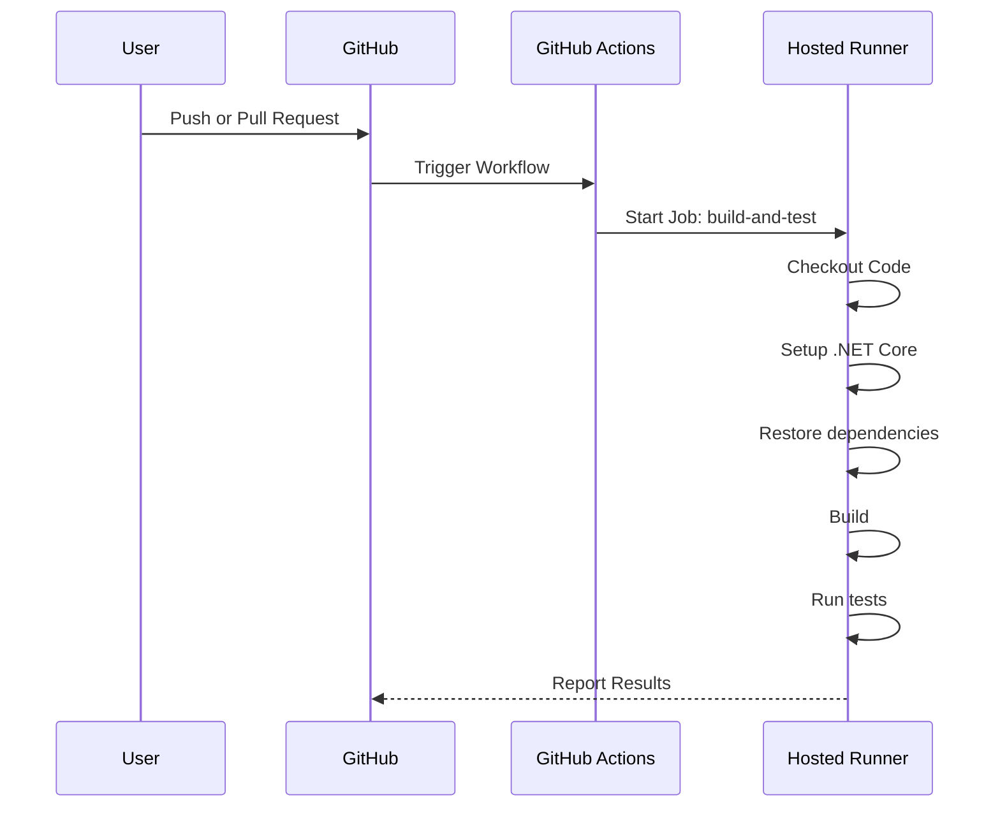

# GitHub Actions でテストの自動実行

*[Created: 2024/05/12, Update: none(same as creation date)]*

---

GitHub Actions を使用して .NET プロジェクトのテストを自動実行する方法について解説します。

:::note[購読対象層]

* 対象者: .NET 開発者や GitHub Actions を使用した CI/CD パイプラインを構築したい方。
* 記事概要: GitHub Actions を使用して .NET プロジェクトのテストを自動実行する方法について解説します。
* 技術: GitHub Actions や .NET プロジェクトのテスト自動化を学びたい方。

:::

---

## シリーズ一覧

1. GitHub Actions でテストの自動実行 (本記事)

※ 順次、新しい記事を追加していきます。

---
---

## 1. GitHub Actions とは

GitHub Actions は、GitHub が提供する CI/CD ツールです。  
GitHub Actions を使用すると、GitHub リポジトリ内でワークフローを定義し、自動化されたビルド、テスト、デプロイを行うことができます。

本記事では、この機能を使用して .NET プロジェクトのテストを自動実行する方法について解説します。

:::tip[GitHubの公式ドキュメント]
より詳しい GitHub Actions についての情報は [GitHub Actions ドキュメント](https://docs.github.com/ja/actions) を参照してください。
:::

---

## 2. シナリオ

以下のシナリオを想定します。

* プロジェクト名: Ateliers.Core
* テストプロジェクト名: Ateliers.Core.UnitTests
* テストフレームワーク: xUnit
* 要件: `master` ブランチへのプルリクエストやマージ時にテストを自動実行する
* 実行条件の例外: ソースに影響しないファイル (`*.md` や `*.yml`) の変更時はテストを実行しない

---

## 3. ワークフローの定義

GitHub Actions でテストを自動実行するためには、リポジトリ内に `.github/workflows` ディレクトリを作成し、ワークフローの定義ファイルを配置します。

以下の手順でワークフローを定義します。

1. `.github/workflows` ディレクトリを作成します。
2. `ci.yml` という名前のファイルを作成します。
3. 以下の内容を `ci.yml` に記述します。

```yaml title=".github/workflows/ci.yml" showLineNumbers
name: CI - .NET Test (Triggered by Push and PR)

on:
  pull_request:
    branches: [ master ]
    paths-ignore:
      - '**/*.md'
      - '**/*.yml'
  push:
    branches: [ master ]
    paths-ignore:
      - '**/*.md'
      - '**/*.yml'
  workflow_dispatch:

jobs:
  build-and-test:
    runs-on: windows-latest

    steps:
    - name: Checkout Code
      uses: actions/checkout@v3

    - name: Setup .NET Core
      uses: actions/setup-dotnet@v2
      with:
        dotnet-version: '8.0.x'  # .NETのバージョン指定

    - name: Restore dependencies
      run: dotnet restore

    - name: Build
      run: dotnet build --no-restore -c Release

    - name: Run tests
      run: dotnet test --no-build -c Release
```

:::info[ディレクトリについて]
ディレクトリはリポジトリのトップレベルに `.github/workflows` ディレクトリを作成します。  
具体的には `*.csproj` のプロジェクトファイルではなく `*.sln` のソリューションファイルがあるディレクトリに `.github/workflows` を作成します。

プロジェクトディレクトリではワークフローが正しく動作しないため、注意してください。
:::

シーケンス図は以下の通りです。



* **参加者（Participants）:**
  * **User:** ユーザーがプッシュまたはプルリクエストを行うエンティティ。
  * **GitHub:** リポジトリをホストしているプラットフォーム。
  * **GitHub Actions:** GitHub Actions のプロセス。
  * **Hosted Runner:** 実際のタスクを実行するホストされたランナー。
* **プロセスフロー:**
  * ユーザーが GitHub に対してプッシュまたはプルリクエストを行います。
  * GitHub はそのアクションに応じてワークフローをトリガーします。
  * GitHub Actions はホストランナー上でジョブを開始します。
  * ランナーはコードをチェックアウトし、.NETをセットアップし、依存関係を復元し、ビルドを実行し、テストを実行します。
  * 結果は GitHub に報告されます。

次に、セクションごとにワークフローの内容を解説します。

---

### 3.1. name セクション

```yaml title=".github/workflows/ci.yml" showLineNumbers
name: CI - .NET Test (Triggered by Push and PR)
```

**name** セクションは、ワークフローの名前を指定します。  
この名前は GitHub Actions のダッシュボードでワークフローを識別するために使用されます。

特別な規則は無く、任意の名前を指定できます。  
GitHub Actions にはこの名前が表示されるため、内容を理解しやすい名前を指定することが望ましいです。

---

### 3.2. on セクション

```yaml title=".github/workflows/ci.yml" showLineNumbers
on:
  pull_request:
    branches: [ master ]
    paths-ignore:
      - '**/*.md'
      - '**/*.yml'
  push:
    branches: [ master ]
    paths-ignore:
      - '**/*.md'
      - '**/*.yml'
  workflow_dispatch:

```

**on** セクションは、ワークフローのトリガーを定義します。

#### トリガー条件

* **pull_request:** プルリクエスト時にワークフローを実行します。
* **push:** プッシュ時にワークフローを実行します。
* **workflow_dispatch:** 手動でワークフローを実行します。（＝実行できます）

:::info[`push`条件について]
シナリオは「マージ後にテスト」ですが、マージも `push` として扱われるため、プルリクエストのマージ時にワークフローが実行されます。
:::

#### ブランチ条件

`pull_request:` と `push:` には、`branches: [ master ]` という条件が指定されています。  
これは `master` ブランチへのプッシュやプルリクエスト時にワークフローを実行することを示します。

#### パス条件

`pull_request:` と `push:` には、`paths-ignore:` という条件が指定されています。  
これは、指定されたパスに変更があった場合にワークフローを実行しないことを示します。

* `**/*.md`: Markdown ファイル
* `**/*.yml`: YAML ファイル

:::tip[パス条件について]
パス条件は必須ではありませんが、私個人としては  
READMEやワークフローの定義ファイルなど、ソースに影響しないファイルの変更時にテストを実行しないようにするために使用しています。

必要に応じて、パス条件を削除したり、追加したりしてください。
:::

---

### 3.3. jobs セクション

```yaml title=".github/workflows/ci.yml" showLineNumbers
jobs:
  build-and-test:
    runs-on: windows-latest

    steps:
    - name: Checkout Code
      uses: actions/checkout@v3

    - name: Setup .NET Core
      uses: actions/setup-dotnet@v2
      with:
        dotnet-version: '8.0.x'  # .NETのバージョン指定

    - name: Restore Dependencies
      run: dotnet restore

    - name: Build
      run: dotnet build --no-restore -c Release

    - name: Run Tests
      run: dotnet test --no-build -c Release
```

**jobs** セクションは、ワークフローのジョブを定義します。

#### ジョブの詳細

* **build-and-test:** ジョブの名前です。
  * **runs-on:** ジョブが実行されるランナーを指定します。  
  .NET開発に適したランナーとして、ここでは `windows-latest` を使用していますが、LinuxやmacOSも可能です。
  * **steps:** ジョブ内のステップを定義します。
    * **users:actions/checkout@v3:** リポジトリのコードをチェックアウトします。
    * **users:actions/setup-dotnet@v2:** .NET SDK をセットアップします。使用する.NETのバージョンを指定する必要があります。
    * **run: dotnet restore:** 依存関係を復元します。
    * **run: dotnet build:** プロジェクトをビルドします。 `--no-restore` は依存関係の復元をスキップするオプションです。
    * **run: dotnet test:** テストを実行します。 `--no-build` はビルドをスキップするオプションです。

#### 指定したテストのみを実行したい場合

`run: dotnet test` にパラメータを以下のように指定します。

```yaml title=".github/workflows/ci.yml" showLineNumbers
    - name: Run tests
      run: dotnet test --no-build -c Release ./path/to/Ateliers.Core.UnitTests
```

説明:

* Run Unit Tests: `dotnet test` コマンドを使用して特定のテストプロジェクトを指定します。  
  `./path/to/Ateliers.Core.UnitTests` は、`Ateliers.Core.UnitTests` プロジェクトが含まれているディレクトリへの相対パスまたは絶対パスを指定します。

この設定により、特定の単体テストプロジェクトだけを実行することができます。

#### 複数のテストプロジェクトを実行したい場合

`run: dotnet test` にパラメータを指定しますが、2つの方法があります。

1. `run: dotnet test` コマンドを複数回実行します。
2. ソリューションファイルを指定します。

コマンドを複数回実行：

```yaml title=".github/workflows/ci.yml" showLineNumbers
    - name: Run Unit Tests
      run: dotnet test --no-build -c Release ./path/to/Ateliers.Core.UnitTests

    - name: Run Integration Tests
      run: dotnet test --no-build -c Release ./path/to/Ateliers.Core.IntegrationTests

```

ソリューションを指定：

```yaml title=".github/workflows/ci.yml" showLineNumbers
    - name: Run Tests
      run: dotnet test --no-build -c Release ./path/to/Ateliers.Core.sln
```

:::warning[注意事項]

* テストプロジェクトごとに依存関係が異なる場合、それぞれの dotnet restore および dotnet build を個別に行うことが推奨されます。
* パフォーマンスを考慮し、必要ないテストは実行から除外することも検討してください。

:::

これらの方法を使えば、必要なテストプロジェクトを柔軟に実行することが可能です。

---

## 4. .NET Framework の場合

.NET Framework の場合、基本的には .NET Core と同様の手順でワークフローを定義します。
しかし、いくつかの注意点があります。

GitHub Actions では Windows ランナーを使用し、MSBuild または Visual Studio Build Tools を用いてプロジェクトをビルドします。

以下は .NET Framework のテストプロジェクトを実行するための GitHub Actions ワークフローの例です。

```yaml title=".github/workflows/ci.yml" showLineNumbers
name: .NET Framework Test Execution

on:
  push:
    branches: [ main ]
  pull_request:
    branches: [ main ]
  workflow_dispatch:

jobs:
  build-and-test:
    runs-on: windows-latest

    steps:
    - name: Checkout Code
      uses: actions/checkout@v3

    - name: Setup MSBuild path
      uses: microsoft/setup-msbuild@v1.1

    - name: Restore NuGet packages
      run: nuget restore YourSolution.sln

    - name: Build the solution
      run: msbuild YourSolution.sln /p:Configuration=Release

    - name: Run tests
      run: |
        $testProjects = Get-ChildItem -Recurse *.Tests.csproj
        foreach ($project in $testProjects)
        {
          dotnet test $project.FullName --no-build --logger "trx;LogFileName=${{ github.workspace }}\TestResults\${{ project.Name }}.trx"
        }
      shell: powershell
```

説明:

* **runs-on: .NET Framework** のビルドとテストには Windows 環境が必要なため、windows-latest を指定します。
* **Setup MSBuild path:** MSBuild のパスをセットアップします。これは .NET Framework プロジェクトのビルドに必要です。
* **Restore NuGet packages:** NuGet パッケージの復元を行います。これは nuget restore コマンドを使用して行われます。
* **Build the solution:** MSBuild を使用してソリューションをビルドします。/p:Configuration=Release はリリース構成でビルドを行うことを指定します。
* **Run tests:** PowerShell スクリプトを使用して、テストプロジェクトを探し、dotnet test コマンドでテストを実行します。このスクリプトは、複数のテストプロジェクトがある場合に便利です。

この例では、.NET Framework プロジェクトのビルドとテストを自動化するための基本的な手順を示しています。プロジェクトによっては、テストフレームワークやビルドプロセスの詳細が異なる場合があるため、適宜調整が必要です。

また、`dotnet test` コマンドを使用する場合は、テストプロジェクトが .NET Core 互換である必要があります。完全な .NET Framework テストプロジェクトの場合は、代わりに `vstest.console.exe` や他のテストランナーを使用することが考慮されるかもしれません。

---
---

## 参考リンクなど

公式ドキュメント：

| リンク | 説明 |
| --- | --- |
| [GitHub Actions ドキュメント](https://docs.github.com/ja/actions) | GitHub Actions の公式ドキュメント |
| [GitHub Actions ワークフロー構文](https://docs.github.com/ja/actions/reference/workflow-syntax-for-github-actions) | GitHub Actions ワークフローの構文についての詳細 |
| [GitHub Actions ワークフローのトリガー](https://docs.github.com/ja/actions/reference/events-that-trigger-workflows) | GitHub Actions ワークフローのトリガーについての詳細 |
| [GitHub Actions ワークフローのジョブ](https://docs.github.com/ja/actions/reference/workflow-syntax-for-github-actions#jobsjob_id) | GitHub Actions ワークフローのジョブについての詳細 |
| [GitHub Actions ワークフローのステップ](https://docs.github.com/ja/actions/reference/workflow-syntax-for-github-actions#jobsjob_idsteps) | GitHub Actions ワークフローのステップについての詳細 |

リポジトリ:

| リンク | 説明 |
| --- | --- |
| [Ateliers.Core - ci.yml](https://github.com/yuu-git/ateliers-core/blob/master/.github/workflows/ci.yml) | GitHub Actions ワークフローの例（Ateliers.Core リポジトリ） |

---

## フィードバックの提供方法と連絡先

:::tip[お知らせ]
この記事に関するフィードバックやご質問、ご意見がございましたら [プロフィールページの連絡先](/docs/profiles/self-introduction#2-連絡先) からお気軽にご連絡ください。  
貴重なディスカッションをお待ちしております。
:::

---
