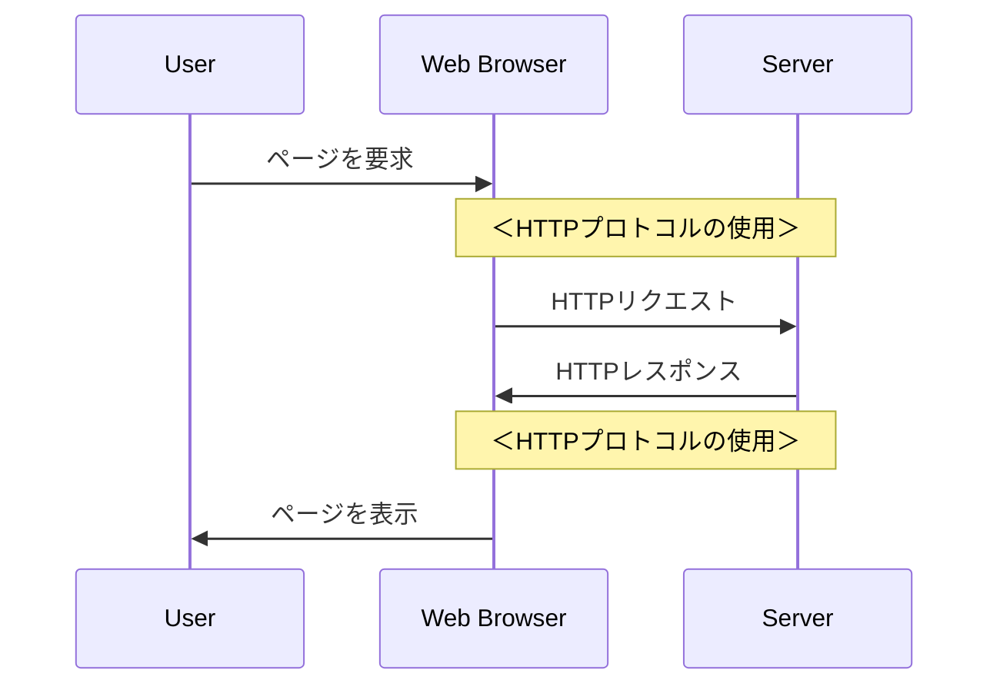

# HTTP プロトコルメソッドの基本解説

*[Created: 2024/05/05, Update: none(same as creation date)]*

---

HTTPプロトコル解説シリーズを通して、HTTP プロトコルのメソッドについて解説します。

それぞれのメソッド別ページにて、概要や使用例、使用ケースについて説明し、C# を使用した具体的なコード例も示します。  
クライアント側とサーバー側の両方についてコーディング例を記載しておりますので、参考にしてください。

:::note[購読対象層]

* 対象者: .NET 開発者やWebアプリケーション開発者。
* 記事概要: HTTPプロトコルの基本的な概念と具体的な使用例、セキュリティに関連する重要な話題について詳述します。
* 技術: HTTPプロトコルの基本を学び始めたばかりの初心者から、その知識を実際のプロジェクトに応用したい方まで。

:::

---

## シリーズ一覧

1. [HTTP GET メソッドの解説](/docs/technical-notebook/dotnet/http-protocol/get-method)
2. [HTTP POST メソッドの解説](/docs/technical-notebook/dotnet/http-protocol/post-method)
3. [HTTP PUT メソッドの解説](/docs/technical-notebook/dotnet/http-protocol/put-method)
4. [HTTP DELETE メソッドの解説](/docs/technical-notebook/dotnet/http-protocol/delete-method)
5. HTTP PATCH メソッドの解説 (作成中)
6. HTTP HEAD メソッドの解説 (作成中)
7. HTTP OPTIONS メソッドの解説 (作成中)
8. HTTP TRACE メソッドの解説 (作成中)
9. HTTP CONNECT メソッドの解説 (作成中)

---
---

## 1. HTTP プロトコルとは

HTTP（HyperText Transfer Protocol）は、インターネット上で情報を交換するための基本的なプロトコルです。  
HTTP プロトコルは、Webブラウザとサーバー間の通信を可能にする規格で、ウェブの基盤となる技術の一つです。

HTTPは「リクエスト」と「レスポンス」という二つの主要なステップを通じて情報のやり取りを行います。  
ユーザーがWebブラウザでページをリクエストすると、サーバーは適切なレスポンスを返します。

---
---

## 2. 動作する .Net バージョン

HTTPプロトコルの関連クラスは、以下の .NET バージョンでサポートされています：

* .NET Core: すべてのバージョン（1.0 以降）
* .NET Framework: 4.5 以降
* .NET Standard: 1.1 以降（ただし、2.0 が推奨されます）

:::tip[サポートのある.Netを選択する]
2024/05/05 の現時点では .Net Framework 4.5 と .Net Standard 1.1 はサポートされておらず、新規作成も推奨されません。  
つまり **".Net のサポートのあるバージョンを選択すれば使うことができる"** という認識で問題ありません。
:::

---
---

## 3. 主要な HTTP プロトコルメソッド

プロトコルのプロセスは、HTTPメソッドを使用して制御され、それぞれのメソッドは異なるタイプのリクエストと対応する動作を定義します。  
主要なHTTPメソッドには、以下のようなものがあります：

* GET: サーバーから**情報を取得**するために使用され、データを取得する際の主要な手段です。
* POST: サーバーに**データを送信**するために使用され、主にフォームの送信やファイルのアップロードに用いられます。
* PUT: サーバーにある既存の**リソースを更新**するために使用されます。
* DELETE: サーバーから特定の**リソースを削除**するために使用されます。

これらのメソッドは、Web開発においてデータの送受信を明確にするための標準的な手段として機能し、開発者がリソースの状態を効率的に管理できるように支援します。

---
---

## 4. その他の HTTP プロトコルメソッド

基本的に4つの主要メソッドの理解があれば、一般的なWebアプリケーションの開発には十分ですが、HTTPプロトコルには他にも多くのメソッドが存在します。  

* PATCH: リソースの一部を更新するために使用されます。
* HEAD: GETリクエストと同様にリソースのメタデータを取得しますが、本文は返されません。
* OPTIONS: サーバーがサポートするメソッドやリソースに関する情報を取得します。
* TRACE: リクエストをサーバーに送信し、そのリクエストがサーバーに到達するまでの経路を追跡します。
* CONNECT: プロキシサーバーを通じてリソースに接続するために使用されます。

これらのメソッドは、特定のシナリオにおいて有用である場合があります。
理解しておくことで、より高度なWebアプリケーションの開発に役に立ちます。

---
---

## 5. メソッドの冪等性とは

「冪等性(べきとうせい、英: Idempotency)」と読みます。  
HTTPメソッドの冪等性は、同一の操作を何度実行してもシステムの状態が最初の1回目の操作以降変わらないことを意味します。  
つまり、同じリクエストを繰り返し送信しても、リソースの状態に対して同じ効果が適用され、それ以上の変更が発生しない性質です。

この性質を理解することは、APIを設計し、予期しないデータの重複や矛盾を防ぐ上で非常に重要です。

:::tip[参考リンク]
参考: [wikipedia - 冪等](https://ja.wikipedia.org/wiki/%E5%86%AA%E7%AD%89)
:::

### 5.1. 各メソッドの冪等性

各HTTPメソッドの冪等性について、以下にまとめます：

| HTTPメソッド | 冪等性 | コメント |
| --- | --- | --- |
| GET | 冪等 | データの取得のみを行うため、同じリクエストを繰り返してもリソースの状態は変化しません。 |
| POST | 非冪等 | 新しいリソースを作成するため、同じリクエストを繰り返すと新しいリソースが作成される可能性があります。 |
| PUT | 冪等 | 既存のリソースを更新するため、同じリクエストを繰り返してもリソースの状態は変化しません。 |
| DELETE | 冪等 | 特定のリソースを削除するため、同じリクエストを繰り返してもリソースの状態は変化しません。 |
| PATCH | 非冪等 | リソースの一部を更新するため、同じリクエストを繰り返すとリソースの状態が変化する可能性があります。 |
| HEAD | 冪等 | GETリクエストと同様にリソースのメタデータを取得しますが、本文は返されません。 |
| OPTIONS | 冪等 | サーバーがサポートするメソッドやリソースに関する情報を取得します。 |
| TRACE | 冪等 | リクエストをサーバーに送信し、そのリクエストがサーバーに到達するまでの経路を追跡します。 |
| CONNECT | 冪等 | プロキシサーバーを通じてリソースに接続するために使用されます。 |

:::tip[より詳しい解説について]
冪等性については、各HTTPメソッド別の解説記事でも触れています。
:::

---
---

## 6. セキュリティ上の考慮事項

HTTPプロトコルは、データの送受信を行うための基本的なプロトコルですが、セキュリティ上のリスクも存在します。  

メソッド別に、主となるセキュリティ上のリスクを以下にまとめます：

| メソッド | セキュリティ上のリスク |
| --- | --- |
| GET | パラメータがURLに表示されるため、機密情報を送信する際には注意が必要です。 |
| POST | データがリクエストボディに含まれるため、GETよりもセキュアですが、暗号化されていない通信ではリスクがあります。 |
| PUT | リソースの更新を行うため、認証されていないユーザーがリソースを更新する可能性があります。 |
| DELETE | PUTと同様に、リソースの削除を行うため、認証されていないユーザーがリソースを削除する可能性があります。 |
| PATCH | PUTと同様に、リソースの一部を更新するため、認証されていないユーザーがリソースを更新する可能性があります。 |
| HEAD | リソースのメタデータを取得するため、リソースの内容を取得することはできませんが、リソースの存在を確認できます。 |
| OPTIONS | サーバーがサポートするメソッドやリソースに関する情報を取得するため、サーバーの情報が漏洩する可能性があります。 |
| TRACE | リクエストをサーバーに送信し、そのリクエストがサーバーに到達するまでの経路を追跡するため、リクエストの内容が漏洩する可能性があります。 |
| CONNECT | プロキシサーバーを通じてリソースに接続するため、プロキシサーバーを介してリソースにアクセスすることができます。 |

### 6.1. セキュリティ対策の例

セキュリティ上のリスクを軽減するために、以下のような対策を行うことが重要です：

* **HTTPSを使用する:**  
  暗号化された通信を行うことで、データの盗聴や改ざんを防ぎます。
* **パラメータの暗号化:**  
  機密情報を送信する際には、パラメータを暗号化して送信することで、情報漏洩を防ぎます。
* **認証と認可:**
  ユーザーを認証し、適切な権限を持つユーザーのみがリソースにアクセスできるようにします。
* **キャッシュコントロール:**  
  キャッシュコントロールヘッダーを適切に設定して、敏感な情報がキャッシュされないようにします。
* **セキュリティヘッダーの使用:**  
  クリックジャッキングやクロスサイトスクリプティングなどの攻撃を防ぐために、セキュリティヘッダーを使用します。
* **セキュリティテスト:**  
  セキュリティテストを定期的に実施し、システムの脆弱性を特定して修正します。
* **セキュリティアップデート:**  
  システムやライブラリのセキュリティアップデートを定期的に適用し、最新のセキュリティ対策を導入します。

:::info[HTTPSの重要性]
HTTPS（安全なHTTP）は、データを暗号化することで通信を保護します。  
これにより、データがインターネットを通じて送受信される際に、悪意のある第三者による盗聴やデータの改ざんを防ぐことができます。

HTTPSはSSL（Secure Sockets Layer）またはTLS（Transport Layer Security）プロトコルを使用して、クライアントとサーバー間のすべての通信を暗号化します。
これは、特にフォームデータや個人情報などのセンシティブな情報を扱う際に、その情報の安全を保障するために不可欠です。

使用する際は、ウェブサイトのURLが「http://」ではなく「https://」で始まることを確認してください。  
これは、そのウェブサイトがHTTPSを使用していることを示しています。
:::

### 6.2. 脆弱性を狙った攻撃

HTTPプロトコルには、以下のような脆弱性を狙った攻撃が存在します。  
簡単な概要と対策について、以下にまとめます：

* **クロスサイトスクリプティング（XSS）**
  * 概要: 悪意のあるスクリプトをWebページに埋め込むことで、ユーザーの情報を盗み出す攻撃です。
  * 対策: 入力値のエスケープやサニタイズを行い、悪意のあるスクリプトを無効化します。
* **クロスサイトリクエストフォージェリ（CSRF）**
  * 概要: ユーザーが意図しないリクエストを送信させることで、サーバーの状態を変更する攻撃です。
  * 対策: トークンやリファラチェックを利用して、不正なリクエストを防ぎます。
* **SQLインジェクション**
  * 概要: SQLクエリを改ざんすることで、データベースから機密情報を盗み出す攻撃です。
  * 対策: パラメータ化されたクエリを使用することで、SQLインジェクションを防ぎます。
* **セッションハイジャック**
  * 概要: セッションIDを盗み出し、他のユーザーのセッションを乗っ取る攻撃です。
  * 対策: セッションIDを暗号化し、HTTPSを使用して通信を暗号化することで、セッションハイジャックを防ぎます。

:::warning[ここでの説明は、簡単な概要です]
Webアプリケーションのセキュリティに関する対策は、非常に重要です。  
セキュリティに関する詳細な情報は、各攻撃に関する専門的な文献やセキュリティ専門家のアドバイスを参考にしてください。
:::
:::info[攻撃の手段は日々増えています]
攻撃者は常に新しい手法を開発しており、セキュリティ対策も日々進化しています。  
最新のセキュリティ情報を常に把握し、適切な対策を講じることが重要です。
:::

---
---

## 参考文献リンクなど

HTTPについて：

| リンク | 説明 |
| --- | --- |
| [wikipedia - HTTPS](https://ja.wikipedia.org/wiki/HTTPS) | HTTPSについてのWikipediaの記事 |
| [wikipedia - HTTPステータスコード](https://ja.wikipedia.org/wiki/HTTP%E3%82%B9%E3%83%86%E3%83%BC%E3%82%BF%E3%82%B9%E3%82%B3%E3%83%BC%E3%83%89) | HTTPステータスコードについてのWikipediaの記事 |

セキュリティ：

| リンク | 説明 |
| --- | --- |
| [wikipedia - クロスサイトスクリプティング](https://ja.wikipedia.org/wiki/%E3%82%AF%E3%83%AD%E3%82%B9%E3%82%B5%E3%82%A4%E3%83%88%E3%82%B9%E3%82%AF%E3%83%AA%E3%83%97%E3%83%86%E3%82%A3%E3%83%B3%E3%82%B0) | クロスサイトスクリプティングについてのWikipediaの記事 |
| [wikipedia - クロスサイトリクエストフォージェリ](https://ja.wikipedia.org/wiki/%E3%82%AF%E3%83%AD%E3%82%B9%E3%82%B5%E3%82%A4%E3%83%88%E3%83%AA%E3%82%AF%E3%82%A8%E3%82%B9%E3%83%88%E3%83%95%E3%82%A9%E3%83%BC%E3%82%B8%E3%83%A3%E3%83%AA) | クロスサイトリクエストフォージェリについてのWikipediaの記事 |
| [wikipedia - SQLインジェクション](https://ja.wikipedia.org/wiki/SQL%E3%82%A4%E3%83%B3%E3%82%B8%E3%82%A7%E3%82%AF%E3%82%B7%E3%83%A7%E3%83%B3) | SQLインジェクションについてのWikipediaの記事 |
| [wikipedia - セッションハイジャック](https://ja.wikipedia.org/wiki/%E3%82%BB%E3%83%83%E3%82%B7%E3%83%A7%E3%83%B3%E3%83%8F%E3%82%A4%E3%82%B8%E3%83%A3%E3%83%83%E3%82%AF) | セッションハイジャックについてのWikipediaの記事 |

---
---

## フィードバックの提供方法と連絡先

:::tip[お知らせ]
この記事に関するフィードバックやご質問、ご意見がございましたら [プロフィールページの連絡先](/docs/profiles/self-introduction#2-連絡先) からお気軽にご連絡ください。  
貴重なディスカッションをお待ちしております。
:::

---
