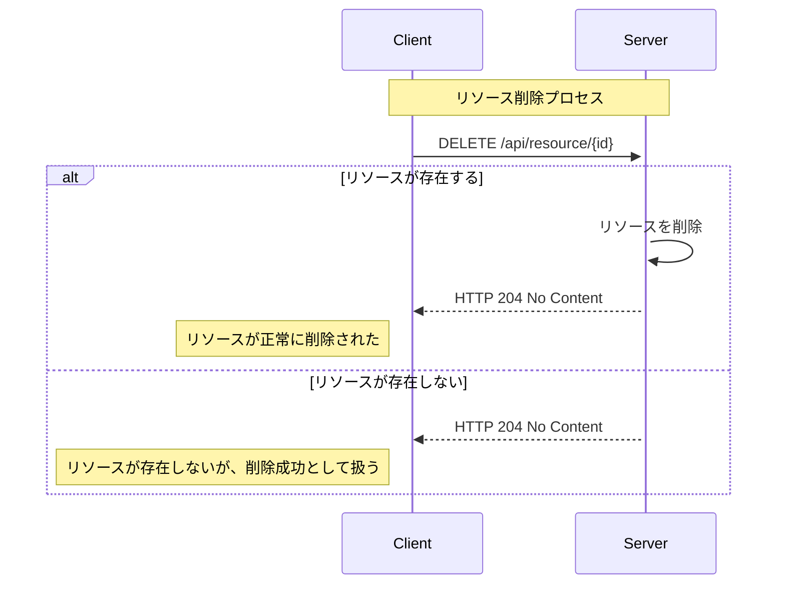
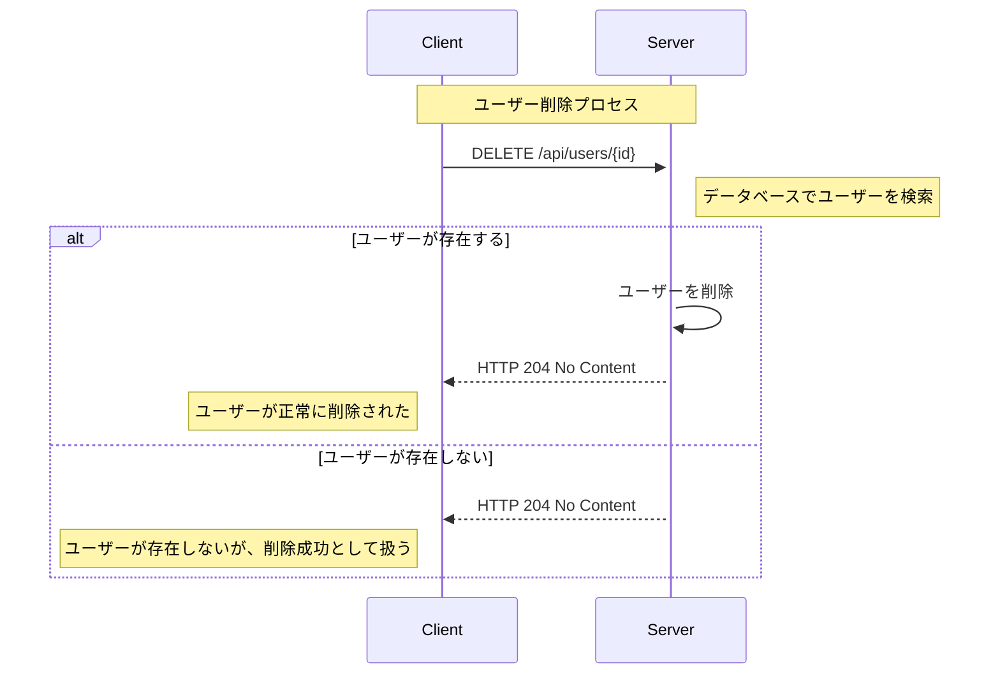

# HTTP プロトコルの『DELETE』解説

---

この記事では、HTTP プロトコルにおける主要な操作である『DELETE』について解説します。

DELETEのメソッドの概要や使用例、使用ケースについて説明し、C# を使用した具体的なコード例も示します。  
クライアント側とサーバー側の両方についてコーディング例を記載しておりますので、参考にしてください。

:::note[購読対象層]

* 対象者: .NET 開発者やWebアプリケーション開発者。
* 記事概要: DELETEの基本的な概念と具体的な使用例、セキュリティに関連する重要な話題について詳述します。
* 技術: DELETEを学び始めたばかりの初心者から、その知識を実際のプロジェクトに応用したい方まで。

:::

---

---

## 動作環境情報

:::info[.NETバージョン]

* .NET Core: すべてのバージョン（1.0 以降）
* .NET Framework: 4.5 以降
* .NET Standard: 1.1 以降（ただし、2.0 が推奨されます）

:::
:::info[必要なサードパーティー製パッケージ]
この記事で必須となるサードパーティー製パッケージはありません。  
しかし Swagger(`Swashbuckle.AspNetCore`) は API の開発やデバッグで役に立つため、導入の検討を推奨します。
:::

---
---

## 1. DELETEとは

DELETEは、指定されたURIのリソースを削除するために使用されます。  
DELETEリクエストを送信すると、サーバーは指定されたリソースを削除し、正常終了のレスポンスを返します。

DELETEは冪等性を持っており、同じリクエストを何度実行しても同じ結果（リソースが削除される）になります。

一般的なDELETEシーケンスは、以下の通りです：



:::info[冪等性（Idempotency）]
HTTPメソッドの「冪等性」は、同一の操作を何度実行してもシステムの状態が最初の1回目の操作以降変わらないことを意味します。  
つまり、同じリクエストを繰り返し送信しても、リソースの状態に対して同じ効果が適用され、それ以上の変更が発生しない性質です。

より詳しい解説は [基本解説の冪等性セクション](/docs/technical-notebook/dotnet/http-protocol/basic-explanation#5-メソッドの冪等性とは) を参照してください。
:::
:::info[データが存在しない場合]
DELETEは、指定されたURIに対応するリソースが存在しない場合、サーバーは何もしないことがあります。  
この場合、サーバーはクライアントに対してエラーを返すことなく、成功として処理を終了します。
これは冪等性を担保する性質によるものです。

DELETEを使用する際は、リソースが存在しない場合の挙動についても考慮することが重要です。
:::
:::tip[簡単に覚える：要約ワンポイント]
DELETEは、リソースを削除する。冪等性であり、データの存在有無に限らず、結果は常に同じ。
:::

---

### 1.1. DELETEを使うケース

DELETEは以下のようなシナリオで一般的に使用されます：

* 個人データの削除: ユーザーが自分のアカウントやプロファイル情報を削除したい場合。
* 一時データのクリア: セッションやキャッシュといった一時的なデータを削除する場合。
* コンテンツの管理: ブログ記事やニュースアイテム、製品リストなど、管理が必要なコンテンツの削除。

一般的なWebアプリケーションでは、以下のようなデータ削除の例があります：

* ユーザーアカウントの削除
* ブログ記事の削除
* 商品情報の削除

---
---

## 2. セキュリティ上の考慮事項

DELETEメソッドは、リソースを削除するためのものであるため、慎重に使用する必要があります。

### 2.1. 主なDELETEのセキュリティリスク

* **データの不正削除:**  
  * 認証されていないユーザーによるリソースの不正削除。
  * 適切な認可措置が欠如していることで、権限のないユーザーがデータを削除できる。
* **クロスサイトリクエストフォージェリ（CSRF）:**
  * 不正なウェブサイトがユーザーのブラウザを利用して、ユーザーが意図しない削除操作を行う。
* **暗号化されていない通信によるデータ漏洩:**
  * HTTPSを使用していない場合、中間者攻撃によりリクエスト内容が盗み見られる可能性があります。

### 2.2. セキュリティ対策

これらの対策を実施することで、DELETEメソッドを使用した際のリスクを大幅に低減できます。

* **HTTPSの使用:**  
  * すべての通信をHTTPSを通じて暗号化し、データの盗聴や改ざんを防ぎます。
* **認証と認可の強化:**  
  * ユーザー認証を厳格に行い、適切なユーザーのみが削除操作を実行できるようにします。
  * リソースに対するアクセス権を細かく管理し、不正なアクセスを防ぎます。
* **クロスサイトリクエストフォージェリ（CSRF）対策:**  
  * トークンベースの認証方式を採用し、CSRF攻撃を防止します。
  * ユーザーのセッションごとに一意のトークンを生成し、削除リクエストに含めることで、正規のリクエストのみを受け入れるようにします。
* **適切なエラーハンドリング:**  
  * エラーレスポンスを適切に管理し、攻撃者にシステムの内部情報を漏らさないようにします。

:::info[HTTPSの重要性]
HTTPSは **すべてのクライアントとサーバー間の通信を暗号化** するため、データの盗聴や改ざんを防ぎます。

HTTPSの全文とセキュリティについては、内部ページである [HTTP プロトコルの基本解説](/docs/technical-notebook/dotnet/http-protocol/basic-explanation#6-セキュリティ上の考慮事項) にも詳細な解説を記載しています。
:::
:::tip[攻撃について]
脆弱性の攻撃に対する詳細はDELETE解説セクションから外れるため、ここでは詳細な説明を省略します。

参考: [wikipedia - クロスサイトリクエストフォージェリ](https://ja.wikipedia.org/wiki/%E3%82%AF%E3%83%AD%E3%82%B9%E3%82%B5%E3%82%A4%E3%83%88%E3%83%AA%E3%82%AF%E3%82%A8%E3%82%B9%E3%83%88%E3%83%95%E3%82%A9%E3%83%BC%E3%82%B8%E3%83%A7%E3%83%AA)
:::

---
---

## 3. DELETEの使用例 (C#)

### 3.1. 一般的なDELETEの使用例

ここでは、特定のユーザーを削除するためのクライアント側とサーバー側でのDELETEの使用例を示します。

#### DELETE-使用ユーザー側-クライアントの例(C#)

```csharp title="[C#] DeleteUser.cs" showLineNumbers
using System;
using System.Net.Http;
using System.Threading.Tasks;

public class DeleteUser
{
    public async Task DeleteUserAsync(int userId)
    {
        using (HttpClient client = new HttpClient())
        {
            // DELETEリクエストを送信
            // highlight-next-line
            var response = await client.DeleteAsync($"https://localhost:44380/api/users/{userId}");

            if (response.IsSuccessStatusCode)
            {
                Console.WriteLine("ユーザーが正常に削除されました。");
            }
            else
            {
                Console.WriteLine("ユーザーの削除に失敗しました。");
            }
        }
    }
}
```

#### DELETE-サーバー側-コントローラーの例(C#)

```csharp title="[C#] UsersController.cs" showLineNumbers
using Microsoft.AspNetCore.Mvc;

namespace ApiExample.Controllers
{
    [ApiController]
    [Route("api/[controller]")]
    public class UsersController : ControllerBase
    {
        // DELETE: api/users/{id}
        // highlight-start
        [HttpDelete("{id}")]
        public IActionResult DeleteUser(int id)
        // highlight-end
        {
            // データベースからユーザーを検索し削除
            // 仮の例として、ユーザーが存在するとします
            // 実際には、ユーザーが見つかった場合の削除処理をここに記述

            return NoContent(); // 204 No Content ステータスを返す
        }
    }
}
```

この例では、特定のユーザーを削除するためのDELETEの使用例を示しています。

クライアント側では、`DeleteUserAsync` メソッドを使用して、指定されたユーザーIDに対してDELETEリクエストを送信しています。

サーバー側では、`DeleteUser` メソッドを使用して、指定されたユーザーIDに対してユーザーを削除しています。
ユーザーが見つかった場合は、データベースからユーザーを削除し、`NoContent` メソッドを使用して204 No Content ステータスを返します。

:::tip[レスポンスのステータスコード]
DELETEメソッドのレスポンスには、一般的に `204 No Content` ステータスコードが返されます。  
しかし一部のAPIでは `200 OK` のステータスコードを返すこともあります。  
設計方針次第では `404 Not Found` を返すこともありますが、この場合でも成功として処理を終了することが一般的です。

このあたりはプロジェクトやAPIの方針により異なるため、設計時はドキュメントに明記し、利用時はドキュメントを確認することが重要です。
:::
:::note[サンプルコードにつき、以下は配慮していません]

* サーバー側のコードで、ユーザーが見つかった場合の処理が適切に行われていますが、他の潜在的なエラー（例えばデータベースアクセスエラーなど）に対する追加のエラーハンドリングを考慮することを推奨します。
* クライアント側は、ユーザーに対するより詳細なフィードバックを省略しています。例えば、削除が成功した際の確認メッセージだけでなく、なぜ削除が失敗したのかについての情報もユーザーに提供することが有益です。

:::

#### DELETE-シーケンス図



:::info[返すべきは`204 No Content`か`200 OK`か]
HTTP DELETE リクエストのレスポンスとして 204 No Content を返すか 200 OK を返すかは、APIの設計に依存します。  
一般的なガイドラインとしては以下の通りです：

* `204 No Content`:  
このレスポンスは、リクエストが成功したが、クライアントに対して返すコンテンツがない場合に使用されます。DELETEリクエストでリソースが正常に削除されたが、返すべき追加の情報がない場合によく使われます。
* `200 OK`:
このレスポンスは、リクエストが成功し、レスポンスボディに何らかの情報（例えば削除されたリソースに関する情報や、削除操作に関する追加のメタデータ）が含まれる場合に使用されます。

例えば、削除したリソースの詳細をクライアントに提供したい場合は `200 OK` とともにそのデータをレスポンスボディに含めます。  
一方で、単に操作が成功したことのみを示したい場合は `204 No Content` を使用することが適切です。
:::

---
---

## 参考文献リンクなど

HTTPについて：

| リンク | 説明 |
| --- | --- |
| [wikipedia - HTTPS](https://ja.wikipedia.org/wiki/HTTPS) | HTTPSについてのWikipediaの記事 |
| [wikipedia - HTTPステータスコード](https://ja.wikipedia.org/wiki/HTTP%E3%82%B9%E3%83%86%E3%83%BC%E3%82%BF%E3%82%B9%E3%82%B3%E3%83%BC%E3%83%89) | HTTPステータスコードについてのWikipediaの記事 |

セキュリティ：

| リンク | 説明 |
| --- | --- |
| [wikipedia - クロスサイトリクエストフォージェリ](https://ja.wikipedia.org/wiki/%E3%82%AF%E3%83%AD%E3%82%B9%E3%82%B5%E3%82%A4%E3%83%88%E3%83%AA%E3%82%AF%E3%82%A8%E3%82%B9%E3%83%88%E3%83%95%E3%82%A9%E3%83%BC%E3%82%B8%E3%83%A3%E3%83%AA) | CSRFについてのWikipediaの記事 |

---

## フィードバックの提供方法と連絡先

:::tip[連絡先]
この記事に関するフィードバックやご質問、ご意見がございましたら [プロフィールページの連絡先](/docs/profiles/self-introduction#2-連絡先) からお気軽にご連絡ください。  
貴重なディスカッションをお待ちしております。
:::


