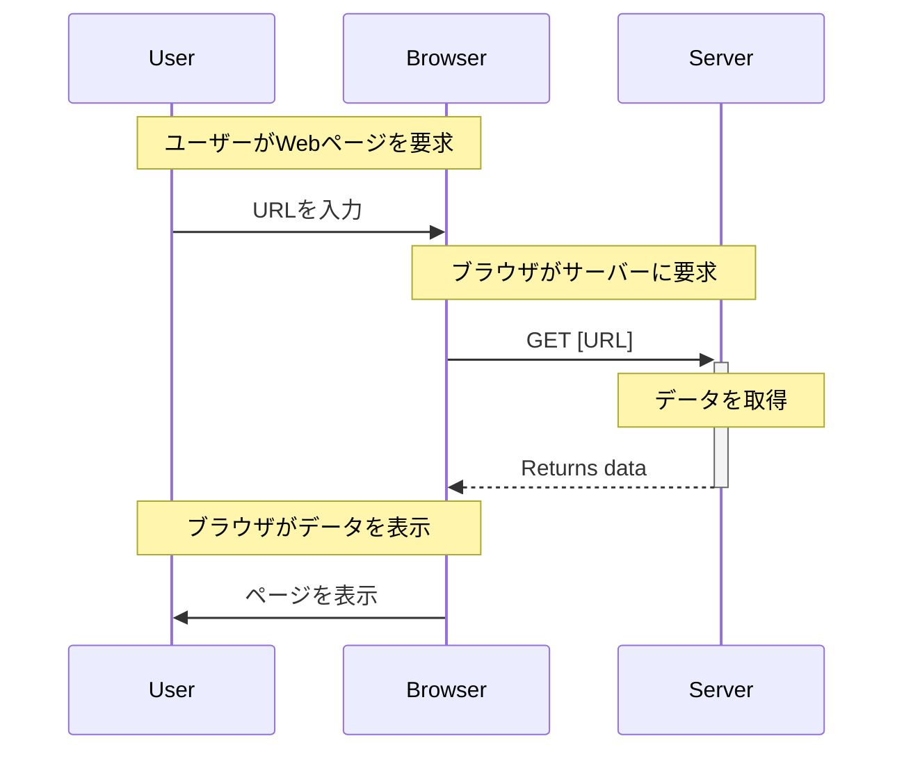
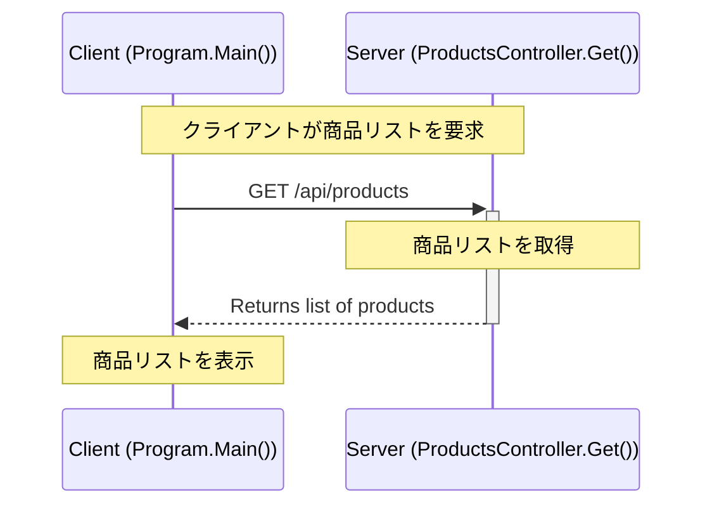

# HTTP プロトコルの『GET』解説

*[Created: 2024/05/05, Update: none(same as creation date)]*

---

この記事では、HTTP プロトコルにおける主要な操作である『GET』について解説します。

GETの概要や使用例、使用ケースについて説明し、C# を使用した具体的なコード例も示します。  
クライアント側とサーバー側の両方についてコーディング例を記載しておりますので、参考にしてください。

:::note[購読対象層]

* 対象者: .NET 開発者やWebアプリケーション開発者。
* 記事概要: GETの基本的な概念と具体的な使用例、セキュリティに関連する重要な話題について詳述します。
* 技術: GETを学び始めたばかりの初心者から、その知識を実際のプロジェクトに応用したい方まで。

:::

---

## 関連する解説記事一覧

1. [HTTP プロトコルの基本解説](/docs/technical-notebook/dotnet/http-protocol/basic-explanation)
2. GET の解説 (本記事)
3. [POST の解説](/docs/technical-notebook/dotnet/http-protocol/post-method)
4. [PUT の解説](/docs/technical-notebook/dotnet/http-protocol/put-method)
5. [DELETE の解説](/docs/technical-notebook/dotnet/http-protocol/delete-method)

---

## 動作環境情報

:::info[.NETバージョン]

* .NET Core: すべてのバージョン（1.0 以降）
* .NET Framework: 4.5 以降
* .NET Standard: 1.1 以降（ただし、2.0 が推奨されます）

:::
:::info[必要なサードパーティー製パッケージ]
この記事で必須となるサードパーティー製パッケージはありません。  
しかし Swagger(`Swashbuckle.AspNetCore`) は API の開発やデバッグで役に立つため、導入の検討を推奨します。
:::

---
---

## 1. GETとは

GETは、指定されたリソースから情報を取得するために使用されます。  
これは、サーバーからクライアント（例えば、Webブラウザ）へデータを送信する一方的なプロセスです。  

GETは、データをサーバーに送るのではなく、サーバーからデータを取得するために設計されています。

GETは冪等性（Idempotency）であるため、同じリクエストを何度実行しても同じ結果になります。

一般的なGETシーケンスは、以下の通りです：



:::info[冪等性（Idempotency）]
HTTPメソッドの「冪等性」は、同一の操作を何度実行してもシステムの状態が最初の1回目の操作以降変わらないことを意味します。  
つまり、同じリクエストを繰り返し送信しても、リソースの状態に対して同じ効果が適用され、それ以上の変更が発生しない性質です。

より詳しい解説は [基本解説の冪等性セクション](/docs/technical-notebook/dotnet/http-protocol/basic-explanation#5-メソッドの冪等性について) を参照してください。
:::
:::tip[簡単に覚える：要約ワンポイント]
GETは、サーバーからデータを取得する。冪等である。
:::

### 1.1. GETを使うケース

GETは主に、以下のようなシナリオで使用されます：

* Webページの閲覧: ユーザーがWebページをリクエストするとき、ブラウザはそのページのコンテンツを取得するためにGETリクエストを送信します。
* 画像や動画などのメディアファイルの取得: Webサイト上のメディアファイルを表示する際にもGETリクエストが用いられます。
* APIを通じたデータの取得: RESTful APIでは、特定のデータセットを取得するためにGETリクエストがよく使用されます。

一般的なWebアプリケーションでは、以下のようなデータ取得の例があります：

* ユーザーデータの取得
* 商品一覧の取得
* 記事やニュースフィードの取得

---
---

## 2. セキュリティ上の考慮事項

GETはデータを取得する際に使用され、クエリパラメータとしてデータがURLに含まれます。  
これにはいくつかのセキュリティリスクが伴います。

### 2.1. 主なGETのセキュリティリスク

* **データの漏洩:**  
  GETリクエストはURLにパラメータを含むため、機密情報がログやリファラーヘッダーに残り漏洩する可能性があります。
* **クロスサイトリクエストフォージェリ（CSRF）:**  
  GETリクエストはサーバーの状態を変更すべきでないが、誤って重要な動作に使われることがあり、不正なサイトから意図しないリクエストが発行されるリスクがあります。
* **キャッシュによるリスク:**  
  敏感な情報を含むGETリクエストがブラウザやプロキシサーバーにキャッシュされると、不正アクセスにより情報が漏れる可能性があります。

### 2.2. セキュリティ対策

これらの対策を実施することで、GETメソッドを使用した際のリスクを大幅に低減できます。

* **HTTPSの使用:**  
  すべての通信をHTTPSを通じて暗号化し、データの盗聴や改ざんを防ぎます。
* **機密情報のGETパラメータ使用回避:**  
  機密性の高い情報はGETリクエストのパラメータに含めず、POSTリクエストやHTTPヘッダーで送信する方法を検討します。
* **適切なキャッシュコントロールヘッダーの使用:**  
  キャッシュコントロールHTTPヘッダーを適切に設定して、敏感な情報がキャッシュされないようにします。
* **CSRF対策の実施:**  
  GETリクエストを利用したCSRF攻撃を防ぐため、重要な操作はPOSTリクエストで行うようにし、トークンやリファラチェックを利用してCSRF対策を強化します。

:::info[HTTPSの重要性]
HTTPSは **すべてのクライアントとサーバー間の通信を暗号化** するため、データの盗聴や改ざんを防ぐことができます。

HTTPSの全文とセキュリティについては、内部ページである [HTTP プロトコルの基本解説](/docs/technical-notebook/dotnet/http-protocol/basic-explanation#6-セキュリティ上の考慮事項) にも詳細な解説を記載しています。
:::
:::tip[攻撃について]
脆弱性の攻撃に対する詳細はGET解説セクションから外れるため、ここでは詳細な説明を省略します。

参考: [wikipedia - クロスサイトリクエストフォージェリ](https://ja.wikipedia.org/wiki/%E3%82%AF%E3%83%AD%E3%82%B9%E3%82%B5%E3%82%A4%E3%83%88%E3%83%AA%E3%82%AF%E3%82%A8%E3%82%B9%E3%83%88%E3%83%95%E3%82%A9%E3%83%BC%E3%82%B8%E3%83%A3%E3%83%AA)
:::

### 2.3. GET に含めるべきではない情報

上記のセキュリティリスクを踏まえ、GETのパラメータに含めるべきではない情報の例を以下に示します：

* パスワード
* クレジットカード情報
* セッションID
* トークン
* センシティブな個人情報
* 重要と分類する機密情報

:::warning[他にもたくさんあります]
これらの情報以外にも、セキュリティ上のリスクを軽減するためにGETリクエストに含めるべきでない情報は多数あります。  
プロジェクトでよく精査を行い、適切に情報を扱うように心がけて下さい。
:::

---
---

## 3. GETの使用例 (C#)

C#でのGETの使用例を以下に示します。

---

### 3.1. 基本的な使用例

#### GET-使用ユーザー側-クライアントの例(C#)

```csharp title="[C#] Program.cs" showLineNumbers
using System;
using System.Net.Http;
using System.Threading.Tasks;

public class Program
{
    public static async Task Main()
    {
        using (HttpClient client = new HttpClient())
        {
            try
            {
                // highlight-start
                // 商品リストを取得するリクエストURL
                string url = "https://api.example.com/api/products";
                // ここで GET リクエストを送信
                HttpResponseMessage response = await client.GetAsync(url);
                // highlight-end

                response.EnsureSuccessStatusCode();
                string responseBody = await response.Content.ReadAsStringAsync();
                Console.WriteLine(responseBody);
            }
            catch(HttpRequestException e)
            {
                // エラー処理
                Console.WriteLine("\nException Caught!");
                Console.WriteLine("Message :{0} ", e.Message);
            }
        }
    }
}
```

このコードは、指定されたURLからデータを非同期に取得し、その内容をコンソールに出力します。  
ポイントは 13行目～16行目で、このコードでGETリクエストを送信し、サーバーからのレスポンスを取得しています。

例外処理が含まれているため、何らかのエラーが発生した場合にはその内容が表示されます。

#### GET-サーバー側-コントローラーの例(C#)

```csharp title="[C#] ProductsController.cs" showLineNumbers
using Microsoft.AspNetCore.Mvc;
using System.Collections.Generic;

namespace WebApiExample.Controllers
{
    [ApiController]
    // highlight-next-line
    [Route("api/[controller]")]
    public class ProductsController : ControllerBase
    {
        // 仮の商品データをリストとして保持
        private static readonly List<string> Products = new List<string>
        {
            "Tablet", "Smartphone", "Laptop"
        };

        // GET: api/products
        // highlight-start
        [HttpGet]
        public IEnumerable<string> Get()
        // highlight-end
        {
            // 商品リストを返す
            return Products;
        }
    }
}
```

このコントローラーは、17行目～18行目で`[HttpGet]` アトリビュートを使用してGETリクエストを処理するメソッド `Get()` を定義しています。  
クライアントが `api/products` にアクセスすると、このメソッドが呼び出され、登録された商品のリストが返されます。  
リストは単純な文字列のリストですが、実際のアプリケーションでは、商品データを表すより複雑なオブジェクトのリストを返すことが一般的です。

:::tip[Routeアトリビュート]
7行目に定義されているコントローラーのアトリビュート `[Route]` は、リクエストを処理するエンドポイントを指定します。  
例えば `[Route("hoge/hogehoge/[controller]")]` に変更すると  
クライアント側は `https://example.com/hoge/hogehoge/products` にアクセスすることで `Get()` が呼び出されます。
:::
:::tip[プレースホルダー]
`[Route]` アトリビュートの中で指定されている `[controller]` は、コントローラー名を自動的に置き換えるプレースホルダーです。  
この例では、クラス名である `ProductsController` が `products` に置き換えられます。  
このプレースホルダーを使用する API は、コントローラー名を変更しても、ルーティングの変更が不要になりますが  
コントローラーのクラス名には気を配る必要があります。
:::



---
---

## 参考文献リンクなど

HTTPについて：

| リンク | 説明 |
| --- | --- |
| [wikipedia - HTTPS](https://ja.wikipedia.org/wiki/HTTPS) | HTTPSについてのWikipediaの記事 |
| [wikipedia - HTTPステータスコード](https://ja.wikipedia.org/wiki/HTTP%E3%82%B9%E3%83%86%E3%83%BC%E3%82%BF%E3%82%B9%E3%82%B3%E3%83%BC%E3%83%89) | HTTPステータスコードについてのWikipediaの記事 |

セキュリティ：

| リンク | 説明 |
| --- | --- |
| [wikipedia - クロスサイトリクエストフォージェリ](https://ja.wikipedia.org/wiki/%E3%82%AF%E3%83%AD%E3%82%B9%E3%82%B5%E3%82%A4%E3%83%88%E3%83%AA%E3%82%AF%E3%82%A8%E3%82%B9%E3%83%88%E3%83%95%E3%82%A9%E3%83%BC%E3%82%B8%E3%83%A3%E3%83%AA) | CSRFについてのWikipediaの記事 |

---

## フィードバックの提供方法と連絡先

:::tip[お知らせ]
この記事に関するフィードバックやご質問、ご意見がございましたら [プロフィールページの連絡先](/docs/profiles/self-introduction#2-連絡先) からお気軽にご連絡ください。  
貴重なディスカッションをお待ちしております。
:::

---
