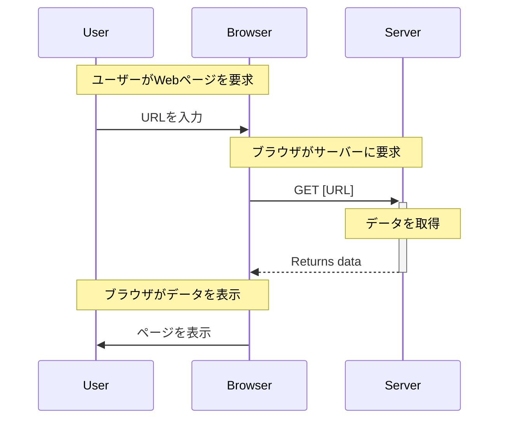
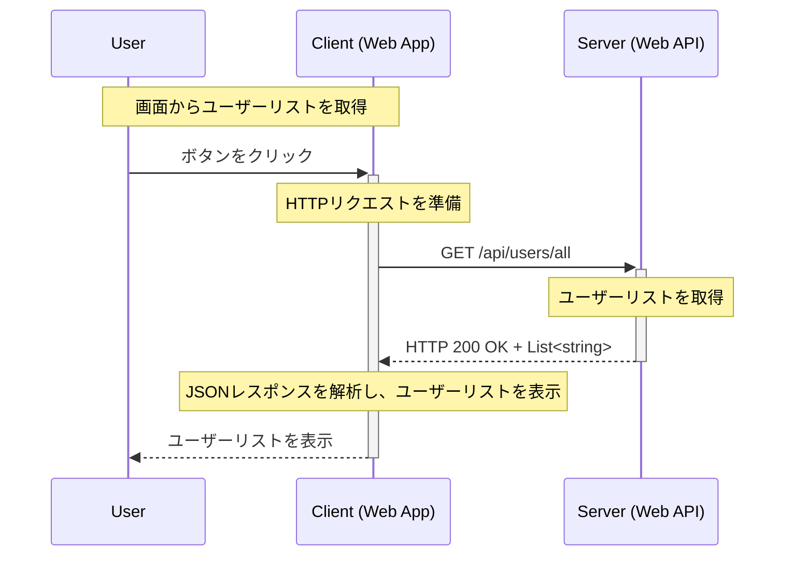
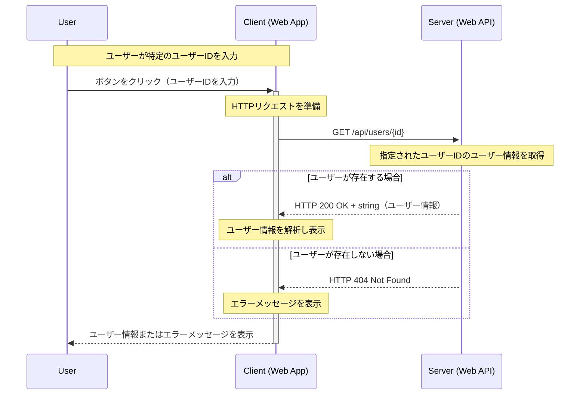

import Tabs from '@theme/Tabs';
import TabItem from '@theme/TabItem';

# HTTP プロトコルの『GET』解説

---

この記事では、HTTP プロトコルにおける主要な操作である『GET』について解説します。

GETの概要や使用例、使用ケースについて説明し、C# を使用した具体的なコード例も示します。  
クライアント側とサーバー側の両方についてコーディング例を記載しておりますので、参考にしてください。

:::note[購読対象層]

* 対象者: .NET 開発者やWebアプリケーション開発者。
* 記事概要: GETの基本的な概念と具体的な使用例、セキュリティに関連する重要な話題について詳述します。
* 技術: GETを学び始めたばかりの初心者から、その知識を実際のプロジェクトに応用したい方まで。

:::

---

---

## 動作環境情報

:::info[.NETバージョン]

* .NET Core: すべてのバージョン（1.0 以降）
* .NET Framework: 4.5 以降
* .NET Standard: 1.1 以降（ただし、2.0 が推奨されます）

:::
:::info[必要なサードパーティー製パッケージ]
この記事で必須となるサードパーティー製パッケージはありません。  
しかし Swagger(`Swashbuckle.AspNetCore`) は API の開発やデバッグで役に立つため、導入の検討を推奨します。
:::

---
---

## 1. GETとは

GETは、指定されたリソースから情報を取得するために使用されます。  
これは、サーバーからクライアント（例えば、Webブラウザ）へデータを送信する一方的なプロセスです。  

GETは、データをサーバーに送るのではなく、サーバーからデータを取得するために設計されています。

GETは冪等性（Idempotency）であるため、同じリクエストを何度実行しても同じ結果になります。

一般的なGETシーケンスは、以下の通りです：



:::info[冪等性（Idempotency）]
HTTPメソッドの「冪等性」は、同一の操作を何度実行してもシステムの状態が最初の1回目の操作以降変わらないことを意味します。  
つまり、同じリクエストを繰り返し送信しても、リソースの状態に対して同じ効果が適用され、それ以上の変更が発生しない性質です。

より詳しい解説は [基本解説の冪等性セクション](/docs/technical-notebook/dotnet/http-protocol/basic-explanation#5-メソッドの冪等性とは) を参照してください。
:::
:::tip[簡単に覚える：要約ワンポイント]
GETは、サーバーからデータを取得する。冪等である。
:::

### 1.1. GETを使うケース

GETは主に、以下のようなシナリオで使用されます：

* Webページの閲覧: ユーザーがWebページをリクエストするとき、ブラウザはそのページのコンテンツを取得するためにGETリクエストを送信します。
* 画像や動画などのメディアファイルの取得: Webサイト上のメディアファイルを表示する際にもGETリクエストが用いられます。
* APIを通じたデータの取得: RESTful APIでは、特定のデータセットを取得するためにGETリクエストがよく使用されます。

一般的なWebアプリケーションでは、以下のようなデータ取得の例があります：

* ユーザーデータの取得
* 商品一覧の取得
* 記事やニュースフィードの取得

---
---

## 2. セキュリティ上の考慮事項

GETはデータを取得する際に使用され、クエリパラメータとしてデータがURLに含まれます。  
これにはいくつかのセキュリティリスクが伴います。

### 2.1. 主なGETのセキュリティリスク

* **データの漏洩:**  
  GETリクエストはURLにパラメータを含むため、機密情報がログやリファラーヘッダーに残り漏洩する可能性があります。
* **クロスサイトリクエストフォージェリ（CSRF）:**  
  GETリクエストはサーバーの状態を変更すべきでないが、誤って重要な動作に使われることがあり、不正なサイトから意図しないリクエストが発行されるリスクがあります。
* **キャッシュによるリスク:**  
  敏感な情報を含むGETリクエストがブラウザやプロキシサーバーにキャッシュされると、不正アクセスにより情報が漏れる可能性があります。

### 2.2. セキュリティ対策

これらの対策を実施することで、GETメソッドを使用した際のリスクを大幅に低減できます。

* **HTTPSの使用:**  
  すべての通信をHTTPSを通じて暗号化し、データの盗聴や改ざんを防ぎます。
* **機密情報のGETパラメータ使用回避:**  
  機密性の高い情報はGETリクエストのパラメータに含めず、POSTリクエストやHTTPヘッダーで送信する方法を検討します。
* **適切なキャッシュコントロールヘッダーの使用:**  
  キャッシュコントロールHTTPヘッダーを適切に設定して、敏感な情報がキャッシュされないようにします。
* **CSRF対策の実施:**  
  GETリクエストを利用したCSRF攻撃を防ぐため、重要な操作はPOSTリクエストで行うようにし、トークンやリファラチェックを利用してCSRF対策を強化します。

:::info[HTTPSの重要性]
HTTPSは **すべてのクライアントとサーバー間の通信を暗号化** するため、データの盗聴や改ざんを防ぐことができます。

HTTPSの全文とセキュリティについては、内部ページである [HTTP プロトコルの基本解説](/docs/technical-notebook/dotnet/http-protocol/basic-explanation#6-セキュリティ上の考慮事項) にも詳細な解説を記載しています。
:::
:::tip[攻撃について]
脆弱性の攻撃に対する詳細はGET解説セクションから外れるため、ここでは詳細な説明を省略します。

参考: [wikipedia - クロスサイトリクエストフォージェリ](https://ja.wikipedia.org/wiki/%E3%82%AF%E3%83%AD%E3%82%B9%E3%82%B5%E3%82%A4%E3%83%88%E3%83%AA%E3%82%AF%E3%82%A8%E3%82%B9%E3%83%88%E3%83%95%E3%82%A9%E3%83%BC%E3%82%B8%E3%83%A3%E3%83%AA)
:::

### 2.3. GET に含めるべきではない情報

上記のセキュリティリスクを踏まえ、GETのパラメータに含めるべきではない情報の例を以下に示します：

* パスワード
* クレジットカード情報
* セッションID
* トークン
* センシティブな個人情報
* 重要と分類する機密情報

:::warning[他にもたくさんあります]
これらの情報以外にも、セキュリティ上のリスクを軽減するためにGETリクエストに含めるべきでない情報は多数あります。  
プロジェクトでよく精査を行い、適切に情報を扱うように心がけて下さい。
:::

---
---

## 3. GETの使用例 (C#)

C#でのGETの使用例を以下に示します。

:::warning[前提：サンプルソースコードは「わかりやすさ」を重視しています]
サンプルコードは **"できるだけ短く"** かつ **"わかりやすい"** を重視しています。参考にして利用する場合、適切にカスタマイズをして下さい。  
具体的には、以下のような部分です：

* パラメータのハードコーディング
* エラーハンドリングの簡略化
* セキュリティ対策の簡略化

:::

---

### 3.1. 基本的な使用例 (全データの取得)

最初に、最も単純なパラメータ不要パターンのGETリクエストを実行する例を示します。

#### GET-ALL-使用ユーザー側-クライアントの例(C#)

<Tabs>
  <TabItem value="blazor" label="Blazor (.NET 8)" default>

```csharp title="[C#] GetUserAll.razor" showLineNumbers
@page "/get-user-all"
@rendermode InteractiveServer
// highlight-next-line
@inject HttpClient httpClient

<h3> api/user/all - ユーザーリストを取得 </h3>

// highlight-next-line
<button class="btn btn-primary" @onclick="FetchUsers">Get User List</button>

<div class="content">
    @if (UserList.Count == 0)
    {
        <p>ユーザーが見つかりませんでした。</p>
    }
    else
    {
        <ul>
            @foreach (var user in UserList)
            {
                <li>@user</li>
            }
        </ul>
    }
</div>

@code {
    private readonly List<string> UserList = new List<string>();

    // highlight-start
    // `Get User List` ボタンがクリックされたときに呼び出されるメソッド
    private async Task FetchUsers()
    // highlight-end
    {
        UserList.Clear();

        // highlight-start
        // GET リクエストを送信し UserController からユーザー情報を取得
        var users = await httpClient.GetFromJsonAsync<IEnumerable<string>>("api/user/all");
        // highlight-end
        if (users is not null)
        {
            UserList.AddRange(users);
        }
    }
}
```

Blazor では、`HttpClient` クラスを使用してGETリクエストを送信し、サーバーからデータを取得します。

`FetchUsers` メソッドは、ボタンがクリックされたときに呼び出され、`api/user/all` にGETリクエストを送信してユーザーリストを取得します。  
`HttpClient` は、BlazorのDI（Dependency Injection）機能を使用して注入され、接続先サーバーを環境毎に切り替えることができます。

  </TabItem>
  <TabItem value="webForms" label="WebForms (.NET Framework 4.6)">

```csharp title="[C#] GetUserAll.aspx" showLineNumbers
<%@ Page Language="C#" AutoEventWireup="true" CodeBehind="GetUserAll.aspx.cs" Inherits="Ateliers.Lectures.MVC.Net46.WebForms.Forms.GetUserAll" Async="true" %>

<!DOCTYPE html>
<html xmlns="http://www.w3.org/1999/xhtml">
<head runat="server">
    <title>Get User List</title>
</head>
<body>
    <form id="form1" runat="server">
        <div>
            // highlight-next-line
            <asp:Button ID="GetUserListButton" runat="server" Text="Get User List" OnClick="GetUserListButton_Click" />
        </div>
        <asp:Label ID="LoadingLabel" runat="server" Text="Loading..." Visible="false"></asp:Label>
        <asp:GridView ID="UserListGridView" runat="server" AutoGenerateColumns="true" Visible="false"></asp:GridView>
        <asp:Label ID="ErrorLabel" runat="server" ForeColor="Red" Visible="false"></asp:Label>
    </form>
</body>
</html>
```

```csharp title="[C#] GetUserAll.aspx.cs (コードビハインド)" showLineNumbers
using Newtonsoft.Json;
using System;
using System.Collections.Generic;
using System.Net.Http;
using System.Threading.Tasks;
using System.Web.UI;

namespace Ateliers.Lectures.MVC.Net46.WebForms.Forms
{
    public partial class GetUserAll : Page
    {
        protected void Page_Load(object sender, EventArgs e)
        {
        }

        // highlight-start
        // ユーザ一覧取得ボタンクリック時のイベントハンドラ
        protected async void GetUserListButton_Click(object sender, EventArgs e)
        // highlight-end
        {
            // highlight-start
            // ユーザ一覧を取得して表示
            await FetchUserListAsync();
            // highlight-end
        }

        // highlight-start
        // ユーザ一覧を取得して表示する非同期メソッド
        private async Task FetchUserListAsync()
        // highlight-end
        {
            LoadingLabel.Visible = true;
            UserListGridView.Visible = false;
            ErrorLabel.Visible = false;

            try
            {
                using (HttpClient client = new HttpClient())
                {
                    // highlight-start
                    // URLを指定してGETリクエストを送信
                    string requestUrl = "https://localhost:44380/api/user/all";
                    var response = await client.GetAsync(requestUrl);
                    // highlight-end

                    if (response.IsSuccessStatusCode)
                    {
                        // Newtonsoft.Jsonを使ってJSONをリストにデシリアライズ
                        var responseBody = await response.Content.ReadAsStringAsync();
                        var userList = JsonConvert.DeserializeObject<List<string>>(responseBody);
                        DisplayUserList(userList);
                    }
                    else
                    {
                        string error = await response.Content.ReadAsStringAsync();
                        DisplayError(error);
                    }
                }
            }
            catch (Exception ex)
            {
                DisplayError(ex.Message);
            }
            finally
            {
                LoadingLabel.Visible = false;
            }
        }

        private void DisplayUserList(List<string> userList)
        {
            UserListGridView.DataSource = userList;
            UserListGridView.DataBind();
            UserListGridView.Visible = true;
        }

        private void DisplayError(string errorMessage)
        {
            ErrorLabel.Text = $"Error: {errorMessage}";
            ErrorLabel.Visible = true;
        }
    }
}
```

WebForms では、`HttpClient` クラスを使用してGETリクエストを送信し、サーバーからデータを取得します。

`FetchUserListAsync` メソッドは、ボタンがクリックされたときに呼び出され、`https://localhost:44380/api/user/all` にGETリクエストを送信してユーザーリストを取得します。

  </TabItem>
  <TabItem value="client" label="API Cliemt (.NET Standard 2.0)">

```csharp title="[C#] UserClient.cs" showLineNumbers
using System.Collections.Generic;
using System.Net.Http;
using System.Text.Json;
using System.Threading;
using System.Threading.Tasks;

namespace Ateliers.Lectures.MVC.APIClients
{
    // 説明のために汎用性を捨てた限界まで雑なコード
    public class UserClient
    {
        public async Task<IEnumerable<string>> GetUserAll(CancellationToken token = default)
        {
            using (HttpClient client = new HttpClient())
            {
                // highlight-start
                // ユーザーリストを取得するリクエストURL
                string url = "https://localhost:44380/api/user/all";
                // ここで GET リクエストを送信
                var response = await client.GetAsync(url, token);
                // highlight-end

                // 成功(200~299)以外、HttpRequestExceptionをスロー
                response.EnsureSuccessStatusCode();
                var responseBody = await response.Content.ReadAsStringAsync();

                return JsonSerializer.Deserialize<IEnumerable<string>>(responseBody);
            }
        }
    }
}
```

API用のクライアントクラスでは、`HttpClient` クラスを使用してGETリクエストを送信し、サーバーからデータを取得します。

`GetUserAll` メソッドは、`https://localhost:44380/api/user/all` にGETリクエストを送信してユーザーリストを取得します。

:::note[限界まで雑なコードです]
繰り返しますが、バリデーションやエラーハンドリングは考慮されていません。  
どのようにGETリクエストを利用するかの説明に重点を置いています。
:::

  </TabItem>
</Tabs>

---

#### GET-ALL-サーバー側-コントローラーの例(C#)

<Tabs>
  <TabItem value="net-core-api" label="Web API (.NET 8)" default>

```csharp title="[C#] ProductsController.cs" showLineNumbers
using Microsoft.AspNetCore.Mvc;

namespace Ateliers.Lectures.MVC.APIServer.Controllers
{
    [ApiController]
    // highlight-next-line
    [Route("API/[controller]")]
    public class UserController : ControllerBase
    {
        // 仮のユーザーデータをリストとして保持
        private static readonly List<string> _UserList = new List<string>
        {
            "Alice", "Bob", "Charlie"
        };

        // highlight-start
        // GET: api/user/all
        [HttpGet("All")]
        public ActionResult<IEnumerable<string>> GetUsers()
        // highlight-end
        {
            // ユーザー情報を確認して、ユーザーリストかエラーを返す
            return _UserList.Any()
                ? Ok(_UserList.Select(user => $"ID:{_UserList.IndexOf(user)}, USER:{user}"))
                : NotFound("ユーザーは0件です。");
        }
    }
}

```

.NET 8 の Web API では、`[HttpGet]` アトリビュートを使用してGETリクエストを処理するエンドポイントを指定します。

`GetUsers` メソッドは、`api/user/all` にGETリクエストが送信されたときに呼び出され、ユーザーリストを返します。

:::tip[Routeアトリビュート]
7行目に定義されているコントローラーのアトリビュート `[Route]` は、リクエストを処理するエンドポイントを指定します。  
例えば `[Route("hoge/hogehoge/[controller]")]` に変更すると  
クライアント側は `https://example.com/hoge/hogehoge/user/all` にアクセスすることで `GetUsers()` が呼び出されます。
:::
:::tip[プレースホルダー]
`[Route]` アトリビュートの中で指定されている `[controller]` は、コントローラー名を自動的に置き換えるプレースホルダーです。  
この例では、クラス名である `UserController` が `User` に置き換えられます。  
このプレースホルダーを使用する API は、コントローラー名を変更しても、ルーティングの変更が不要になりますが  
コントローラーのクラス名には気を配る必要があります。
:::

  </TabItem>
  <TabItem value="net-framework-api" label="Web API (.NET Framework 4.6)">

```csharp title="[C#] UserController.cs" showLineNumbers
using System.Collections.Generic;
using System.Linq;
using System.Net;
using System.Web.Http;

namespace Ateliers.Lectures.MVC.Net46.APIServer.Controllers
{
    // highlight-next-line
    [RoutePrefix("API/User")]
    public class UserController : ApiController
    {
        // 仮のユーザーデータをリストとして保持
        private static readonly List<string> _UserList = new List<string>
        {
            "Alice", "Bob", "Charlie"
        };

        // highlight-start
        // GET: api/user/all
        [HttpGet]
        [Route("All")]
        public IHttpActionResult GetUsers()
        // highlight-end
        {
            if (!_UserList.Any())
            {
                return NotFound();
            }
            
            return Ok(_UserList.Select(user => $"ID:{_UserList.IndexOf(user)}, USER:{user}"));
        }
    }
}
```

.NET Framework の Web API では、`[RoutePrefix]` と `[Route]` アトリビュートを使用してGETリクエストを処理するエンドポイントを指定します。

`GetUsers` メソッドは、`api/user/all` にGETリクエストが送信されたときに呼び出され、ユーザーリストを返します。

:::tip[RoutePrefixアトリビュート]
`[RoutePrefix]` アトリビュートは、コントローラーのルートパスを指定します。  
例えば `[RoutePrefix("hoge/hogehoge")]` に変更すると  
クライアント側は `https://example.com/hoge/hogehoge/user/all` にアクセスすることで `GetUsers()` が呼び出されます。
:::

  </TabItem>
</Tabs>

#### GET-ユーザーリスト-シーケンス図

概要：

1. ユーザーは、アプリケーションでボタンをクリックしてユーザーリストを取得しようとします。
2. アプリケーションは、サーバーに対してGETリクエストを送信します。
3. サーバーは、リクエストを処理し、ユーザーリストのJSONレスポンスを返します。
4. アプリケーションは、JSONレスポンスを解析し、ユーザーリストを表示します。



---

### 3.2. 基本的な使用例 (特定データの取得)

パラメータを使い、特定のデータを取得するGETリクエストの例を示します。

#### GET-ById-使用ユーザー側-クライアントの例(C#)

<Tabs>
  <TabItem value="blazor" label="Blazor (.NET 8)" default>

```csharp title="[C#] GetUserById.razor" showLineNumbers
@page "/get-user-by-id"
@rendermode InteractiveServer
// highlight-next-line
@inject HttpClient httpClient

<h3> api/get/{id} - 特定ユーザーの取得 </h3>

<div>
    <label for="userId">Enter User ID:</label>
    // highlight-start
    <InputNumber @bind-Value="UserId" id="userId" min="0" />
    <button @onclick="FetchUser">Get User Info</button>
    // highlight-end
</div>

@if (IsLoading)
{
    <p>Loading...</p>
}
else if (!string.IsNullOrEmpty(UserInfo))
{
    <p><strong>User Info:</strong> @UserInfo</p>
}
else if (HasError)
{
    <p style="color:red">Error: @ErrorMessage</p>
}

@code {
    // highlight-start
    // 画面にバインドされているユーザーID
    private int UserId;
    // highlight-end

    private bool IsLoading;
    private bool HasError;
    private string? UserInfo;
    private string? ErrorMessage;

    // highlight-start
    // `Get User Info` ボタンがクリックされたときに呼び出されるメソッド
    private async Task FetchUser()
    // highlight-end
    {
        IsLoading = true;
        HasError = false;
        UserInfo = null;
        ErrorMessage = null;

        try
        {
            // highlight-start
            // GET リクエストを送信し UserController からユーザー情報を取得
            var response = await httpClient.GetAsync($"api/user/{UserId}");
            // highlight-end

            if (response.IsSuccessStatusCode)
            {
                UserInfo = await response.Content.ReadAsStringAsync();
            }
            else
            {
                HasError = true;
                ErrorMessage = await response.Content.ReadAsStringAsync();
            }
        }
        catch (Exception ex)
        {
            HasError = true;
            ErrorMessage = ex.Message;
        }
        finally
        {
            IsLoading = false;
        }
    }
}
```

Blazor では、`HttpClient` クラスを使用してGETリクエストを送信し、サーバーからデータを取得します。

`FetchUser` メソッドは、ボタンがクリックされたときに呼び出され、`api/user/{id}` にGETリクエストを送信して特定のユーザー情報を取得します。  

`UserId` は、ユーザーが入力したIDを保持するための変数です。  
この変数は、`InputNumber` コンポーネントを使用してユーザーが入力した値をバインドします。

`HttpClient` は、BlazorのDI（Dependency Injection）機能を使用して注入され、接続先サーバーを環境毎に切り替えることができます。

  </TabItem>
  <TabItem value="webForms" label="WebForms (.NET Framework 4.6)">

```csharp title="[C#] GetUserById.aspx" showLineNumbers
<%@ Page Language="C#" AutoEventWireup="true" CodeBehind="GetUserById.aspx.cs" Inherits="Ateliers.Lectures.MVC.Net46.WebForms.Forms.GetUserById" Async="true" %>

<!DOCTYPE html>
<html xmlns="http://www.w3.org/1999/xhtml">
    <head runat="server">
        <title>Get User Info</title>
    </head>
    <body>
        <form id="form1" runat="server">
            <div>
                <label for="userId">Enter User ID:</label>
                // highlight-start
                <asp:TextBox ID="UserIdTextBox" runat="server"></asp:TextBox>
                <asp:Button ID="GetUserButton" runat="server" Text="Get User Info" OnClick="GetUserButton_Click" />
                // highlight-end
            </div>
            <asp:Label ID="LoadingLabel" runat="server" Text="Loading..." Visible="false"></asp:Label>
            <asp:Label ID="UserInfoLabel" runat="server" Visible="false"></asp:Label>
            <asp:Label ID="ErrorLabel" runat="server" ForeColor="Red" Visible="false"></asp:Label>
        </form>
    </body>
</html>
```

```csharp title="[C#] GetUserById.aspx.cs (コードビハインド)" showLineNumbers
using System;
using System.Net.Http;
using System.Threading.Tasks;
using System.Web.UI;

namespace Ateliers.Lectures.MVC.Net46.WebForms.Forms
{
    public partial class GetUserById : Page
    {
        protected void Page_Load(object sender, EventArgs e)
        {
        }

        // highlight-start
        // ユーザー情報取得ボタンクリック時のイベントハンドラ
        protected async void GetUserButton_Click(object sender, EventArgs e)
        // highlight-end
        {
            // highlight-start
            // テキストボックスからユーザーIDを取得
            int userId;
            if (int.TryParse(UserIdTextBox.Text, out userId))
            // highlight-end
            {
                // highlight-start
                // ユーザーIDを指定してユーザー情報を取得
                await FetchUserInfoAsync(userId);
                // highlight-end
            }
            else
            {
                // バリデーション：ユーザーIDが不正な場合はエラーメッセージを表示
                DisplayError("Invalid User ID");
            }
        }

        // highlight-start
        // ユーザー情報を取得する非同期メソッド
        private async Task FetchUserInfoAsync(int userId)
        // highlight-end
        {
            LoadingLabel.Visible = true;
            UserInfoLabel.Visible = false;
            ErrorLabel.Visible = false;

            try
            {
                using (HttpClient client = new HttpClient())
                {
                    // URLを指定してGETリクエストを送信
                    // highlight-start
                    string requestUrl = $"https://localhost:44380/api/user/{userId}";
                    var response = await client.GetAsync(requestUrl);
                    // highlight-end

                    if (response.IsSuccessStatusCode)
                    {
                        string userInfo = await response.Content.ReadAsStringAsync();
                        DisplayUserInfo(userInfo);
                    }
                    else
                    {
                        string error = await response.Content.ReadAsStringAsync();
                        DisplayError(error);
                    }
                }
            }
            catch (Exception ex)
            {
                DisplayError(ex.Message);
            }
            finally
            {
                LoadingLabel.Visible = false;
            }
        }
        {
            LoadingLabel.Visible = true;
            UserInfoLabel.Visible = false;
            ErrorLabel.Visible = false;

            try
            {
                using (HttpClient client = new HttpClient())
                {
                    // highlight-start
                    // URLを指定してGETリクエストを送信
                    string requestUrl = $"https://localhost:44380/api/user/{userId}";
                    var response = await client.GetAsync(requestUrl);
                    // highlight-end

                    if (response.IsSuccessStatusCode)
                    {
                        string userInfo = await response.Content.ReadAsStringAsync();
                        DisplayUserInfo(userInfo);
                    }
                    else
                    {
                        string error = await response.Content.ReadAsStringAsync();
                        DisplayError(error);
                    }
                }
            }
            catch (Exception ex)
            {
                DisplayError(ex.Message);
            }
            finally
            {
                LoadingLabel.Visible = false;
            }
        }

        private void DisplayUserInfo(string userInfo)
        {
            UserInfoLabel.Text = $"User Info: {userInfo}";
            UserInfoLabel.Visible = true;
        }

        private void DisplayError(string errorMessage)
        {
            ErrorLabel.Text = $"Error: {errorMessage}";
            ErrorLabel.Visible = true;
        }
    }
}
```

WebForms では、`HttpClient` クラスを使用してGETリクエストを送信し、サーバーからデータを取得します。

`FetchUserInfoAsync` メソッドは、ボタンがクリックされたときに呼び出され、`https://localhost:44380/api/user/{id}` にGETリクエストを送信して特定のユーザー情報を取得します。

`UserId` は、ユーザーが入力したIDを保持するための変数です。  
この変数は、`TextBox` コントロールを使用してユーザーが入力した値を取得します。

  </TabItem>
  <TabItem value="client" label="API Cliemt (.NET Standard 2.0)">

```csharp title="[C#] UserClient.cs" showLineNumbers
using System.Collections.Generic;
using System.Net.Http;
using System.Text.Json;
using System.Threading;
using System.Threading.Tasks;

namespace Ateliers.Lectures.MVC.APIClients
{
    // 説明のために汎用性を捨てた限界まで雑なコード
    public class UserClient
    {
        public async Task<string> GetUserById(int userId, CancellationToken token = default)
        {
            using (HttpClient client = new HttpClient())
            {
                // highlight-start
                // ユーザー情報を取得するリクエストURL
                string url = $"https://localhost:44380/api/user/{userId}";
                // ここで GET リクエストを送信
                var response = await client.GetAsync(url, token);
                // highlight-end

                // 成功(200~299)以外、HttpRequestExceptionをスロー
                response.EnsureSuccessStatusCode();
                var responseBody = await response.Content.ReadAsStringAsync();

                return responseBody;
            }
        }
    }
}
```

API用のクライアントクラスでは、`HttpClient` クラスを使用してGETリクエストを送信し、サーバーからデータを取得します。

`GetUserById` メソッドは、`https://localhost:44380/api/user/{id}` にGETリクエストを送信して特定のユーザー情報を取得します。

`userId` は、取得したいユーザーのIDを指定するための引数です。  
クライアントの利用側から受け取り、リクエストURLに含めてサーバーに送信します。

:::note[限界まで雑なコードです]
繰り返しますが、バリデーションやエラーハンドリングは考慮されていません。  
どのようにGETリクエストを利用するかの説明に重点を置いています。
:::

  </TabItem>
</Tabs>

#### GET-ById-サーバー側-コントローラーの例(C#)

<Tabs>
  <TabItem value="net-core-api" label="Web API (.NET 8)" default>

```csharp title="[C#] UserController.cs" showLineNumbers
using Microsoft.AspNetCore.Mvc;

namespace Ateliers.Lectures.MVC.APIServer.Controllers
{
    [ApiController]
    // highlight-next-line
    [Route("API/[controller]")]
    public class UserController : ControllerBase
    {
        // 仮のユーザーデータをリストとして保持
        private static readonly List<string> _UserList = new List<string>
        {
            "Alice", "Bob", "Charlie"
        };

        // highlight-start
        // GET: api/user/{id}
        [HttpGet("{id}")]
        public ActionResult<string> GetUserById(int id)
        // highlight-end
        {
            // ユーザー情報を確認して、ユーザー情報かエラーを返す
            return id < 0 || id >= _UserList.Count
                ? NotFound("ユーザーが見つかりません")
                : Ok(_UserList[id]);
        }
    }
}
```

.NET 8 の Web API では、`[HttpGet]` アトリビュートを使用してGETリクエストを処理するエンドポイントを指定します。

`GetUserById` メソッドは、`api/user/{id}` にGETリクエストが送信されたときに呼び出され、特定のユーザー情報を返します。  

`id` は、クライアントから送信されたユーザーIDを受け取るための引数です。

   </TabItem>
   <TabItem value="net-framework-api" label="Web API (.NET Framework 4.6)">

```csharp title="[C#] UserController.cs" showLineNumbers
using System.Collections.Generic;
using System.Linq;
using System.Net;
using System.Web.Http;

namespace Ateliers.Lectures.MVC.Net46.APIServer.Controllers
{
    // highlight-next-line
    [RoutePrefix("API/User")]
    public class UserController : ApiController
    {
        // 仮のユーザーデータをリストとして保持
        private static readonly List<string> _UserList = new List<string>
        {
            "Alice", "Bob", "Charlie"
        };

        // highlight-start
        // GET: api/user/{id}
        [HttpGet]
        [Route("{id}")]
        public IHttpActionResult GetUserById(int id)
        // highlight-end
        {
            // IDに対応するユーザー情報を取得
            if (id < 0 || id >= _UserList.Count)
            {
                return NotFound();
            }

            // ユーザー情報を返す
            return Ok(_UserList[id]);
        }
    }
}
```

.NET Framework の Web API では、`[RoutePrefix]` と `[Route]` アトリビュートを使用してGETリクエストを処理するエンドポイントを指定します。

`GetUserById` メソッドは、`api/user/{id}` にGETリクエストが送信されたときに呼び出され、特定のユーザー情報を返します。

`id` は、クライアントから送信されたユーザーIDを受け取るための引数です。

   </TabItem>
</Tabs>

:::tip[プレースホルダー]
`[HttpGet("{id}")]` の中で指定されている `{id}` は、クライアントから送信されたリクエストURLの一部を表します。  
例えば `api/user/99` にアクセスすると、`id` には、数値 `99` が渡されます。
:::

:::tip[引数は文字列型など、他の型も使用可能です]
この例では `int` 型の引数を使用していますが、`string` 型など他の型を使用することも可能です。  
例えば追加で `[HttpGet("ByName/{name}")]` を実装することで、ユーザー名を指定してユーザー情報を取得することが可能になります。  
その場合、URLは `api/user/byname/Alice` のようになり、引数は `string name` として受け取ります。
:::

#### GET-ユーザー情報-シーケンス図

概要：

1. ユーザーは、特定のユーザーIDを使ってユーザー情報を取得しようとします。
2. アプリケーションは、指定されたユーザーIDでGETリクエストを送信します。
3. サーバーは、リクエストを処理します。  
   ユーザーが存在する場合は、ユーザー情報のJSONレスポンスを返し、存在しない場合は404エラーメッセージを返します。
4. アプリケーションは、レスポンスを解析し、ユーザー情報かエラーメッセージを表示します。



---
---

## 参考文献リンクなど

HTTPについて：

| リンク | 説明 |
| --- | --- |
| [wikipedia - HTTPS](https://ja.wikipedia.org/wiki/HTTPS) | HTTPSについてのWikipediaの記事 |
| [wikipedia - HTTPステータスコード](https://ja.wikipedia.org/wiki/HTTP%E3%82%B9%E3%83%86%E3%83%BC%E3%82%BF%E3%82%B9%E3%82%B3%E3%83%BC%E3%83%89) | HTTPステータスコードについてのWikipediaの記事 |

セキュリティ：

| リンク | 説明 |
| --- | --- |
| [wikipedia - クロスサイトリクエストフォージェリ](https://ja.wikipedia.org/wiki/%E3%82%AF%E3%83%AD%E3%82%B9%E3%82%B5%E3%82%A4%E3%83%88%E3%83%AA%E3%82%AF%E3%82%A8%E3%82%B9%E3%83%88%E3%83%95%E3%82%A9%E3%83%BC%E3%82%B8%E3%83%A3%E3%83%AA) | CSRFについてのWikipediaの記事 |

---

## フィードバックの提供方法と連絡先

:::tip[連絡先]
この記事に関するフィードバックやご質問、ご意見がございましたら [プロフィールページの連絡先](/docs/profiles/self-introduction#2-連絡先) からお気軽にご連絡ください。  
貴重なディスカッションをお待ちしております。
:::


