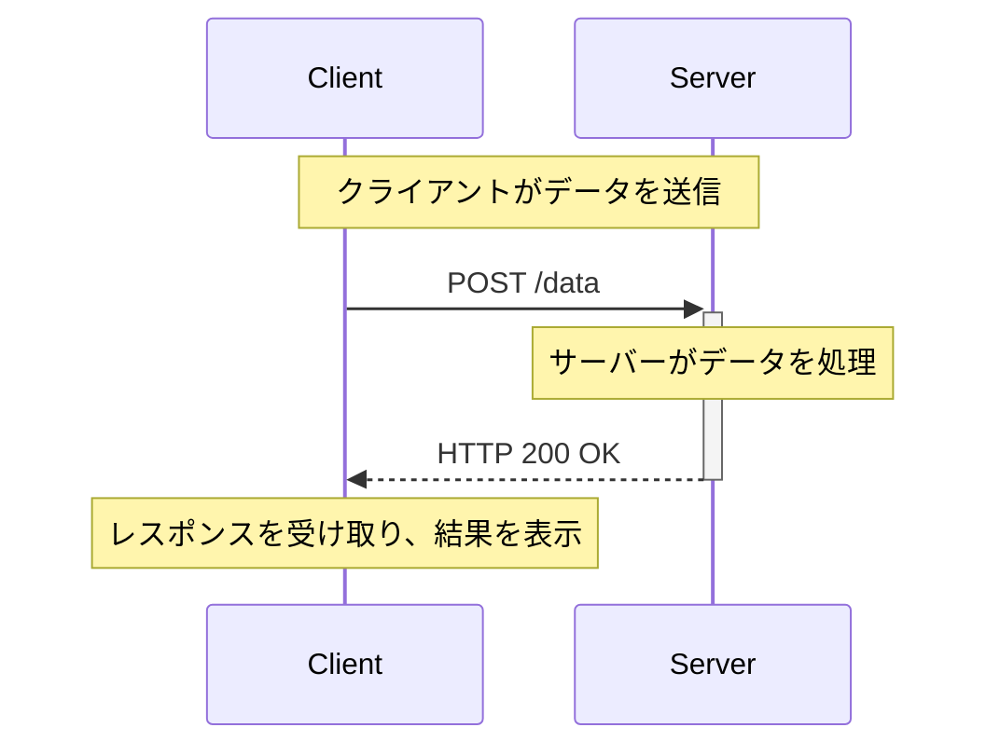
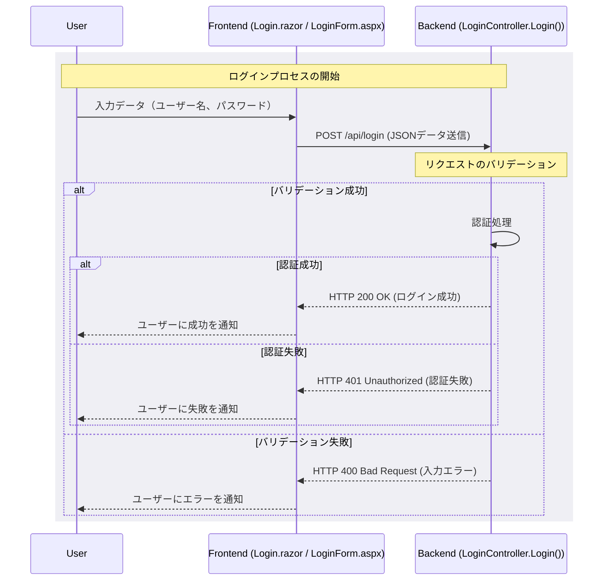

import SeriesList from '@site/src/components/SeriesList';

# HTTP プロトコルの『POST』解説

*[Created: 2024/05/05, Update: none(same as creation date)]*

---

この記事では、HTTP プロトコルにおける主要な操作である『POST』について解説します。

POSTの概要や使用例、使用ケースについて説明し、C# を使用した具体的なコード例も示します。  
クライアント側とサーバー側の両方についてコーディング例を記載しておりますので、参考にしてください。

:::note[購読対象層]

* 対象者: .NET 開発者や Web アプリケーション開発者。
* 記事概要: POST の基本的な概念と具体的な使用例、セキュリティに関連する重要な話題について詳述します。
* 技術: POST を学び始めたばかりの初心者から、その知識を実際のプロジェクトに応用したい方まで。

:::

---

## 関連する解説シリーズ記事一覧

<SeriesList
    seriesName="technical-notebook-dotnet-http-protocol"
    exclusion="post-method"/>

---

## 動作環境情報

:::info[.NETバージョン]

* .NET Core: すべてのバージョン（1.0 以降）
* .NET Framework: 4.5 以降
* .NET Standard: 1.1 以降（ただし、2.0 が推奨されます）

:::
:::info[必要なサードパーティー製パッケージ]
この記事で必須となるサードパーティー製パッケージはありません。  
しかし Swagger(`Swashbuckle.AspNetCore`) は API の開発やデバッグで役に立つため、導入の検討を推奨します。
:::

---
---

## 1. POSTとは

POSTは、新しいデータを作成したり、サーバーに情報をまとめて送信するために使用されます。  
リクエストには、ボディにデータを含めることができ、サーバーにデータを送信する際に使用されます。

GETに比べて、POSTはより多くのデータを送信できるため、フォームデータやファイルのアップロードなどに適しています。

POSTは非冪等性であり、同じリクエストを複数回送信しても、同じ結果が得られるとは限りません。

一般的な POST シーケンスは、以下の通りです：



:::info[冪等性（Idempotency）]
HTTPの「冪等性」は、同一の操作を何度実行してもシステムの状態が最初の1回目の操作以降変わらないことを意味します。  
POSTは非冪等性であるため、同じリクエストを複数回送信すると、サーバーの状態が変わる可能性があります。

より詳しい解説は [基本解説の冪等性セクション](/docs/technical-notebook/dotnet/http-protocol/basic-explanation#5-メソッドの冪等性について) を参照してください。
:::
:::tip[簡単に覚える：要約ワンポイント]
POSTは、サーバーにデータを送信する。非冪等性である。
:::

---

### 1.1. POSTを使うケース

POSTは以下のようなシナリオで一般的に使用されます：

* ユーザー認証: ユーザーがログインフォームに入力したユーザー名とパスワードをサーバーに送信します。
* データの作成: 新しいレコード（例えば、オンラインフォーム経由での新しい顧客情報）をデータベースに追加する場合。
* ファイルのアップロード: ユーザーが画像やドキュメントをサイトにアップロードする場合。

一般的なWebアプリケーションでは、以下のようなデータ送信の例があります：

* ユーザー登録
* フォームの送信
* 商品の注文

:::info[GETに比べてPOSTは安全なデータ送信に適しています]
POSTはリクエストボディにデータを含めることができるため、ユーザー名やパスワードなどの情報を安全に送信することができます。

一方、GETはリソースの取得に使用することを目的としており、リクエストボディにデータを含めることができません。  
そのため、ログイン情報などを送信するためにGETを使用すると、情報がURLの一部として露出してしまう可能性があります。
:::
:::note[なぜGETをPOSTで代用する？その背景]
HTTPは1989年に初めて導入されたプロトコルで、当初は開かれたネットワーク環境で情報共有する目的で設計されました。  
その後、急速に広がり、プロトコルの変更が容易でなくなったため、規格の修正が難しくなりました。  
全世界で使用されているため、多大なる影響範囲の観点から新しいプロトコルを導入することも困難です。  
そのため、セキュリティを確保する代替案として、POSTリクエストの使用を推奨されるようになりました。
:::

---

### 1.2. 例外的なPOSTの使用ケース

POSTは、一般的にはデータ作成や更新をするために使用されますが、以下のような例外的なケースもあります。

* **バリデーション (推奨):**  
  フォームの入力値を検証するためにPOSTリクエストを使用するのは一般的です。  
  これは、特に入力データが多量であるか、敏感な情報を含む場合に適しています。

* **ログアウト (推奨):**  
  ログアウト機能でPOSTを使用するのはセキュリティのベストプラクティスです。  
  GETではなくPOSTを使用することで、誤ってログアウトがトリガーされることを防ぎ、CSRF攻撃を防ぐ効果があります。

* **データの削除 (特殊ケース):**  
  通常、データ削除にはDELETEが推奨されますが、POSTが使用されることもあります。  
  特に、DELETEのサポートが不完全な場合や追加のデータ送信が必要な場合に見られます。

* **ファイルのダウンロード (特殊ケース):**  
  通常、ファイルのダウンロードはGETを使用しますが、ダウンロードリクエストに多くのパラメータが必要な場合や、セキュリティを強化するためにPOSTを使用することがあります。

* **データの検索 (特殊ケース):**  
  一般的にはGETが使用されますが、検索クエリが複雑である場合や、大量のデータを送信する必要がある場合にPOSTを使用することがあります。

* **ページの遷移 (極めて特殊なケース):**  
  以下のような極めて特殊なケースでは、POSTが使用されることがあります：

  * 重要なトランザクション完了後のリダイレクト: 例えば、金融関連のトランザクション後など
  * マルチステップフォームの処理: 複数のステップを持つフォームの途中でPOSTを使用して各ステップのデータを送信
  * セッションベースの操作: セッションハイジャックなどのセキュリティリスクを軽減するため

#### 特殊ケースのまとめ

:::info[重要情報はPOSTで扱う]
ユーザー名やパスワード、クレジットカード情報、個人情報などのセンシティブなデータを扱う場合  
データの作成や更新でなくともPOSTを使用することが推奨されます。  
情報の重要度を考慮し、セキュリティを強化するためにPOSTを選択することが重要です。
:::
:::tip[API利用者に意図を伝える]
特殊なケースでPOSTを使用する場合、API利用者にその意図を明確に伝えることが重要です。  
SwaggerなどのAPIドキュメントを使用する場合 `summary` や `description` に記載すると、親切です。
:::

---
---

## 2. セキュリティ上の考慮事項

POSTはデータの送信や更新に使用されるため、セキュリティ上のリスクが存在します。  
POSTは特にセキュリティに配慮する必要がある操作の一つです。

### 2.1. 主なPOSTのセキュリティリスク

* **データの改ざん:**  
  POSTリクエストを傍受してデータを改ざんすることができる可能性があります。
* **データの漏洩:**  
  POSTリクエストに機密情報が含まれている場合、データが漏洩する可能性があります。
* **クロスサイトリクエストフォージェリ（CSRF）:**  
  POSTリクエストを不正なWebサイトから送信されると、認証されたユーザーのリソースが更新される可能性があります。
* **クロスサイトスクリプティング（XSS）:**  
  POSTリクエストに悪意のあるスクリプトが含まれると、ユーザーのデータが改ざんされる可能性があります。
* **SQLインジェクション:**  
  POSTリクエストにSQLインジェクションが含まれると、データベースが改ざんされる可能性があります。
* **セッションハイジャック:**  
  POSTリクエストを傍受してセッションIDを盗み取ると、認証されたユーザーのリソースが更新される可能性があります。

### 2.2. セキュリティ対策

これらの対策を実施することで、POSTメソッドを使用した際のリスクを大幅に低減できます。

* **HTTPSの使用:**  
  POSTリクエストを暗号化された通信で送信することで、データの盗聴や改ざんを防ぎます。
* **認証と認可:**  
  POSTリクエストを送信するユーザーを認証し、適切な権限を持つユーザーのみがリソースを更新できるようにします。
* **パラメータの暗号化:**  
  POSTリクエストに機密情報が含まれる場合、パラメータを暗号化して送信することで、情報漏洩を防ぎます。
* **エラーハンドリング:**  
  POSTリクエストが失敗した場合、エラーメッセージを適切に処理して、攻撃者に情報を漏洩しないようにします。
* **クロスサイトスクリプティング（XSS）対策:**  
  POSTリクエストに悪意のあるスクリプトが含まれないように、ユーザーからの入力を適切にエスケープします。
* **クロスサイトリクエストフォージェリ（CSRF）対策:**  
  POSTリクエストに対してトークンを付与することで、CSRF攻撃を防ぎます。
* **SQLインジェクション対策:**  
  POSTリクエストにSQLインジェクションが含まれないように、入力値を適切に検証・エスケープします。
* **セッションハイジャック対策:**  
  POSTリクエストを暗号化された通信で送信することで、セッションIDの盗み取りを防ぎます。

:::warning[POSTとPUTのセキュリティリスクの比較]
POSTとPUTは、どちらもリソースの作成と更新に使用されるメソッドですが、セキュリティリスクにはいくつかの違いがあります。

**POSTリクエストは、新しいリソースを作成するため、CSRF攻撃やSQLインジェクションのリスクが高まります。**  
一方、PUTリクエストは、リソースの完全な内容を送信するため、データの改ざんや漏洩のリスクが高まります。

POSTもPUTも攻撃の手段として使用されることに変わりはありませんが  
セキュリティリスクを軽減するためには、PUTとPOSTの違いを理解し、適切な対策を講じることが重要です。
:::
:::info[HTTPSの重要性]
HTTPSは ***すべてのクライアントとサーバー間の通信を暗号化*** するため、データの盗聴や改ざんを防ぐことができます。

HTTPSの全文とセキュリティについては、内部ページである [HTTP プロトコルの基本解説](/docs/technical-notebook/dotnet/http-protocol/basic-explanation#6-セキュリティ上の考慮事項) にも詳細な解説を記載しています。
:::
:::tip[攻撃について]
脆弱性の攻撃に対する詳細はPOST解説セクションから外れるため、ここでは詳細な説明を省略します。

参考: [wikipedia - クロスサイトスクリプティング](https://ja.wikipedia.org/wiki/%E3%82%AF%E3%83%AD%E3%82%B9%E3%82%B5%E3%82%A4%E3%83%88%E3%82%B9%E3%82%AF%E3%83%AA%E3%83%97%E3%83%86%E3%82%A3%E3%83%B3%E3%82%B0)  
参考: [wikipedia - クロスサイトリクエストフォージェリ](https://ja.wikipedia.org/wiki/%E3%82%AF%E3%83%AD%E3%82%B9%E3%82%B5%E3%82%A4%E3%83%88%E3%83%AA%E3%82%AF%E3%82%A8%E3%82%B9%E3%83%88%E3%83%95%E3%82%A9%E3%83%BC%E3%82%B8%E3%83%A3%E3%83%AA)  
参考: [wikipedia - SQLインジェクション](https://ja.wikipedia.org/wiki/SQL%E3%82%A4%E3%83%B3%E3%82%B8%E3%82%A7%E3%82%AF%E3%82%B7%E3%83%A7%E3%83%B3)  
参考: [wikipedia - セッションハイジャック](https://ja.wikipedia.org/wiki/%E3%82%BB%E3%83%83%E3%82%B7%E3%83%A7%E3%83%B3%E3%83%8F%E3%82%A4%E3%82%B8%E3%83%A3%E3%83%83%E3%82%AF)  
:::

---
---

## 3. POSTの使用例 (C#)

C#でのPOSTの使用例を以下に示します。

---

### 3.1. 基本的な使用例

#### POST-クライアントとサーバーの共通モデル(C#)

```csharp title="[C#] UserModel.cs" showLineNumbers
using System;
using System.ComponentModel.DataAnnotations;

namespace Ateliers.Lectures.MVC.SharedModel
{
    public class UserModel
    {
        [Required(ErrorMessage = "ユーザー名を入力してください。")]
        public string UserName { get; set; } = "";
        [Required(ErrorMessage = "パスワードを入力してください。")]
        public string Password { get; set; } = "";
    }
}
```

#### POST-使用ユーザー側-クライアントの例(C#)

import Tabs from '@theme/Tabs';
import TabItem from '@theme/TabItem';

<Tabs>
  <TabItem value="blazor" label="Blazor" default>

```razor title="[C#] Login.razor" showLineNumbers
@page "/Login"
@using System.ComponentModel.DataAnnotations
@using Microsoft.AspNetCore.Authentication
@using Microsoft.AspNetCore.Authentication.Cookies
@using System.Security.Claims
@using Ateliers.Lectures.MVC.SharedModel;
@inject NavigationManager NavigationManager

<h2> ログイン試行 </h2>

<EditForm EditContext="EditContext" FormName="login-form" OnValidSubmit="LoginAsync">
    <DataAnnotationsValidator />
    <ValidationSummary Model="userModel" />
    <div>
        <label>
            ユーザー名:
            <InputText @bind-Value="userModel.UserName" />
            <ValidationMessage For="() => userModel.UserName" />
        </label>
    </div>
    <div>
        <label>
            パスワード:
            <InputText @bind-Value="userModel.Password" type="password" />
            <ValidationMessage For="() => userModel.Password" />
        </label>
    </div>
    <div>
        <button type="submit">ログイン</button>
    </div>
</EditForm>

@code {
    [SupplyParameterFromForm]
    private UserModel userModel { get; set; } = default!;
    private EditContext EditContext { get; set; } = default!;
    private ValidationMessageStore ValidationMessageStore { get; set; } = default!;

    // HttpClientのDI
    [Inject]
    HttpClient Http { get; set; }

    protected override void OnInitialized()
    {
        userModel ??= new();
        EditContext = new(userModel);
        ValidationMessageStore = new(EditContext);
    }

    private async Task LoginAsync(EditContext editContext)
    {
        // highlight-start
        // POSTリクエストに含めるBodyデータは、画面とバインドされたモデルをそのまま使用
        // ログイン情報をPOSTリクエストで送信
        var response = await Http.PostAsJsonAsync("api/login", userModel);
        // highlight-end
        if (response.IsSuccessStatusCode)
        {
            // ログイン成功時の処理をここに書く
        }
        else
        {
            // ログイン失敗時の処理をここに書く
        }

    }
}
```

  </TabItem>
  <TabItem value="webForms" label="WebForms">

```cshtml title="[C#] LoginForm.cs" showLineNumbers
<%@ Page Language="C#" AutoEventWireup="true" CodeBehind="LoginForm.aspx.cs" Inherits="Ateliers.Lectures.MVC.Net46.WebForms.LoginForm" Async="true" %>

<!DOCTYPE html>

<html xmlns="http://www.w3.org/1999/xhtml">
<head runat="server">
    <title>Login Form</title>
</head>
<body>
    <form id="form1" runat="server">
        <div>
            <label for="UserName">ユーザー名:</label>
            <asp:TextBox ID="UserName" runat="server"></asp:TextBox>
        </div>
        <div>
            <label for="Password">パスワード:</label>
            <asp:TextBox ID="Password" runat="server" TextMode="Password"></asp:TextBox>
        </div>
        <div>
            <asp:Button ID="LoginButton" runat="server" Text="ログイン" OnClick="LoginButton_Click" />
        </div>
    </form>
</body>
</html>
```

```csharp title="[C#] LoginForm.aspx.cs" showLineNumbers
using System;
using System.Net.Http;
using System.Web.UI;
using Newtonsoft.Json;
using Ateliers.Lectures.MVC.SharedModel;

public partial class LoginForm : Page
{
    protected void Page_Load(object sender, EventArgs e)
    {
    }

    protected async void LoginButton_Click(object sender, EventArgs e)
    {
        string userName = UserName.Text;
        string password = Password.Text;

        var userModel = new UserModel { UserName = userName, Password = password };
        var json = JsonConvert.SerializeObject(userModel);

        using (var client = new HttpClient())
        {
            // highlight-start
            // POSTリクエストに含めるBodyデータを作成
            var content = new StringContent(json, System.Text.Encoding.UTF8, "application/json");
            // ログイン情報をPOSTリクエストで送信
            var response = await client.PostAsync("https://localhost:44380/api/login", content);
            // highlight-end

            if (response.IsSuccessStatusCode)
            {
                // ログイン成功時の処理をここに書く
            }
            else
            {
                // ログイン失敗時の処理をここに書く
            }
        }
    }
}
```

  </TabItem>
</Tabs>

Blazor と WebForms の例では、それぞれのフレームワークにおけるPOSTメソッドの使用例を示しています。

Blazer では、ログインフォームに入力されたユーザー名とパスワードをサーバーに送信するためにPOSTリクエストを使用しています。
データは `UserModel` クラスにバインドされ、`PostAsJsonAsync` メソッドを使用してJSON形式でサーバーに送信されます。

WebForms では、`TextBox` に入力されたユーザー名とパスワードを取得し、`UserModel` クラスに格納して JSON 形式にシリアライズします。
`HttpClient` クラスを使用してPOSTリクエストを送信し、サーバーからのレスポンスを処理します。

:::tip[共通モデル]
Blazor と WebForms の例では、共通のモデル `UserModel` を使用してログイン情報を扱っています。  
このモデルは必須ではありませんが .Net 同士でデータをやり取りする際は、同じモデルとすることで、クライアントとサーバーでのデータのやり取りが容易になります。

フロントエンドが .Net ではない場合、通常通りJSON形式でデータを送受信することになります。
:::

#### POST-サーバー側-コントローラーの例(C#)

<Tabs>
  <TabItem value="net-core" label=".Net (Core)">

```csharp title="[C#] LoginController.cs" showLineNumbers
using Microsoft.AspNetCore.Mvc;
using Ateliers.Lectures.MVC.SharedModel;

namespace Ateliers.Lectures.MVC.APIServer.Controllers
{
    [ApiController]
    [Route("api/[controller]")]
    public class LoginController : ControllerBase
    {
        // POST: api/login
        // highlight-start
        [HttpPost]
        public ActionResult Login([FromBody] UserModel userModel)
        // highlight-end
        {
            // ここで認証処理を行います
            if (userModel.UserName == "user" && userModel.Password == "pass")
            {
                return Ok("ログイン成功");
            }

            return Unauthorized("認証失敗");
        }
    }
}
```

  </TabItem>
  <TabItem value="net-framework" label=".Net Framework">

```csharp title="[C#] LoginController.cs (.Net Framework 4.6)" showLineNumbers
using System.Web.Http;
using Ateliers.Lectures.MVC.SharedModel;

namespace Ateliers.Lectures.MVC.Net46.APIServer.Controllers
{
    [RoutePrefix("api")]
    public class LoginController : ApiController
    {
        // POST: api/login
        // highlight-start
        [HttpPost]
        public IHttpActionResult Login([FromBody] UserModel userModel)
        // highlight-end
        {
            // ここで認証処理を行います
            if (userModel.UserName == "user" && userModel.Password == "pass")
            {
                return Ok("ログイン成功");
            }

            return Unauthorized();
        }
    }
}
```

  </TabItem>
</Tabs>

.Net Core と .Net Framework の例では、それぞれのフレームワークにおけるPOSTリクエストの処理例を示しています。

.Net Core も .Net Framework も、`[HttpPost]` アトリビュートを使用してPOSTリクエストを処理するメソッド `Login()` を定義しています。  
このメソッドは、`UserModel` クラスを引数として受け取り、ユーザー名とパスワードが正しい場合には `Ok` メソッドを使用して成功を返します。  
ログイン情報が誤っている場合は `Unauthorized` メソッドを使用して失敗を返します。

:::info[FromBodyアトリビュート]
パラメータに付与されている `[FromBody]` アトリビュートは、リクエストボディからデータをバインドするために使用されます。  
このアトリビュートを使用することで、リクエストボディのデータをモデルにバインドすることができます。

このアトリビュートは必須ではありませんが、リクエストボディからデータを取得する場合には推奨されます。
:::

#### POST-シーケンス図



---
---

## 参考文献リンクなど

HTTPについて：

| リンク | 説明 |
| --- | --- |
| [wikipedia - HTTPS](https://ja.wikipedia.org/wiki/HTTPS) | HTTPSについてのWikipediaの記事 |
| [wikipedia - HTTPステータスコード](https://ja.wikipedia.org/wiki/HTTP%E3%82%B9%E3%83%86%E3%83%BC%E3%82%BF%E3%82%B9%E3%82%B3%E3%83%BC%E3%83%89) | HTTPステータスコードについてのWikipediaの記事 |

セキュリティ：

| リンク | 説明 |
| --- | --- |
| [wikipedia - クロスサイトスクリプティング](https://ja.wikipedia.org/wiki/%E3%82%AF%E3%83%AD%E3%82%B9%E3%82%B5%E3%82%A4%E3%83%88%E3%82%B9%E3%82%AF%E3%83%AA%E3%83%97%E3%83%86%E3%82%A3%E3%83%B3%E3%82%B0) | クロスサイトスクリプティングについてのWikipediaの記事 |
| [wikipedia - クロスサイトリクエストフォージェリ](https://ja.wikipedia.org/wiki/%E3%82%AF%E3%83%AD%E3%82%B9%E3%82%B5%E3%82%A4%E3%83%88%E3%83%AA%E3%82%AF%E3%82%A8%E3%82%B9%E3%83%88%E3%83%95%E3%82%A9%E3%83%BC%E3%82%B8%E3%83%A3%E3%83%AA) | クロスサイトリクエストフォージェリについてのWikipediaの記事 |
| [wikipedia - SQLインジェクション](https://ja.wikipedia.org/wiki/SQL%E3%82%A4%E3%83%B3%E3%82%B8%E3%82%A7%E3%82%AF%E3%82%B7%E3%83%A7%E3%83%B3) | SQLインジェクションについてのWikipediaの記事 |
| [wikipedia - セッションハイジャック](https://ja.wikipedia.org/wiki/%E3%82%BB%E3%83%83%E3%82%B7%E3%83%A7%E3%83%B3%E3%83%8F%E3%82%A4%E3%82%B8%E3%83%A3%E3%83%83%E3%82%AF) | セッションハイジャックについてのWikipediaの記事 |

---

## フィードバックの提供方法と連絡先

:::tip[お知らせ]
この記事に関するフィードバックやご質問、ご意見がございましたら [プロフィールページの連絡先](/docs/profiles/self-introduction#2-連絡先) からお気軽にご連絡ください。  
貴重なディスカッションをお待ちしております。
:::

---
