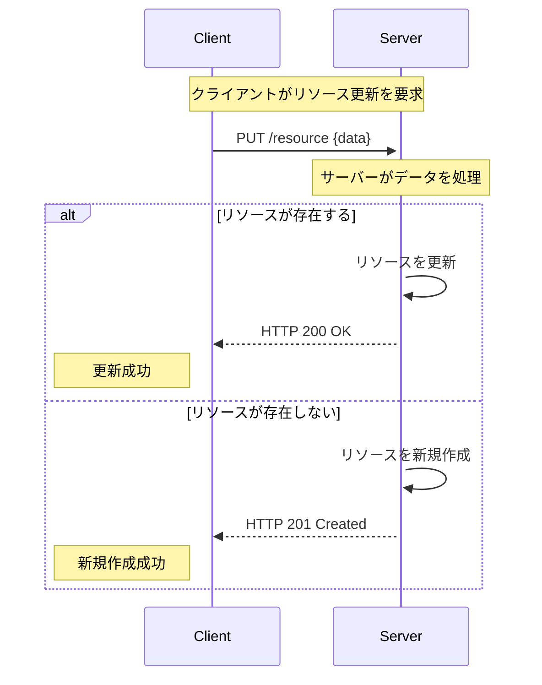
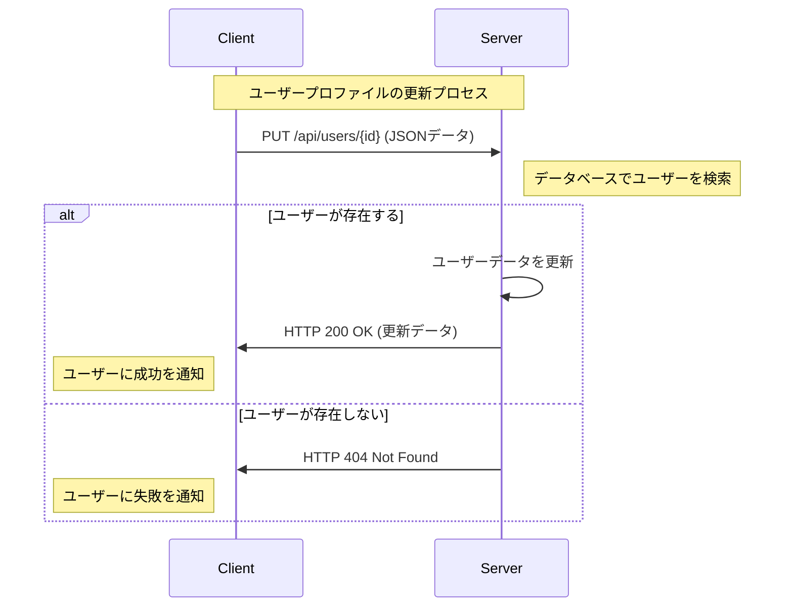

# HTTP プロトコルの『PUT』解説

*[Created: 2024/05/05, Update: none(same as creation date)]*

---

この記事では、HTTP プロトコルにおける主要な操作である『PUT』について解説します。

PUTの概要や使用例、使用ケースについて説明し、C# を使用した具体的なコード例も示します。  
クライアント側とサーバー側の両方についてコーディング例を記載しておりますので、参考にしてください。

:::note[購読対象層]

* 対象者: .NET 開発者やWebアプリケーション開発者。
* 記事概要: PUTの基本的な概念と具体的な使用例、セキュリティに関連する重要な話題について詳述します。
* 技術: PUTを学び始めたばかりの初心者から、その知識を実際のプロジェクトに応用したい方まで。

:::

---

## 関連する解説記事一覧

1. [HTTP プロトコルの基本解説](/docs/technical-notebook/dotnet/http-protocol/basic-explanation)
2. [GET の解説](/docs/technical-notebook/dotnet/http-protocol/get-method)
3. [POST の解説](/docs/technical-notebook/dotnet/http-protocol/post-method)
4. PUT の解説 (本記事)
5. [DELETE の解説](/docs/technical-notebook/dotnet/http-protocol/delete-method)

---

## 動作環境情報

:::info[.NETバージョン]

* .NET Core: すべてのバージョン（1.0 以降）
* .NET Framework: 4.5 以降
* .NET Standard: 1.1 以降（ただし、2.0 が推奨されます）

:::
:::info[必要なサードパーティー製パッケージ]
この記事で必須となるサードパーティー製パッケージはありません。  
しかし Swagger(`Swashbuckle.AspNetCore`) は API の開発やデバッグで役に立つため、導入の検討を推奨します。
:::

---
---

## 1. PUTとは

PUTは、指定されたURIにリソースを作成または更新するために使用されます。  
PUTリクエストの本体には、更新されるリソースの完全な内容が含まれている必要があります。

PUTは冪等性（Idempotency）であるため、同じリクエストを何度実行しても同じ結果になります。

一般的なPUTシーケンスは、以下の通りです：



:::info[冪等性（Idempotency）]
HTTPメソッドの「冪等性」は、同一の操作を何度実行してもシステムの状態が最初の1回目の操作以降変わらないことを意味します。  
つまり、同じリクエストを繰り返し送信しても、リソースの状態に対して同じ効果が適用され、それ以上の変更が発生しない性質です。

より詳しい解説は [基本解説の冪等性セクション](/docs/technical-notebook/dotnet/http-protocol/basic-explanation#5-メソッドの冪等性について) を参照してください。
:::
:::tip[簡単に覚える：要約ワンポイント]
PUTは、リソースを作成または更新する。冪等性であり、一意のキーが同じであれば、絶対に重複しない。
:::

---

### 1.1. PUT と POST の違い

APIの設計や利用をする上で PUT と POST の違いを理解し、適切に操作を分けて実装することは、重要です。  
理解を深めるために、具体的な例を挙げて PUT と POST の違いを解説します。

#### PUTとPOST-基本的な違い

* PUT:  
PUTは冪等性がある操作で、同じリクエストを何度行っても同じ結果になることを意味します。  
具体的には、PUTは **特定のリソースを更新または置換** するために使用されます。  
リソースの全体を送信し、サーバー上でそのリソースを完全に置換します。  

* POST:  
POSTは非冪等性の操作で、同じリクエストを繰り返すと異なる結果が生じる可能性があります。  
POSTは主に **新しいリソースを作成** するために使用されます。  
また、POSTはサーバー上で新しいリソースを生成する操作に使われることが多く、リソースのURIはサーバーによって指定されます。

#### PUTとPOST-使用シナリオ

* PUTの使用例:  
既存のユーザープロファイルや設定情報の更新にPUTを使用します。  
この場合、クライアントは更新されるリソースの全データを提供し、サーバーはそれを受け取ったデータで **既存のリソースを完全に置換** します。

* POSTの使用例:  
新しいユーザーアカウントを作成する際にPOSTを使用します。  
クライアントは必要なデータを送信し、サーバーはそのデータを元に **新しいリソースを作成** し、リソースのURIをクライアントに返します。

#### PUTとPOST-操作の影響

* PUT操作の影響:  
PUT操作では、指定されたURIに対応する既存のリソースが **新しいデータで完全に置換** されます。  
存在しないURIにPUTリクエストが行われた場合、新しいリソースがそのURIで作成されることがあります。

* POST操作の影響:  
POST操作は、新しいサブリソースを作成したり、複数のリソースに影響を与える処理を行ったりするのに適しています。  
たとえば、一つのPOSTリクエストでデータベースに複数の **レコードを追加** する場合などがこれに該当します。

---

### 1.2. PUTを使うケース

PUTは以下のようなシナリオで一般的に使用されます：

* リソースの更新: 既存のリソースのデータを更新する場合（例: ユーザープロファイルの更新）。
* 新しいリソースの作成: サーバーが新しいリソースのURIをクライアントに知らせない場合、クライアントが指定したURIにリソースを作成します。
* リソースの置換: 既存のリソースを新しいデータで完全に置き換える場合。

一般的なWebアプリケーションでは、以下のようなデータ送信の例があります：

* ユーザープロファイルの更新
* 設定オプションの保存
* 文章やブログポストの編集

:::info[これらは冪等性の性質を利用します]
いずれも重複してはならないデータの例です。  
API利用側は明確に「最新の状態を保つ」意図があり、サーバー側は完全に更新(置換)することで、データの整合性を保つことができます。
:::

---
---

## 2. セキュリティに関する考慮事項

PUTを使用してリソースの更新を行う場合、セキュリティに関する考慮事項があります。  
PUTもPOSTと同様に、特にセキュリティリスクを配慮して設計する必要があります。

### 2.1. 主なPUTのセキュリティリスク

* **データの改ざん:**  
  PUTリクエストを傍受してデータを改ざんすることができる可能性があります。
* **データの漏洩:**  
  PUTリクエストに機密情報が含まれている場合、データが漏洩する可能性があります。
* **クロスサイトリクエストフォージェリ（CSRF）:**  
  PUTリクエストを不正なWebサイトから送信されると、認証されたユーザーのリソースが更新される可能性があります。
* **クロスサイトスクリプティング（XSS）:**  
  PUTリクエストに悪意のあるスクリプトが含まれると、ユーザーのデータが改ざんされる可能性があります。
* **SQLインジェクション:**  
PUTリクエストにSQLインジェクションが含まれると、データベースが改ざんされる可能性があります。
* **セッションハイジャック:**  
  PUTリクエストを傍受してセッションIDを盗み取ると、認証されたユーザーのリソースが更新される可能性があります。

### 2.2. セキュリティ対策

これらの対策を実施することで、PUTメソッドを使用した際のリスクを大幅に低減できます。

* **HTTPSの使用:**  
  PUTリクエストを暗号化された通信で送信することで、データの盗聴や改ざんを防ぎます。
* **認証と認可:**  
  PUTリクエストを送信するユーザーを認証し、適切な権限を持つユーザーのみがリソースを更新できるようにします。
* **パラメータの暗号化:**  
  PUTリクエストに機密情報が含まれる場合、パラメータを暗号化して送信することで、情報漏洩を防ぎます。
* **エラーハンドリング:**  
  PUTリクエストが失敗した場合、エラーメッセージを適切に処理して、攻撃者に情報を漏洩しないようにします。
* **クロスサイトスクリプティング（XSS）対策:**  
  PUTリクエストに悪意のあるスクリプトが含まれないように、ユーザーからの入力を適切にエスケープします。
* **クロスサイトリクエストフォージェリ（CSRF）対策:**  
  PUTリクエストに対してトークンを付与することで、CSRF攻撃を防ぎます。
* **SQLインジェクション対策:**  
  PUTリクエストにSQLインジェクションが含まれないように、入力値を適切に検証・エスケープします。
* **セッションハイジャック対策:**  
  PUTリクエストを暗号化された通信で送信することで、セッションIDの盗み取りを防ぎます。

:::warning[PUTとPOSTのセキュリティリスクの比較]
PUTとPOSTは、どちらもリソースの作成と更新に使用されるメソッドですが、セキュリティリスクにはいくつかの違いがあります。

**PUTリクエストは、リソースの完全な内容を送信するため、データの改ざんや漏洩のリスクが高まります。**  
一方、POSTリクエストは、新しいリソースを作成するため、CSRF攻撃やSQLインジェクションのリスクが高まります。

PUTもPOSTも攻撃の手段として使用されることに変わりはありませんが  
セキュリティリスクを軽減するためには、PUTとPOSTの違いを理解し、適切な対策を講じることが重要です。
:::
:::info[HTTPSの重要性]
HTTPSは ***すべてのクライアントとサーバー間の通信を暗号化*** するため、データの盗聴や改ざんを防ぐことができます。

HTTPSの全文とセキュリティについては、内部ページである [HTTP プロトコルの基本解説](/docs/technical-notebook/dotnet/http-protocol/basic-explanation#6-セキュリティ上の考慮事項) にも詳細な解説を記載しています。
:::
:::tip[攻撃について]
脆弱性の攻撃に対する詳細はPUT解説セクションから外れるため、ここでは詳細な説明を省略します。

参考: [wikipedia - クロスサイトスクリプティング](https://ja.wikipedia.org/wiki/%E3%82%AF%E3%83%AD%E3%82%B9%E3%82%B5%E3%82%A4%E3%83%88%E3%82%B9%E3%82%AF%E3%83%AA%E3%83%97%E3%83%86%E3%82%A3%E3%83%B3%E3%82%B0)  
参考: [wikipedia - クロスサイトリクエストフォージェリ](https://ja.wikipedia.org/wiki/%E3%82%AF%E3%83%AD%E3%82%B9%E3%82%B5%E3%82%A4%E3%83%88%E3%83%AA%E3%82%AF%E3%82%A8%E3%82%B9%E3%83%88%E3%83%95%E3%82%A9%E3%83%BC%E3%82%B8%E3%83%A3%E3%83%AA)  
参考: [wikipedia - SQLインジェクション](https://ja.wikipedia.org/wiki/SQL%E3%82%A4%E3%83%B3%E3%82%B8%E3%82%A7%E3%82%AF%E3%82%B7%E3%83%A7%E3%83%B3)  
参考: [wikipedia - セッションハイジャック](https://ja.wikipedia.org/wiki/%E3%82%BB%E3%83%83%E3%82%B7%E3%83%A7%E3%83%B3%E3%83%8F%E3%82%A4%E3%82%B8%E3%83%A3%E3%83%83%E3%82%AF)  
:::

---
---

## 3. PUT使用例 (C#)

### 3.1. 一般的なPUTの使用例

ここでは、ユーザープロファイルの更新を例に、クライアント側とサーバー側でのPUTの使用例を示します。

#### PUT-使用ユーザー側-クライアントの例(C#)

```csharp title="[C#] UpdateProfile.cs" showLineNumbers
using System;
using System.Net.Http;
using System.Text.Json;
using System.Threading.Tasks;
using Ateliers.Lectures.MVC.SharedModel;

public class UpdateProfile
{
    public async Task UpdateUserAsync(int userId, UserModel user)
    {
        using (var client = new HttpClient())
        {
            // highlight-start
            // PUTリクエストのBodyデータを作成
            var json = JsonSerializer.Serialize(user);
            var content = new StringContent(json, System.Text.Encoding.UTF8, "application/json");

            // PUTリクエストを送信
            var response = await client.PutAsync($"https://localhost:44380/api/users/{userId}", content);
            // highlight-end

            if (response.IsSuccessStatusCode)
            {
                Console.WriteLine("ユーザー情報を更新しました。");
            }
            else
            {
                Console.WriteLine("更新に失敗しました。");
            }
        }
    }
}
```

#### PUT-サーバー側-コントローラーの例(C#)

```csharp title="[C#] UsersController.cs" showLineNumbers
using Microsoft.AspNetCore.Mvc;
using Ateliers.Lectures.MVC.SharedModel;

namespace Ateliers.Lectures.MVC.APIServer.Controllers
{
    [ApiController]
    [Route("api/[controller]")]
    public class UsersController : ControllerBase
    {
        // PUT: api/users/{id}
        // highlight-start
        [HttpPut("{id}")]
        public ActionResult UpdateUser(int id, [FromBody] UserModel user)
        // highlight-end
        {
            // データベースからユーザーを検索
            // 仮の例として、ユーザーが存在するとします
            var existingUser = new UserModel(); // 仮のユーザーデータ

            if (existingUser == null)
            {
                return NotFound();
            }

            // ユーザーデータの更新処理
            existingUser.UserName = user.UserName;
            existingUser.Password = user.Password;

            // データベースに保存
            // 保存処理をここに記述

            return Ok(existingUser);
        }
    }
}
```

この例では、ユーザープロファイルの更新を例に、PUTの使用例を示しています。

クライアント側では、`UpdateUserAsync` メソッドを使用して、指定されたユーザーIDに対してPUTリクエストを送信しています。
リクエストの本体には、更新するユーザー情報がJSON形式で含まれています。

サーバー側では、`UpdateUser` メソッドを使用して、指定されたユーザーIDに対してユーザー情報を更新しています。
リクエストボディからユーザー情報を取得し、データベースからユーザーを検索して更新処理を行います。

:::note[サンプルコードにつき、以下は配慮していません]

* サーバー側のコードで、ユーザーが見つからない場合の処理が NotFound() で適切に行われていますが、他の潜在的なエラー（例えばデータベースアクセスエラーなど）に対する追加のエラーハンドリングを考慮することを推奨します。
* クライアント側は、ユーザーに対するより詳細なフィードバックを省略しています。例えば、更新が成功した際の確認メッセージだけでなく、なぜ更新が失敗したのかについての情報もユーザーに提供することが有益です。

:::

#### PUT-シーケンス図



---
---

## 参考文献リンクなど

HTTPについて：

| リンク | 説明 |
| --- | --- |
| [wikipedia - HTTPS](https://ja.wikipedia.org/wiki/HTTPS) | HTTPSについてのWikipediaの記事 |
| [wikipedia - HTTPステータスコード](https://ja.wikipedia.org/wiki/HTTP%E3%82%B9%E3%83%86%E3%83%BC%E3%82%BF%E3%82%B9%E3%82%B3%E3%83%BC%E3%83%89) | HTTPステータスコードについてのWikipediaの記事 |

セキュリティ：

| リンク | 説明 |
| --- | --- |
| [wikipedia - クロスサイトスクリプティング](https://ja.wikipedia.org/wiki/%E3%82%AF%E3%83%AD%E3%82%B9%E3%82%B5%E3%82%A4%E3%83%88%E3%82%B9%E3%82%AF%E3%83%AA%E3%83%97%E3%83%86%E3%82%A3%E3%83%B3%E3%82%B0) | クロスサイトスクリプティングについてのWikipediaの記事 |
| [wikipedia - クロスサイトリクエストフォージェリ](https://ja.wikipedia.org/wiki/%E3%82%AF%E3%83%AD%E3%82%B9%E3%82%B5%E3%82%A4%E3%83%88%E3%83%AA%E3%82%AF%E3%82%A8%E3%82%B9%E3%83%88%E3%83%95%E3%82%A9%E3%83%BC%E3%82%B8%E3%83%A3%E3%83%AA) | クロスサイトリクエストフォージェリについてのWikipediaの記事 |
| [wikipedia - SQLインジェクション](https://ja.wikipedia.org/wiki/SQL%E3%82%A4%E3%83%B3%E3%82%B8%E3%82%A7%E3%82%AF%E3%82%B7%E3%83%A7%E3%83%B3) | SQLインジェクションについてのWikipediaの記事 |
| [wikipedia - セッションハイジャック](https://ja.wikipedia.org/wiki/%E3%82%BB%E3%83%83%E3%82%B7%E3%83%A7%E3%83%B3%E3%83%8F%E3%82%A4%E3%82%B8%E3%83%A3%E3%83%83%E3%82%AF) | セッションハイジャックについてのWikipediaの記事 |

---

## フィードバックの提供方法と連絡先

:::tip[お知らせ]
この記事に関するフィードバックやご質問、ご意見がございましたら [プロフィールページの連絡先](/docs/profiles/self-introduction#2-連絡先) からお気軽にご連絡ください。  
貴重なディスカッションをお待ちしております。
:::

---
