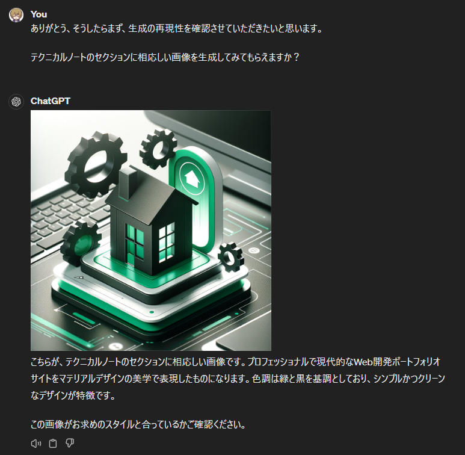

import FullHeader from '@site/src/components/IntegratedArticleComponents/FullHeader';
import FullFooter from '@site/src/components/IntegratedArticleComponents/FullFooter';
import RelatedArticles from '@site/src/components/RelatedArticles';

# 一貫した画像再現の方法

<FullHeader
  slug="/technical-notebook/openai-gpt/dall-e/consistent-image-reproduction-method"
  title="【DALL-E】一貫した画像再現の方法 | ateliers.dev"
  created="2024/04/27"/>

---

DALL-E を使って一貫した画像再現を行う方法について記載します。

## 1. 目的

WEBサイトの画像を、生成AI (この場合は DALL-E) を用いて生成し「追加で別の画像を生成したい」となったケースにおいて、統一感のある画像を再生成したいと考えることがあります。  
ここでは、そのための方法を紹介します。

## 2. 画像再現の方法

当WEBサイトの画像を生成する場合を例として、手順を紹介します。

なお 「2.1.」と「2.2.」の手順は、まとめて行っても良いかもしれません。  
今回は手順紹介であるため、分けて記載しています。

### 2.1. WEBサイトの情報を覚えさせる

当WEBサイトでは「サイト案内」ページにて、WEBサイトの概要や構造を示しています。  
まずこの情報を ChatGPT(DALL-E) などの AI に覚えさせます。

以下の画像は、サイト案内 (`site-guidance.md`) を覚えさせた画面です。

### 2.2. 画像再現のプロンプトを覚えさせる

次に、WEBサイトで使用している画像を生成するためのプロンプトを覚えさせます。  
同じ [テクニカルノート] のセクションで「当サイトのイメージ生成メモ」のコンテンツがありますので、これを参照させます。

以下の画像は、当サイトのイメージ生成メモ (`image-generation-memo.md`) を覚えさせた画面です。

ちょっと応答が怪しいけど、たぶん… 大丈夫でしょう。

### 2.3. 画像再現の実行

ChatGPT(DALL-E) に対して、覚えさせた情報を元に画像再現を実行します。

今回は、テクニカルノートの画像再現を行いました。  
以下の画像は、ChatGPT(DALL-E) による画像再現の実行結果です。

少々テクニカルノート感は薄いですが、トレードマークである「家と歯車」が3Dマテリアルデザイン描かれています。色調も「黒と緑」で統一されているので、一貫性があると言えるでしょう。

この情報を元に調整を行い、コンテンツにマッチする画像を生成することで、WEBサイト全体で統一感のあるイメージを保つことができます。

## 3. まとめ

WEBサイトのイメージとして生成AIの画像を利用する場合は、生成した画像のプロンプトを記録しておくことで、将来的に一貫性を持たせた画像を再生成するための参考情報として活用できます。
またWEBサイトの案内や概要情報もまとめておき、イメージ生成の補完をすることで、より一貫性のある画像を生成することができます。

プロンプトやサイト情報をまとめたりする作業は少々手間がかかりますが、生成AIにイメージを生成させて、なおかつWEBサイト全体の統一感を保つためには、非常に便利な方法です。  
必要であれば適宜、記録しておくことをお勧めします。

---

## フィードバックの提供方法と連絡先

:::tip[連絡先]
この記事に関するフィードバックやご質問、ご意見がございましたら [プロフィールページの連絡先](/docs/profiles/self-introduction#2-連絡先) からお気軽にご連絡ください。  
貴重なディスカッションをお待ちしております。
:::

---

<FullFooter
  slug="/technical-notebook/openai-gpt/dall-e/consistent-image-reproduction-method"
  title="【DALL-E】一貫した画像再現の方法 | ateliers.dev"/>
