---
# Docusaurus メタデータ
id: technical-notebook-my-site-image-generation-memo
slug: /technical-notebook/openai-gpt/dall-e/my-site-image-generation-memo
category: テクニカルノート
title: ateliers.dev - テクニカルノート - 当サイトのイメージ生成メモ
sidebar_label: 当サイトのイメージ生成メモ
tags: [technical-notebook, openai-gpt, dall-e]
description: ateliers.dev の「テクニカルノート」内コンテンツです。当サイトで使っている画像の生成メモをまとめています。
image: img/jpg/ateliers-dev-technical-notebook.jpg
---

# 当サイトのイメージ生成メモ
*[Created: 2024/04/24, Update: 2024/04/27]*

---

再生成したいケースに備えて、当サイトで使っている画像のプロンプトを記録しておきます。  
メモ書きです。

## 1. このページのコンテンツテンプレート

````


|生成AI|生成日|
|---|---|
|AI名とバージョン|yyyy/mm/dd|

プロンプト:
```prompt
プロンプトを書く
```
````

---

## 2. 汎用 生成画像

今のところ、無し。

## 3. トップページ用 生成画像

当サイトのトップページまたはウェブサイト全体をイメージする画像の生成メモです。

---

### 3.1. 用途: OGイメージ、インデックス

---

No.001
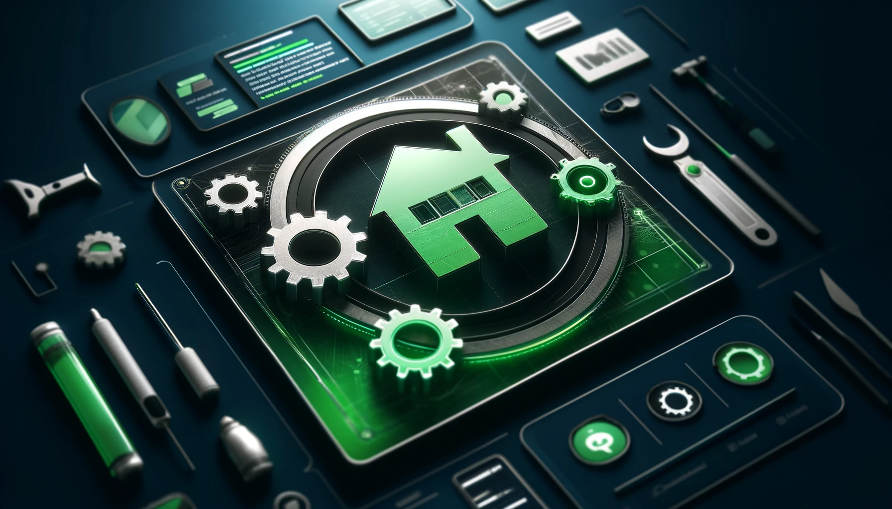

No.002


No.003


|生成AI|生成日|
|---|---|
|OpenAI - DALL-E 3|2024/04/24|

プロンプト:
```prompt
A professional and modern web development portfolio website with a material design aesthetic, focusing on technology and innovation. The main colors are green and black, reflecting a sleek, tech-oriented design. The image includes a single house and 3 to 5 gears as trademark elements, representing a developer's workspace with a simple and clean look.
```

---

No.004
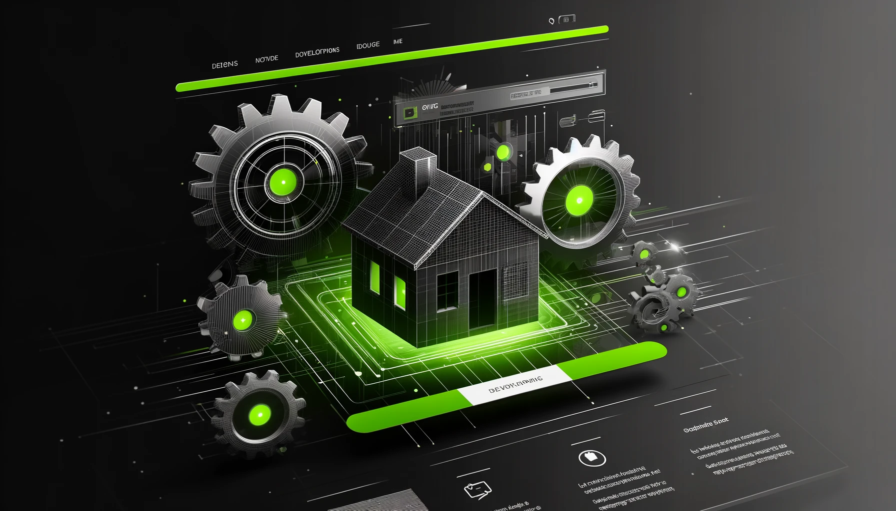

No.005


No.006
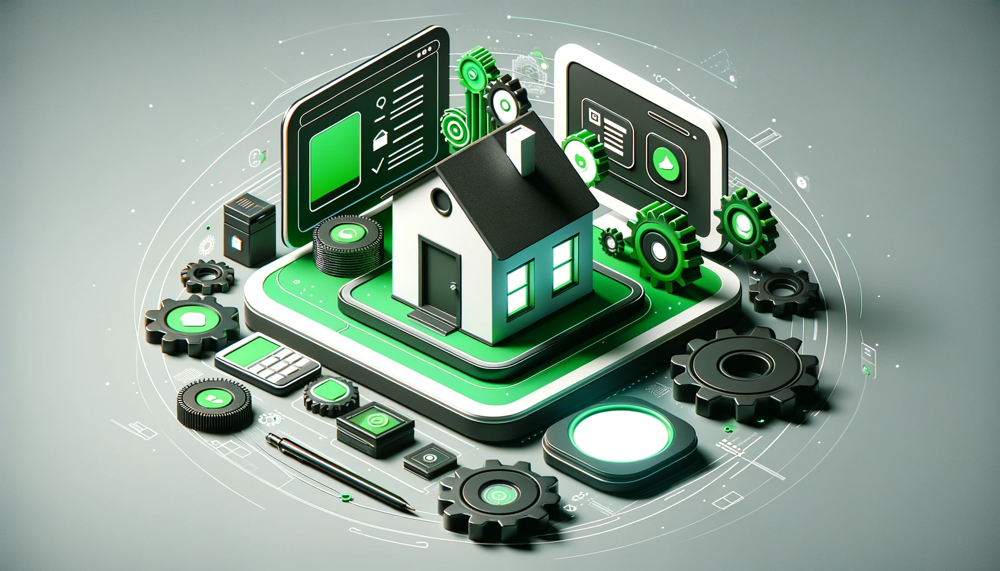

|生成AI|生成日|
|---|---|
|OpenAI - DALL-E 3|2024/04/24|

特殊条件: No.001 ~ 003 の画像に対して good した。

プロンプト:
```prompt
A professional and modern web development portfolio website with a material design aesthetic, focusing on technology and innovation. The main colors are green and black, reflecting a sleek, tech-oriented design. The image includes elements like a single house and 3 to 5 gears, representing a developer's workspace with a simple and clean look, in a style that previously received a positive 'good' feedback.
```

---
## 4. GitHub ガイドライン用 生成画像
---
GitHub ガイドラインページ用の画像生成メモです。

### 4.1. 用途: OGイメージ、インデックス

No.001
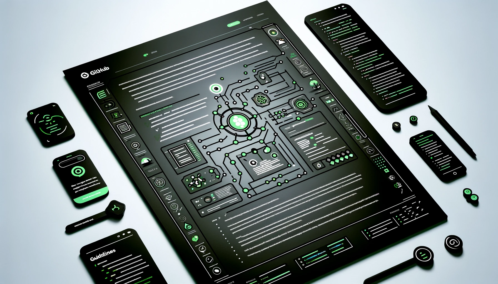

|生成AI|生成日|
|---|---|
|OpenAI - DALL-E 3|2024/04/24|

プロンプト:
```prompt
A professional and modern GitHub guidelines page with a material design aesthetic, focusing on subtle technology and innovation. The main color is black with green accents, reflecting a sophisticated, tech-oriented design. The image includes elements like code snippets, a repository structure diagram, and collaborative icons, representing an informative and collaborative environment for developers, with green used sparingly as an accent color.
```

---

No.002
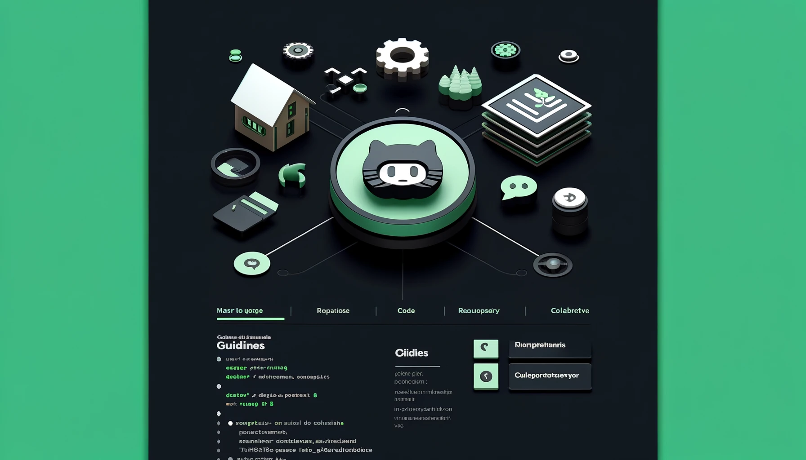

No.003
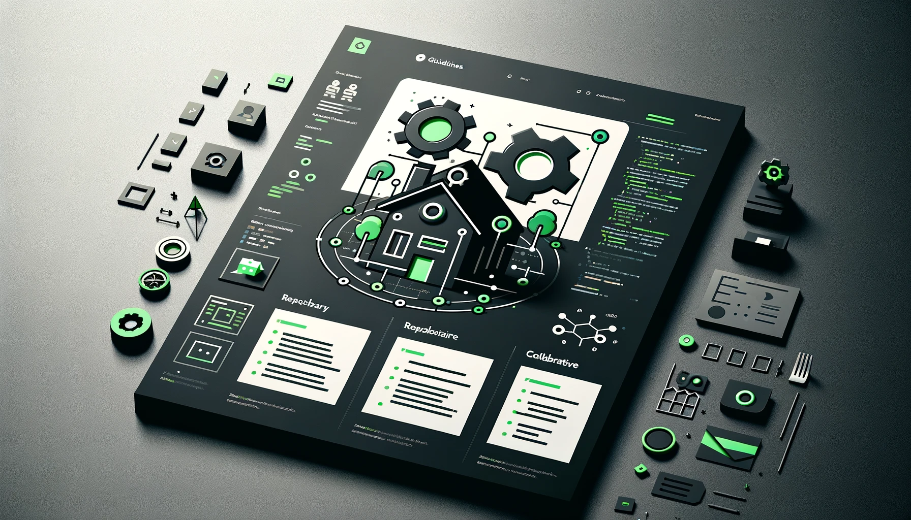

|生成AI|生成日|
|---|---|
|OpenAI - DALL-E 3|2024/04/24|

プロンプト:
```prompt
A professional and modern GitHub guidelines page with a material design aesthetic, focusing on subtle technology and innovation. The main color is black with green accents, reflecting a sophisticated, tech-oriented design. The image includes small elements like a single house and one gear, representing the trademark of the site, along with code snippets, a repository structure diagram, and collaborative icons, representing an informative and collaborative environment for developers.
```

---
## 5. テクニカルポリシー用 生成画像
---

テクニカルポリシーページ用の画像生成メモです。

### 5.1. 用途: OGイメージ、インデックス

No.001
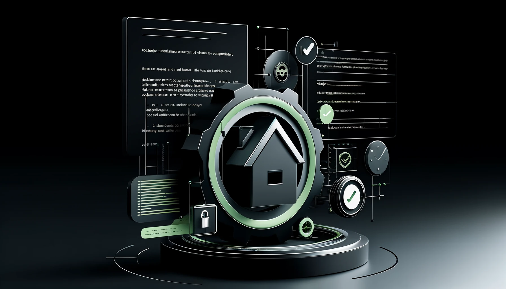

No.002


|生成AI|生成日|
|---|---|
|OpenAI - DALL-E 3|2024/04/24|

プロンプト:
```prompt
A professional and modern Technical Policy page with a material design aesthetic, focusing on subtle technology and innovation. The main color is black with green accents, reflecting a sophisticated, tech-oriented design. The image includes small elements like a single house and one gear, representing the trademark of the site, along with code snippets, a legal document icon, and privacy settings icons, representing an informative and authoritative environment for developers, enhanced with a dynamic background.
```

---

No.003
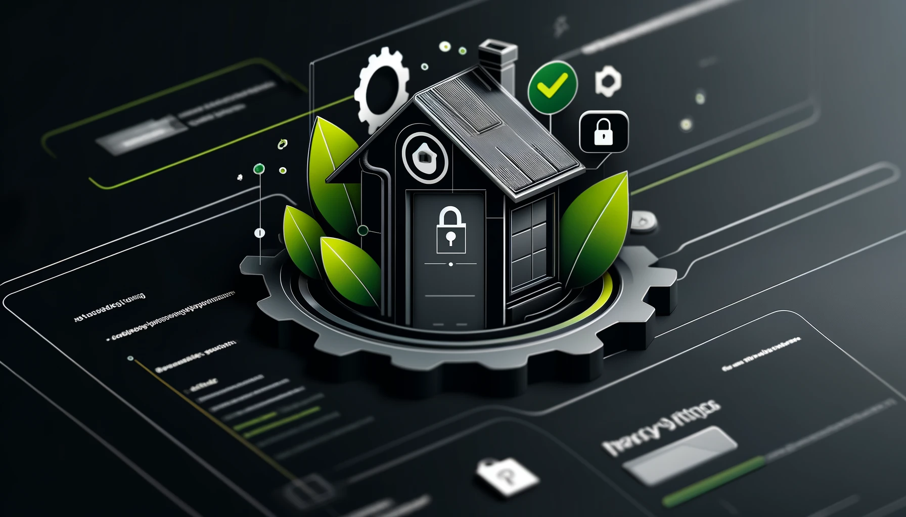

|生成AI|生成日|
|---|---|
|OpenAI - DALL-E 3|2024/04/24|

プロンプト:
```prompt
A professional and modern Technical Policy page with a material design aesthetic, focusing on subtle technology and innovation. The main color is black with green accents, reflecting a sophisticated, tech-oriented design. The image includes small elements like a single house and one gear, representing the trademark of the site, along with code snippets, a legal document icon, and privacy settings icons, representing an informative and authoritative environment for developers, enhanced with a friendly and welcoming background.
```

---
## 6. テクニカルノート用 生成画像
---

テクニカルノートページ用の画像生成メモです。

### 6.1. 用途: OGイメージ、インデックス

No.001
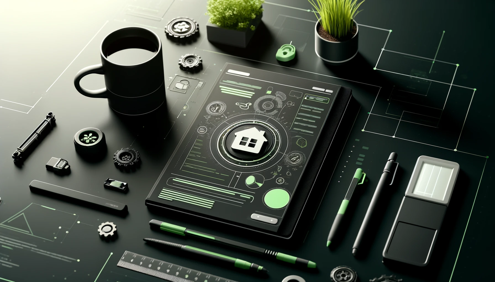

No.002


|生成AI|生成日|
|---|---|
|OpenAI - DALL-E 3|2024/04/24|

プロンプト:
```prompt
A professional and modern Technical Notes page with a material design aesthetic, focusing on subtle technology and innovation. The main color is black with green accents, reflecting a sophisticated, tech-oriented design. The image includes small elements like a single house and one gear, representing the trademark of the site, along with notepads, pens, and educational icons, representing an informative and educational environment for developers, enhanced with a friendly and welcoming background.
```

---

No.003


|生成AI|生成日|
|---|---|
|OpenAI - DALL-E 3|2024/04/24|

プロンプト:
```prompt
A professional and modern Technical Notes page with a material design aesthetic, focusing on subtle technology and innovation. The main color is black with green accents, but slightly brighter to provide a more inviting atmosphere. The image includes small elements like a single house and one gear, representing the trademark of the site, along with notepads, pens, and educational icons, representing an informative and educational environment for developers, enhanced with a welcoming background.
```

---
## 7. プロフィール用 生成画像
---

プロフィールページ用の画像生成メモです。

### 7.1. 用途: OGイメージ、インデックス

No.001
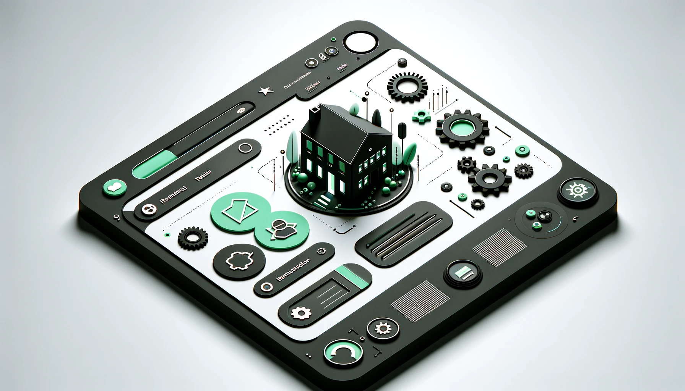

|生成AI|生成日|
|---|---|
|OpenAI - DALL-E 3|2024/04/24|

プロンプト:
```prompt
A professional and modern Profile page with a material design aesthetic, focusing on subtle technology and innovation. The main color is black with green accents, set against a white background to create a more inviting and bright atmosphere. The image includes smaller and fewer elements like a single house and one gear, representing the trademark of the site, along with minimalist icons related to personal identity and career development. The design is simplified while maintaining a 3D, material-style texture and a quarter-view perspective to add depth and a tangible quality, representing an informative and user-friendly environment for visitors.
```

No.002
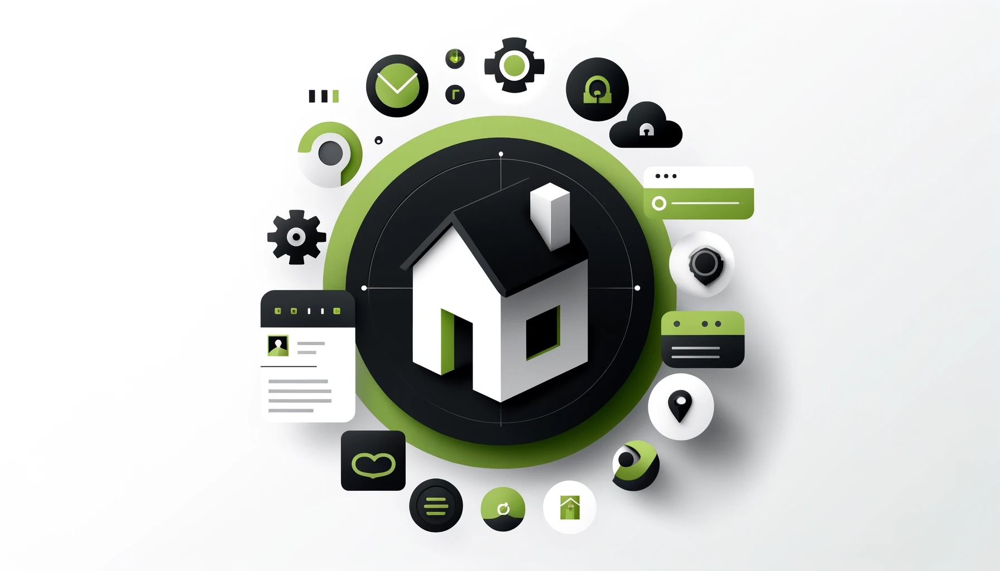

|生成AI|生成日|
|---|---|
|OpenAI - DALL-E 3|2024/04/24|

特記事項：プロフィール用として作成したが、サイト案内として採用。

プロンプト:
```prompt
A professional and modern Profile page with a material design aesthetic, focusing on subtle technology and innovation. The main color is black with green accents, set against a white background to create a more inviting and bright atmosphere. The image effectively utilizes the entire canvas, featuring elements like a single house and one gear representing the trademark of the site, along with minimalist icons related to personal identity and career development. The design is simplified while maintaining a 3D, material-style texture and a quarter-view perspective to add depth and a tangible quality, representing an informative and user-friendly environment for visitors.
```

---

No.003
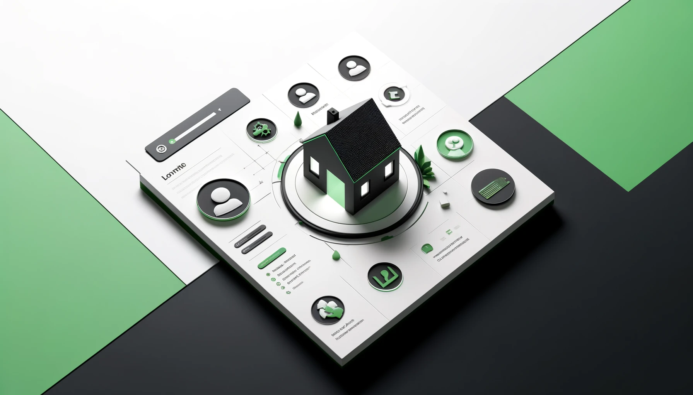

No.004
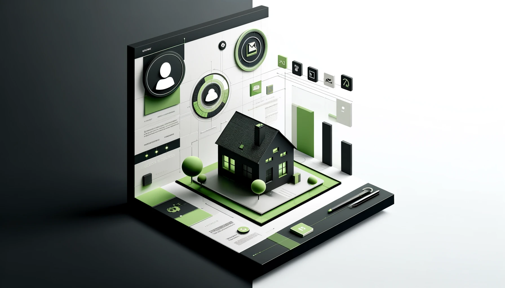

|生成AI|生成日|
|---|---|
|OpenAI - DALL-E 3|2024/04/24|

プロンプト:
```prompt
A professional and modern Profile page with a material design aesthetic, focusing on subtle technology and innovation. The main color is black with green accents, set against a white background to create a more inviting and bright atmosphere. The image prominently features a 3D, material-style house viewed from above, representing the trademark of the site, along with minimalist icons related to personal identity such as a stylized human figure or a portrait icon, and career development. The design maintains a quarter-view perspective to add depth and a tangible quality, representing an informative and user-friendly environment for visitors.
```

---
## 8. FAQ用 生成画像
---

FAQページ用の画像生成メモです。

### 8.1. 用途: OGイメージ、インデックス

No.001


|生成AI|生成日|
|---|---|
|OpenAI - DALL-E 3|2024/04/24|

プロンプト:
```prompt
A professional and modern FAQ page with a material design aesthetic, focusing on subtle technology and innovation. The main color is black with green accents, but slightly brighter to create a more inviting and friendly atmosphere. The image includes small elements like a single house and one gear, representing the trademark of the site, along with minimalist question mark icons and FAQ-related symbols. The design is enhanced with a 3D, material-style texture to add depth and a tangible quality, representing an informative and user-friendly environment for visitors.
```

---

No.002


|生成AI|生成日|
|---|---|
|OpenAI - DALL-E 3|2024/04/24|

プロンプト:
```prompt
A professional and modern FAQ page with a material design aesthetic, focusing on subtle technology and innovation. The main color is a moderate light gray with hints of green accents, maintaining the trademark color while creating a more inviting and friendly atmosphere. The image includes small elements like a single house and one gear, representing the trademark of the site, along with minimalist question mark icons and FAQ-related symbols. The design is enhanced with a 3D, material-style texture to add depth and a tangible quality, representing an informative and user-friendly environment for visitors.
```

---

No.003
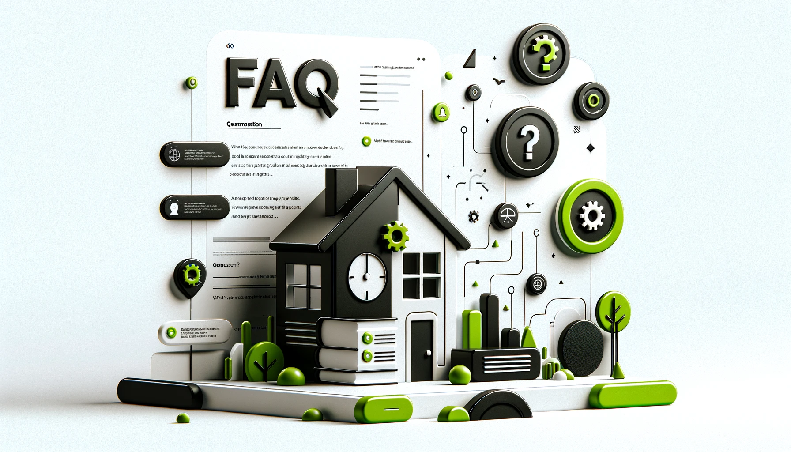

|生成AI|生成日|
|---|---|
|OpenAI - DALL-E 3|2024/04/24|

プロンプト:
```prompt
A professional and modern FAQ page with a material design aesthetic, focusing on subtle technology and innovation. The main color is black with green accents, set against a white background to create a more inviting and bright atmosphere. The image includes small elements like a single house and one gear, representing the trademark of the site, along with minimalist question mark icons and FAQ-related symbols. The design is enhanced with a 3D, material-style texture to add depth and a tangible quality, representing an informative and user-friendly environment for visitors.
```

---
## 9. お遊び系 生成画像
---

お遊び系の画像生成メモです。

### 9.1. 目的: UBW を再現したかった

どうしても上手くいかない。

No.001
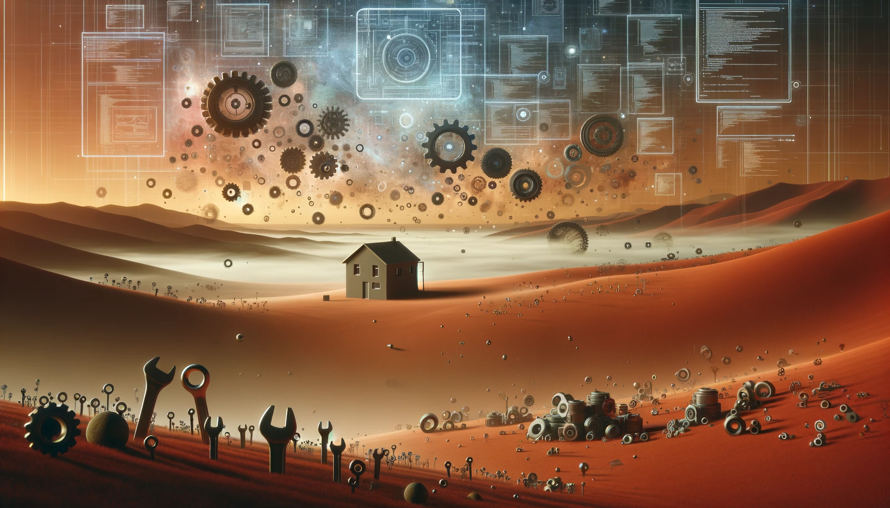

|生成AI|生成日|
|---|---|
|OpenAI - DALL-E 3|2024/04/27|

所感： ツールの丘、って感じはあれど、全体的に壮大感がない…。

プロンプト:
```prompt
Imagine a landscape in an alien dimension with a gradient of soft brown to lighter shades of orange and red, extending the atmosphere beyond traditional concepts. The scene is slightly darker to create a more mysterious atmosphere. It is filled with floating windows displaying futuristic code and diagrams, and engineering tools such as wrenches, screwdrivers, and pliers spread widely across and beyond the visible frame, some embedded into the ground. Among these, two to three gears are fully materialized, appearing solid and tangible amidst the ethereal environment. These materialized gears symbolize the advanced technology field, seamlessly integrated with nature, some embedded into the ground. The minimalist 3D designed house remains subtly placed, blending with the surreal, tech-infused, darker setting.
```

---

No.002
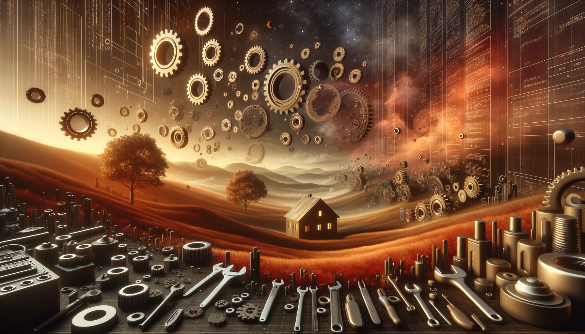

|生成AI|生成日|
|---|---|
|OpenAI - DALL-E 3|2024/04/27|

所感： 全体的に見た目は良いのだけど、ツールが突き刺さっていない。

プロンプト:
```prompt
Imagine a landscape in an alien dimension with a gradient of soft brown to lighter shades of orange and red, extending the atmosphere beyond traditional concepts. The scene is slightly darker to create a more mysterious atmosphere. It is filled with floating windows displaying futuristic code and diagrams, and engineering tools such as wrenches, screwdrivers, and pliers spread widely across and beyond the visible frame. Among these, two to three gears are fully materialized, appearing solid and tangible amidst the ethereal environment. These materialized gears symbolize the advanced technology field, seamlessly integrated with nature. The minimalist 3D designed house remains subtly placed, blending with the surreal, tech-infused, darker setting.
```

---

No.003
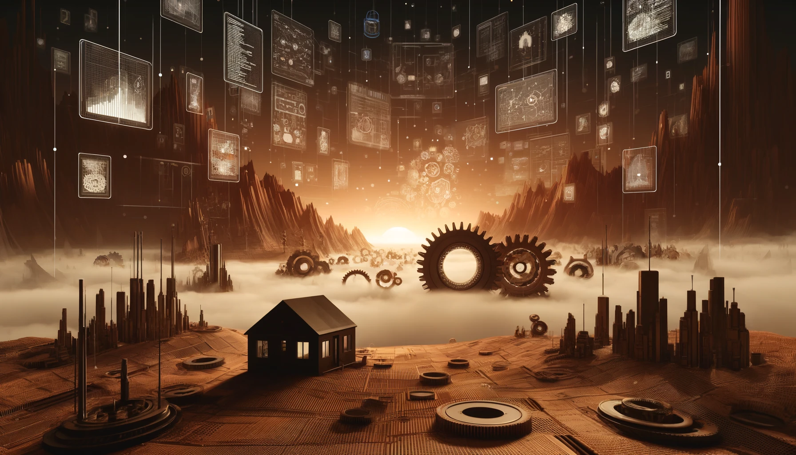

|生成AI|生成日|
|---|---|
|OpenAI - DALL-E 3|2024/04/27|

所感： これはこれで良いけど、やはりツールが突き刺さっていない。

プロンプト:
```prompt
Imagine a landscape in an alien dimension with a gradient of soft brown to lighter shades of orange and red, extending the atmosphere beyond traditional concepts. The scene is slightly darker to create a more mysterious atmosphere. It is filled with floating windows displaying futuristic code and diagrams, and engineering tools and servers such as wrenches, screwdrivers, and pliers spread widely across and beyond the visible frame, some embedded into the ground. Among these, two to three gears are fully materialized and made larger, appearing solid and tangible amidst the ethereal environment. These large gears symbolize the advanced technology field, seamlessly integrated with nature, some embedded into the ground. The minimalist 3D designed house remains subtly placed, blending with the surreal, tech-infused, darker setting.
```
